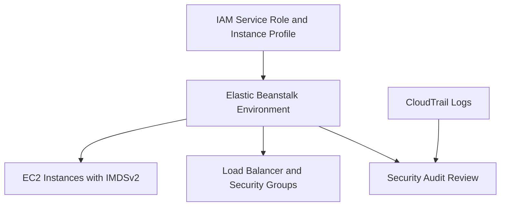

# Security Operations

## Prerequisites

-    IAM permissions to review and update roles, instance profiles, and environment options.
-    Access to CloudTrail event history and Elastic Beanstalk configuration details.
-    Change process for security group rule updates with approval and rollback windows.
-    Latest AWS SDK versions in application code that interacts with instance metadata.
-    Inventory of active environments and associated service roles and instance profiles.

## When to Use

-    Use for recurring credential and role hygiene checks in Elastic Beanstalk environments.
-    Use when enforcing IMDSv2 and reducing attack surface from metadata access patterns.
-    Use when adjusting instance and load balancer security groups for least privilege.
-    Use when auditing operational changes through CloudTrail records.

## Procedure

Review environment service role and instance profile configuration.

```bash
aws elasticbeanstalk describe-environment-resources \
    --environment-name "my-app-prod" \
    --profile "eb-ops" \
    --region "us-east-1"
```

Review current launch configuration options including instance profile and IMDS behavior.

```bash
aws elasticbeanstalk describe-configuration-settings \
    --application-name "my-app" \
    --environment-name "my-app-prod" \
    --profile "eb-ops" \
    --region "us-east-1"
```

Enforce IMDSv2 by disabling IMDSv1 in launch configuration namespace.

```bash
aws elasticbeanstalk update-environment \
    --environment-name "my-app-prod" \
    --option-settings Namespace=aws:autoscaling:launchconfiguration,OptionName=DisableIMDSv1,Value=true \
    --profile "eb-ops" \
    --region "us-east-1"
```

Update security groups for instance and load balancer paths with explicit references.

```bash
aws elasticbeanstalk update-environment \
    --environment-name "my-app-prod" \
    --option-settings Namespace=aws:autoscaling:launchconfiguration,OptionName=SecurityGroups,Value="sg-0123abcd4567efgh8" \
    Namespace=aws:elbv2:loadbalancer,OptionName=SecurityGroups,Value="sg-0aaa1111bbb2222c" \
    --profile "eb-ops" \
    --region "us-east-1"
```

Rotate environment credentials by updating IAM access strategy and attached policies.

1.    Prefer IAM roles attached to environment resources over long-lived user credentials.
2.    Review managed policies for service role and instance profile relevance.
3.    Remove excess permissions that are not required for environment function.
4.    Revalidate environment operations after policy adjustments.

Audit operational changes in CloudTrail for Elastic Beanstalk API actions.

```bash
aws cloudtrail lookup-events \
    --lookup-attributes AttributeKey=EventSource,AttributeValue=elasticbeanstalk.amazonaws.com \
    --max-results 50 \
    --profile "eb-ops" \
    --region "us-east-1"
```



Security principles reflected in AWS docs:

-    Security is shared responsibility between AWS and customer configuration.
-    Use managed policies where possible to keep required permissions current.
-    Keep authorization for enhanced health statistic publishing when enhanced health is enabled.
-    Use least privilege by limiting role actions and narrowing security group sources.

## Verification

-    Confirm `DisableIMDSv1` is true in environment option settings.
-    Confirm application components still retrieve required metadata through supported SDK behavior.
-    Confirm security group rule paths allow only required ingress and egress.
-    Confirm CloudTrail records expected update actions and no unexpected principals.

## Rollback / Troubleshooting

-    If application metadata access fails, verify SDK version and IMDSv2 compatibility before re-enabling IMDSv1.
-    If environment update fails, verify launch template permissions required by IMDS configuration change.
-    If traffic fails after security group update, restore previous security group assignments.
-    If health reporting shows No Data after role changes, restore permission for `elasticbeanstalk:PutInstanceStatistics`.

## See Also

-    [Networking](./networking.md)
-    [Health Monitoring](./health-monitoring.md)
-    [Security Architecture](../platform/security-architecture.md)
-    [Best Practices: Security](../best-practices/security.md)

## Sources

-    https://docs.aws.amazon.com/elasticbeanstalk/latest/dg/security.html
-    https://docs.aws.amazon.com/elasticbeanstalk/latest/dg/environments-cfg-ec2-imds.html
-    https://docs.aws.amazon.com/elasticbeanstalk/latest/dg/iam-servicerole.html
-    https://docs.aws.amazon.com/elasticbeanstalk/latest/dg/iam-instanceprofile.html
-    https://docs.aws.amazon.com/elasticbeanstalk/latest/dg/security-best-practices.html
-    https://docs.aws.amazon.com/elasticbeanstalk/latest/dg/health-enhanced.html
