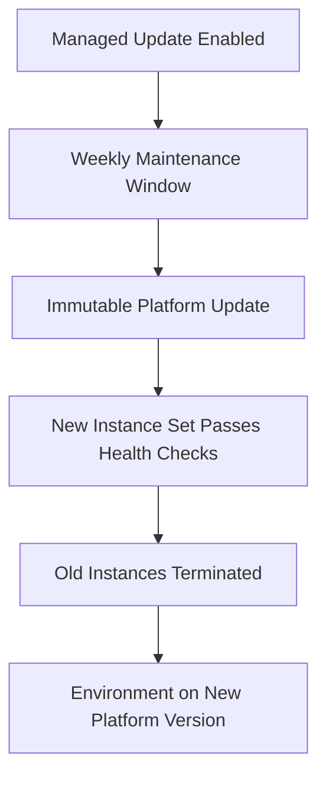

---
hide:
  - toc
---

# Updates and Patching Operations

## Prerequisites

-    Environment running a supported platform branch for managed platform updates.
-    Enhanced health enabled, because managed updates depend on health validation.
-    Service role with managed updates permissions, including managed updates policy.
-    Defined weekly maintenance window aligned with low-risk traffic periods.
-    Blue/green deployment process available for controlled production changes.

## When to Use

-    Use for regular patch and minor platform updates without major branch migration.
-    Use when you need predictable update windows and immutable update behavior.
-    Use when applying updates with minimal availability risk in production workloads.
-    Use when recovering from runtime drift by replacing instances on a schedule.

## Procedure

Inspect current platform and managed updates configuration.

```bash
aws elasticbeanstalk describe-configuration-settings \
    --application-name "my-app" \
    --environment-name "my-app-prod" \
    --profile "eb-ops" \
    --region "us-east-1"
```

Enable managed platform updates and set the maintenance window.

```bash
aws elasticbeanstalk update-environment \
    --environment-name "my-app-prod" \
    --option-settings Namespace=aws:elasticbeanstalk:managedactions,OptionName=ManagedActionsEnabled,Value=true \
    Namespace=aws:elasticbeanstalk:managedactions,OptionName=PreferredStartTime,Value="Tue:09:00" \
    Namespace=aws:elasticbeanstalk:managedactions:platformupdate,OptionName=UpdateLevel,Value=minor \
    Namespace=aws:elasticbeanstalk:managedactions:platformupdate,OptionName=InstanceRefreshEnabled,Value=false \
    --profile "eb-ops" \
    --region "us-east-1"
```

Use clone, update, validate, and swap for production-safe rollout.

1.    Clone production to a green environment.
2.    Update platform version on green environment.
3.    Validate enhanced health and application behavior.
4.    Swap CNAME from blue to green environment.

Apply an immediate managed update when needed.

```bash
aws elasticbeanstalk apply-environment-managed-action \
    --environment-name "my-app-prod" \
    --action-id "ManagedUpdate-2026-04-05" \
    --profile "eb-ops" \
    --region "us-east-1"
```

Check managed action history and pending actions.

```bash
aws elasticbeanstalk describe-environment-managed-actions \
    --environment-name "my-app-prod" \
    --status "Scheduled" \
    --profile "eb-ops" \
    --region "us-east-1"
```



Update level planning from AWS docs:

-    Patch updates include fixes and performance improvements.
-    Minor updates add feature support within the same platform branch.
-    Major branch changes are not handled by managed updates and require separate migration.
-    Managed updates use immutable behavior and preserve capacity during update execution.

Maintenance strategy guidance:

-    Spread maintenance windows across many environments to reduce throttling risk.
-    Keep instance replacement disabled unless periodic full refresh is required.
-    Use managed updates with enhanced health for update success determination.
-    Use blue/green swap for rollback speed and operational control.

## Verification

-    Confirm managed updates settings are present in managed actions namespaces.
-    Confirm update history includes successful completion and target platform version.
-    Confirm enhanced health remains healthy during and after update operations.
-    Confirm application endpoints and background workers remain stable after rollout.

## Rollback / Troubleshooting

-    If update fails, inspect managed update history cause and service role permissions.
-    If application regression occurs, swap CNAME back to previous stable environment.
-    If no update is scheduled, verify update level and platform scan timing.
-    If immutable checks fail repeatedly, review health rules, startup time, and endpoint readiness.
-    If branch migration is required, create a new environment on the target branch and migrate with blue/green.

## See Also

-    [Blue/Green Deployment](./blue-green-deployment.md)
-    [Immutable Deployment](./immutable-deployment.md)
-    [Health Monitoring](./health-monitoring.md)
-    [Environment Management](./environment-management.md)

## Sources

-    https://docs.aws.amazon.com/elasticbeanstalk/latest/dg/environment-platform-update-managed.html
-    https://docs.aws.amazon.com/elasticbeanstalk/latest/dg/using-features.platform.upgrade.html
-    https://docs.aws.amazon.com/elasticbeanstalk/latest/dg/using-features.CNAMESwap.html
-    https://docs.aws.amazon.com/elasticbeanstalk/latest/dg/environmentmgmt-updates-immutable.html
