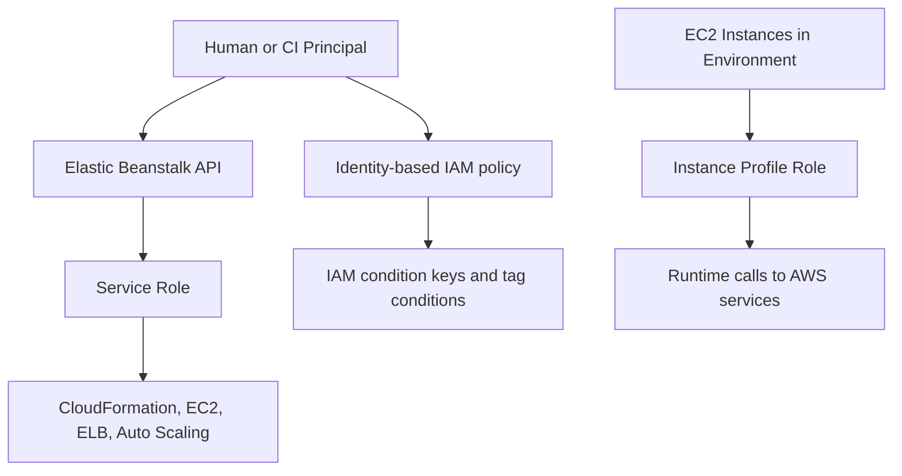

---
hide:
  - toc
---

# Authentication and Access

AWS Elastic Beanstalk access control is implemented through AWS Identity and Access Management (IAM). A production-ready model separates platform orchestration permissions, application runtime permissions, and operator permissions.

This page explains the role model, policy boundaries, environment-level access patterns, and IAM conditions that improve guardrails.

## Main Content

### Identity Boundaries in Elastic Beanstalk

Elastic Beanstalk relies on multiple IAM identities with different trust and permission scopes.



Use least privilege and keep these boundaries explicit:

- **Service role**: Used by Elastic Beanstalk to provision and manage resources on your behalf.
- **Instance profile**: Used by EC2 instances for runtime access to AWS services.
- **Operator or CI role**: Used by humans and automation to deploy, inspect, and operate environments.

### IAM Roles for Elastic Beanstalk

#### Service Role (`aws-elasticbeanstalk-service-role`)

The service role is assumed by Elastic Beanstalk to orchestrate infrastructure actions such as creating Auto Scaling groups, load balancers, and related resources.

Core guidance:

- Keep trust policy scoped to the Elastic Beanstalk service principal.
- Prefer AWS-managed baseline permissions for required service behavior.
- Add customer-managed policies only for explicit, documented needs.
- Avoid reusing this role for unrelated automation.

#### Instance Profile (`aws-elasticbeanstalk-ec2-role`)

The instance profile should only allow runtime actions required by the application.

Typical patterns:

- Read application artifacts from Amazon S3.
- Publish logs and metrics to CloudWatch where configured.
- Read specific parameters or secrets through explicit resource-scoped policies.

Avoid wildcard actions and wildcard resources unless AWS API constraints require them.

### Elastic Beanstalk Managed Policies

Elastic Beanstalk supports AWS-managed policies that accelerate secure baseline setup for service and instance roles.

Implementation approach:

1. Start from AWS-managed policies recommended in Elastic Beanstalk IAM documentation.
2. Layer customer-managed policies for workload-specific access.
3. Add explicit deny statements for sensitive operations where governance requires it.
4. Review policy drift after platform and workload changes.

### Resource-Based Policies and Environment Integrations

Elastic Beanstalk environments often interact with resources protected by resource-based policies (for example Amazon S3 bucket policies and AWS KMS key policies).

Design principles:

- Grant resource access to the instance profile role rather than broad account principals.
- Scope policies by resource ARN, prefix, and encryption context where possible.
- Validate that resource policies and identity policies align, because both can affect authorization decisions.

Example policy intent for deployment artifact storage:

- Allow `s3:GetObject` only from the artifact bucket path used by `$APP_NAME`.
- Deny access from non-approved principals by default.

### Environment-Level Access Control

Environment-level access can be constrained by names, tags, and approved actions.

Recommended control points:

- Limit who can call update and terminate actions for production environments.
- Enforce tagging requirements at environment creation time.
- Separate read-only monitoring from deployment and infrastructure mutation roles.

```bash
aws elasticbeanstalk update-environment \
    --application-name "$APP_NAME" \
    --environment-name "$ENV_NAME" \
    --option-settings Namespace=aws:elasticbeanstalk:environment,OptionName=ServiceRole,Value="$SERVICE_ROLE_NAME"
```

### IAM Condition Keys for Elastic Beanstalk Workflows

Condition keys are critical for policy guardrails.

Useful policy strategies:

- Require specific request tags for create and update operations.
- Restrict operations based on resource tags (for example only `EnvironmentType=dev`).
- Gate sensitive actions to approved regions using global condition keys.

Example guardrail intent:

- Allow environment termination only when a break-glass tag is present.
- Deny production updates outside approved deployment principals.

### Operational Access Validation

Use AWS CLI checks to verify role and policy behavior after changes.

```bash
aws elasticbeanstalk describe-configuration-settings \
    --application-name "$APP_NAME" \
    --environment-name "$ENV_NAME"
```

```bash
aws elasticbeanstalk describe-environment-resources \
    --environment-name "$ENV_NAME"
```

!!! warning
    Over-privileged instance profiles increase blast radius if application code is compromised.
    Keep runtime permissions minimal and review policies on a fixed schedule.

## Advanced Topics

### Permission Boundaries and SCP Alignment

For multi-account organizations, combine IAM permission boundaries with AWS Organizations service control policies (SCPs) to enforce platform guardrails consistently.

Practical outcomes:

- Prevent privilege escalation from workload roles.
- Enforce regional and service usage constraints centrally.
- Standardize production controls across accounts.

### Cross-Account Deployment Model

If CI/CD deploys from a central tooling account:

1. Assume a deployment role in the target account.
2. Constrain role trust with explicit principal and optional external ID checks.
3. Scope Elastic Beanstalk actions to approved applications and environments.
4. Audit all role assumptions and deployment API calls with CloudTrail.

### Access Review and Drift Detection

Establish recurring IAM reviews for:

- Service role and instance profile policy drift.
- Unused permissions identified by access analysis.
- Environment-specific exceptions that should be removed.

## See Also

- [Security Architecture](./security-architecture.md)
- [Networking](./networking.md)
- [Best Practices Security](../best-practices/security.md)
- [Operations Security](../operations/security.md)

## Sources

- [Using IAM with Elastic Beanstalk](https://docs.aws.amazon.com/elasticbeanstalk/latest/dg/AWSHowTo.iam.html)
- [Managing Elastic Beanstalk Service Roles](https://docs.aws.amazon.com/elasticbeanstalk/latest/dg/iam-servicerole.html)
- [Managing Elastic Beanstalk User Policies](https://docs.aws.amazon.com/elasticbeanstalk/latest/dg/iam-userpolicy.html)
- [Elastic Beanstalk Managed Policies](https://docs.aws.amazon.com/elasticbeanstalk/latest/dg/security-iam-awsmanpol.html)
- [Actions, Resources, and Condition Keys for Elastic Beanstalk](https://docs.aws.amazon.com/service-authorization/latest/reference/list_awselasticbeanstalk.html)
