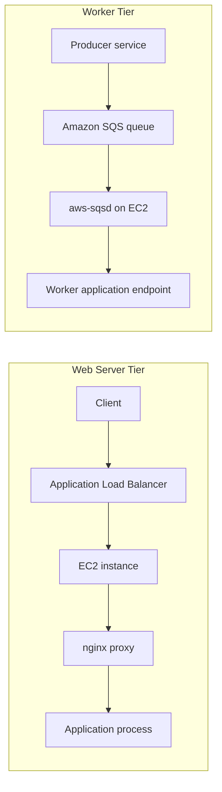

---
hide:
  - toc
---

# Environment Tiers

Elastic Beanstalk supports two environment tiers: **Web Server** and **Worker**.

Choosing the right tier defines request flow, scaling signals, and operational characteristics.

## Tier Comparison at a Glance

| Dimension | Web Server Tier | Worker Tier |
|---|---|---|
| Primary traffic pattern | Synchronous HTTP(S) requests | Asynchronous task processing |
| Entry service | Elastic Load Balancing | Amazon SQS |
| Runtime trigger | Client request | Queue message |
| Internal router | Platform proxy such as nginx | `aws-sqsd` daemon |
| Typical workload | APIs, web apps, user-facing endpoints | Background jobs, long-running tasks, retries |
| Failure handling model | Load balancer health and instance replacement | Visibility timeout, retries, dead-letter patterns |

## Web Server Tier Flow

In a load-balanced web environment, traffic generally follows:

1. Client sends request to environment endpoint or custom domain.
2. Load balancer accepts the connection.
3. Request reaches EC2 instance and platform proxy.
4. Proxy forwards request to application process.
5. Response returns through proxy and load balancer to client.

## Worker Tier Flow

Worker environments consume messages from an Amazon SQS queue.

1. Producer writes message to SQS queue.
2. `aws-sqsd` polls the queue on worker instances.
3. `aws-sqsd` sends an HTTP POST to a local application endpoint.
4. Application handles task and returns success or failure status.
5. `aws-sqsd` deletes message on success or leaves it for retry behavior.

## Architecture Comparison

## When to Choose Web Server Tier

- You need direct user request and response interactions.
- You host APIs or websites requiring low-latency round trips.
- You rely on load balancer health checks for routing decisions.
- You need sticky sessions or listener-level routing controls at the load balancer.

## When to Choose Worker Tier

- You process jobs that are not user-interactive.
- You need decoupled producer and consumer scaling.
- You expect bursty workloads that benefit from queue buffering.
- You need retry semantics based on queue behavior.

## Combined Pattern: Web + Worker

Many production systems deploy both tiers:

- Web tier validates and accepts client commands.
- Web tier publishes asynchronous work to SQS.
- Worker tier processes heavy or slow tasks.
- Results are persisted to shared data stores or emitted as events.

This reduces client-facing latency while maintaining reliable background execution.

## Operational Differences

- Web tier health is heavily tied to request path health checks.
- Worker tier health includes queue consumption behavior and daemon activity.
- Web tier scales for throughput and latency.
- Worker tier scales for queue depth and processing rate.

!!! note
    Worker environments require your application to expose an HTTP endpoint for `aws-sqsd` POST requests.
    Endpoint routing and success response behavior should be explicit and tested.

## Configuration Decision Checklist

- Is the workload synchronous or asynchronous?
- Is user latency directly affected by task duration?
- Do you need queue-mediated retries and buffering?
- Are scaling metrics request-based or queue-based?
- Should failures immediately surface to clients or be retried in background?

## Migration Considerations Between Tiers

Moving from web-only to mixed web-worker architecture often requires:

- Message contract definitions.
- Idempotent worker handlers.
- Error categorization for retry vs terminal failure.
- Monitoring for queue age and backlog.

## See Also

- [Platform Index](./index.md)
- [How Elastic Beanstalk Works](./how-elastic-beanstalk-works.md)
- [Request Lifecycle](./request-lifecycle.md)
- [Scaling](./scaling.md)

## Sources

- [Environment Tiers](https://docs.aws.amazon.com/elasticbeanstalk/latest/dg/concepts-tier.html)
- [Worker Environment Overview](https://docs.aws.amazon.com/elasticbeanstalk/latest/dg/using-features-managing-env-tiers.html)
- [Elastic Beanstalk Concepts](https://docs.aws.amazon.com/elasticbeanstalk/latest/dg/concepts.html)
