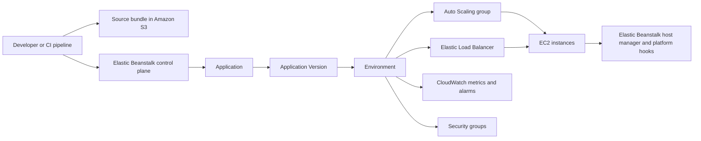

# How Elastic Beanstalk Works

AWS Elastic Beanstalk provides an application-centric control plane on top of core AWS infrastructure services.

You deploy source code as an application version, select a platform version, and Elastic Beanstalk provisions and manages environment resources.

## Core Resource Model

Elastic Beanstalk uses five foundational concepts:

- **Application**: Logical container for one or more environments.
- **Application Version**: Deployable build artifact, typically a source bundle in Amazon S3.
- **Environment**: Running stack of AWS resources that executes one application version.
- **Configuration Template**: Reusable set of option values for environment creation.
- **Platform Version**: Runtime and operating system definition for your environment.

## Managed AWS Services in an Environment

Elastic Beanstalk orchestrates service configuration for the environment lifecycle.

- Amazon EC2 instances for runtime execution.
- Auto Scaling groups for horizontal capacity management.
- Elastic Load Balancing for request distribution in load-balanced web environments.
- Amazon CloudWatch metrics and alarms for health and scaling signals.
- Security groups for instance and load balancer traffic boundaries.

## Architecture Overview



## Deployment Pipeline from Source Bundle to Running Code

1. Build your deployable artifact.
2. Upload the source bundle and register an application version.
3. Deploy the application version to a target environment.
4. Elastic Beanstalk coordinates platform-specific deployment commands on instances.
5. Environment health transitions based on deployment and runtime checks.

### Example CLI Flow

```bash
aws elasticbeanstalk create-application-version \
  --application-name "$APP_NAME" \
  --version-label "$VERSION_LABEL" \
  --source-bundle S3Bucket="$S3_BUCKET",S3Key="$S3_KEY"

aws elasticbeanstalk update-environment \
  --environment-name "$ENV_NAME" \
  --version-label "$VERSION_LABEL"
```

## What the Elastic Beanstalk Agent Does on Instances

On managed platform AMIs, platform components coordinate deployment and configuration tasks.

- Pull deployment metadata and application artifacts.
- Apply configuration updates from environment option settings.
- Restart proxy and application processes according to platform conventions.
- Report health-relevant state to the control plane.
- Execute platform hooks at defined lifecycle phases when present.

## Environment Lifecycle States to Understand

- **Launching**: Provisioning resources and applying baseline platform configuration.
- **Updating**: Applying code or configuration changes.
- **Ready**: Environment is healthy and serving as expected.
- **Terminating**: Resource cleanup in progress.

Health status is surfaced independently and should be interpreted with environment events and logs.

## Configuration Surfaces

You can manage behavior through:

- Option settings in namespaces.
- Saved configurations and templates.
- Configuration files bundled with source.
- Platform-specific hooks and extension points.

!!! tip
    Treat configuration as versioned assets alongside source code.
    This reduces drift across environments and improves rollback confidence.

## Practical Design Rules

- Keep application versions immutable once published.
- Use explicit version labels that map to commit identifiers.
- Separate environment concerns by lifecycle stage, such as dev, staging, and production.
- Prefer reproducible configuration templates over ad hoc console edits.

## Common Misunderstandings

- Elastic Beanstalk does not replace IAM, VPC, or service quota planning.
- Application versions are deployment inputs, not environment snapshots.
- Platform version changes and application version changes are distinct operations.
- Health green status does not guarantee end-user latency objectives are met.

## Validation Checklist

- Your application has at least one registered application version.
- Each environment references an intended platform version.
- Source bundle path and version label are traceable in deployment history.
- Environment events show successful provisioning and deployment transitions.

## See Also

- [Platform Index](./index.md)
- [Environment Tiers](./environment-tiers.md)
- [Request Lifecycle](./request-lifecycle.md)
- [Resource Relationships](./resource-relationships.md)

## Sources

- [Elastic Beanstalk Concepts](https://docs.aws.amazon.com/elasticbeanstalk/latest/dg/concepts.html)
- [Application Versions](https://docs.aws.amazon.com/elasticbeanstalk/latest/dg/applications-versions.html)
- [Managing Environments](https://docs.aws.amazon.com/elasticbeanstalk/latest/dg/using-features-managing-env-tiers.html)
