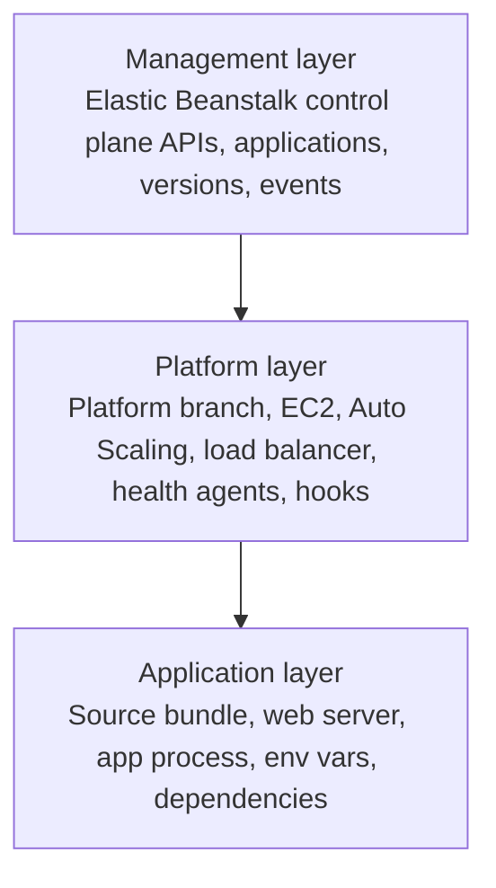
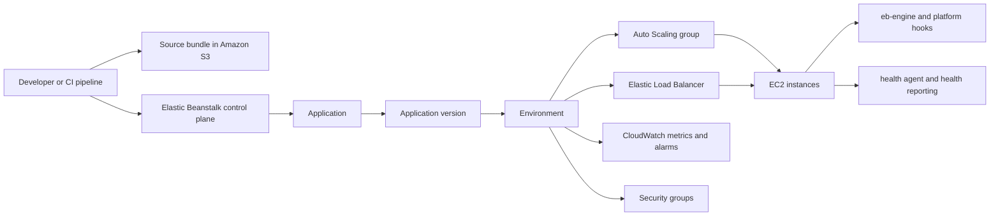
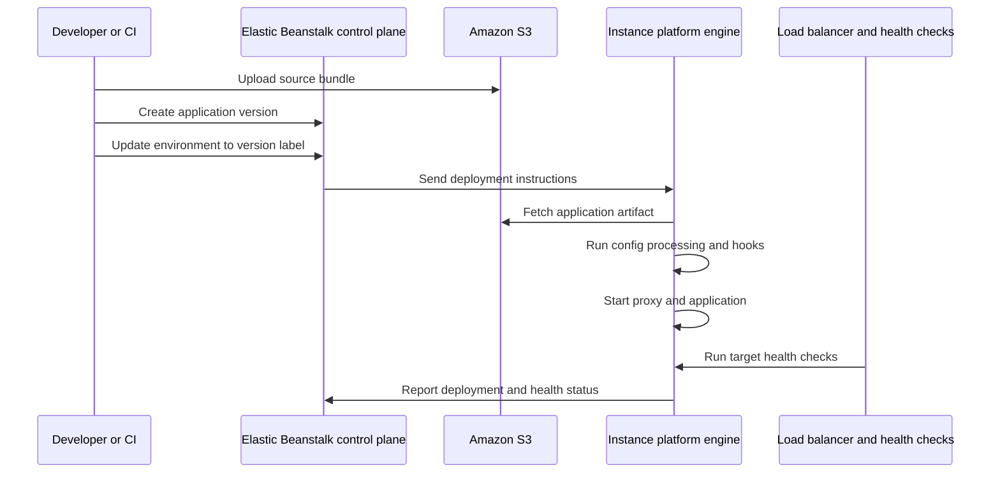
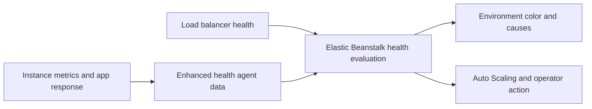

# How Elastic Beanstalk Works

AWS Elastic Beanstalk provides an application-centric control plane on top of core AWS infrastructure services.

You deploy source code as an application version, select a platform version, and Elastic Beanstalk provisions, updates, and monitors the environment resources that run that version.

## Three-Layer Operating Model

Elastic Beanstalk is easiest to reason about as three layers with different responsibilities.



| Layer | Owned by | Main responsibility | Typical artifacts |
|---|---|---|---|
| Management | Elastic Beanstalk service and operators | Environment lifecycle, deployment orchestration, configuration history | Applications, environments, saved configs, events |
| Platform | Elastic Beanstalk platform branch plus AWS infrastructure services | Instance provisioning, proxy/runtime setup, health reporting, scaling, managed updates | EC2, Auto Scaling group, load balancer, security groups, host components |
| Application | Your team | Business code, dependency set, startup behavior, secret consumption | Source bundle, Procfile, `.ebextensions`, `.platform` hooks |

## Core Resource Model

Elastic Beanstalk uses five foundational concepts:

- **Application**: Logical container for one or more environments.
- **Application Version**: Deployable build artifact, typically a source bundle in Amazon S3.
- **Environment**: Running stack of AWS resources that executes one application version.
- **Configuration Template**: Reusable set of option values for environment creation.
- **Platform Version**: Runtime and operating system definition for your environment.

## Managed AWS Services in an Environment

Elastic Beanstalk orchestrates service configuration for the environment lifecycle.

- Amazon EC2 instances for runtime execution.
- Auto Scaling groups for horizontal capacity management.
- Elastic Load Balancing for request distribution in load-balanced web environments.
- Amazon CloudWatch metrics and alarms for health and scaling signals.
- Security groups for instance and load balancer traffic boundaries.

## Architecture Overview



## Deployment Pipeline Internals

Deployment is more than copying files to instances. Elastic Beanstalk coordinates control plane state, instance-local deployment execution, and health validation.

### Deployment flow



### Example CLI flow

```bash
aws elasticbeanstalk create-application-version \
    --application-name "$APP_NAME" \
    --version-label "$VERSION_LABEL" \
    --source-bundle S3Bucket="$S3_BUCKET",S3Key="$S3_KEY"

aws elasticbeanstalk update-environment \
    --environment-name "$ENV_NAME" \
    --version-label "$VERSION_LABEL"
```

### What happens on instances

On Amazon Linux 2 and Amazon Linux 2023 based platforms, Elastic Beanstalk uses host-side platform components such as `eb-engine`, proxy configuration, deployment instructions, and platform hooks to apply the version.

Typical responsibilities include:

- Pull deployment metadata and application artifacts.
- Expand the source bundle to the expected staging and current application paths.
- Apply option settings and configuration files.
- Run `.platform/hooks` lifecycle scripts when present.
- Restart or reload proxy and application processes.
- Emit deployment logs and health-relevant signals.

## EB Agent Lifecycle and Hooks

Treat hooks as privileged lifecycle code because they execute during environment configuration and deployment.

### Hook phases

| Hook surface | When it runs | Typical use |
|---|---|---|
| `.platform/hooks/prebuild` | Before app build steps complete | OS-level prerequisites, generated config |
| `.platform/hooks/predeploy` | Before application is deployed to the live path | Validation, file preparation, migrations with caution |
| `.platform/hooks/postdeploy` | After application deploy | Cache warm-up, local verification, service reload helpers |
| `.platform/confighooks/...` | During configuration-only updates | Sync config-dependent changes without full app deploy |

Operational rules:

- Make scripts idempotent because instance replacement and retries are normal.
- Avoid assuming a single-instance environment.
- Fail fast with clear logging when a hook blocks safe startup.

## Health Monitoring System Internals

Elastic Beanstalk health is not just load balancer status. Enhanced health combines multiple signals and reports them as environment and instance health states.

### Signal sources

- Elastic Load Balancing health checks.
- EC2 instance availability.
- Application and proxy responsiveness.
- Deployment success and failure state.
- Instance-level health agent reporting.

### Health interpretation model



Health state should always be interpreted with recent environment events and deployment history. A Green environment can still hide latency or functional regressions if health checks are too shallow.

## Environment Lifecycle States to Understand

- **Launching**: Provisioning resources and applying baseline platform configuration.
- **Updating**: Applying code, configuration, or platform changes.
- **Ready**: Environment is healthy and serving as expected.
- **Terminating**: Resource cleanup in progress.

Health status is surfaced independently and should be interpreted with environment events and logs.

## Platform Update Lifecycle

Platform updates are distinct from application deployments.

1. Elastic Beanstalk selects or is instructed to use a newer platform version.
2. Instances are replaced or updated according to the deployment policy or managed update behavior.
3. New instances boot with the target platform version.
4. Application version and configuration are re-applied on the new instances.
5. Health gates determine whether old capacity is retired.

Managed platform updates use immutable-style instance replacement, which is why health readiness and startup correctness matter before the old capacity is removed.

## Configuration Surfaces

You can manage behavior through:

- Option settings in namespaces.
- Saved configurations and templates.
- Configuration files bundled with source.
- Platform-specific hooks and extension points.

!!! tip
    Treat configuration as versioned assets alongside source code.
    This reduces drift across environments and improves rollback confidence.

## Practical Design Rules

- Keep application versions immutable once published.
- Use explicit version labels that map to commit identifiers.
- Separate environment concerns by lifecycle stage, such as dev, staging, and production.
- Prefer reproducible configuration templates over ad hoc console edits.
- Treat platform updates, config updates, and code updates as separate change categories in review.

## Common Misunderstandings

- Elastic Beanstalk does not replace IAM, VPC, or service quota planning.
- Application versions are deployment inputs, not environment snapshots.
- Platform version changes and application version changes are distinct operations.
- Health Green status does not guarantee end-user latency objectives are met.
- Directly changing underlying resources can create drift from Elastic Beanstalk-managed intent.

## Validation Checklist

- Your application has at least one registered application version.
- Each environment references an intended platform version.
- Source bundle path and version label are traceable in deployment history.
- Environment events show successful provisioning and deployment transitions.
- Hook scripts and configuration assets are versioned with the application.

## See Also

- [Platform Index](./index.md)
- [Environment Tiers](./environment-tiers.md)
- [Request Lifecycle](./request-lifecycle.md)
- [Resource Relationships](./resource-relationships.md)
- [Security Architecture](./security-architecture.md)
- [Reference: EB Diagnostics](../reference/eb-diagnostics.md)

## Sources

- [Elastic Beanstalk Concepts](https://docs.aws.amazon.com/elasticbeanstalk/latest/dg/concepts.html)
- [Application Versions](https://docs.aws.amazon.com/elasticbeanstalk/latest/dg/applications-versions.html)
- [Managing Environments](https://docs.aws.amazon.com/elasticbeanstalk/latest/dg/using-features-managing-env-tiers.html)
- [Platform script tools and hooks](https://docs.aws.amazon.com/elasticbeanstalk/latest/dg/platforms-linux-extend.hooks.html)
- [Enhanced health reporting and monitoring in Elastic Beanstalk](https://docs.aws.amazon.com/elasticbeanstalk/latest/dg/health-enhanced.html)
- [Updating your Elastic Beanstalk environment's platform version](https://docs.aws.amazon.com/elasticbeanstalk/latest/dg/using-features.platform.upgrade.html)
