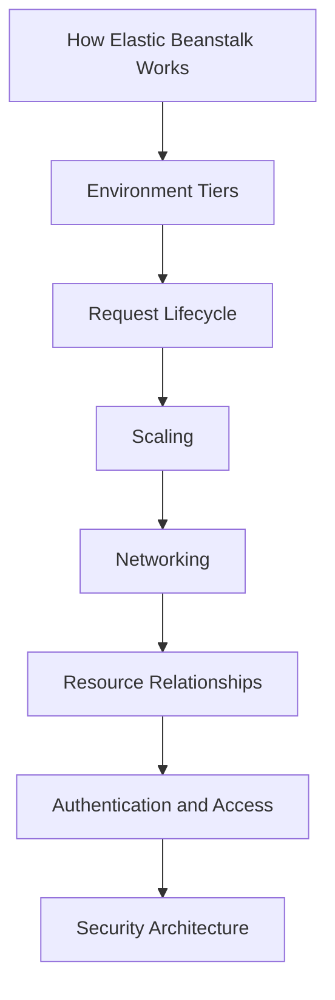

---
hide:
  - toc
---

# Platform

The Platform section explains how AWS Elastic Beanstalk works under the hood so you can make predictable architecture and operations decisions.

Read this section before tuning production environments, introducing private networking, or hardening access controls.

## What You Will Learn

- The core resource model used by Elastic Beanstalk.
- How requests flow through load balancers, EC2 instances, and the platform proxy.
- How web and worker tiers differ in runtime behavior and scaling strategy.
- How networking, IAM, and security controls compose into a production design.

## Platform Documents

| Order | Document | Description |
|---|---|---|
| 1 | [How Elastic Beanstalk Works](./how-elastic-beanstalk-works.md) | Core architecture, deployment units, managed resources, and EB agent behavior. |
| 2 | [Environment Tiers](./environment-tiers.md) | Web Server vs Worker tier architecture, message flow, and tier selection criteria. |
| 3 | [Request Lifecycle](./request-lifecycle.md) | End-to-end request path, health checks, timeout chain, and worker delivery model. |
| 4 | [Scaling](./scaling.md) | Auto Scaling behavior, triggers, scheduled scaling, and scaling configuration examples. |
| 5 | [Networking](./networking.md) | VPC design, subnet placement, load balancer choices, and outbound access patterns. |
| 6 | [Resource Relationships](./resource-relationships.md) | Service integrations across RDS, S3, CloudWatch, SNS, SQS, and IAM. |
| 7 | [Authentication and Access](./authentication-and-access.md) | Service role, instance profile, policies, service-linked roles, and tag-based controls. |
| 8 | [Security Architecture](./security-architecture.md) | Network isolation, encryption, updates, TLS termination models, and shared responsibility. |

## Recommended Reading Path

## Study Approach

1. Build a baseline mental model with the first three documents.
2. Add operational controls with scaling and networking.
3. Complete governance and risk controls with IAM and security architecture.

## Suggested Lab Sequence

- Deploy one web environment and inspect generated AWS resources.
- Add a worker environment and connect an Amazon SQS queue.
- Move web instances into private subnets and validate outbound traffic through NAT.
- Apply managed platform updates and validate health state transitions.

!!! note
    The platform pages focus on documented AWS behavior.
    Keep your own account defaults, quotas, and organization guardrails in scope when applying these patterns.

## Key Design Questions to Carry Through the Section

- Which tier model maps to your workload execution pattern?
- Where should TLS terminate, and where is encryption still required internally?
- Which scaling metric best represents user impact for your workload?
- Which IAM role should own each permission boundary?
- Which dependencies should be coupled to an environment versus externalized?

## Fast Navigation

- [How Elastic Beanstalk Works](./how-elastic-beanstalk-works.md)
- [Environment Tiers](./environment-tiers.md)
- [Request Lifecycle](./request-lifecycle.md)
- [Scaling](./scaling.md)
- [Networking](./networking.md)
- [Resource Relationships](./resource-relationships.md)
- [Authentication and Access](./authentication-and-access.md)
- [Security Architecture](./security-architecture.md)

## Operational Context

Elastic Beanstalk is an orchestration layer over core AWS services.

That means most production outcomes depend on:

- Elastic Beanstalk configuration options,
- underlying service constraints,
- and account-level security and networking posture.

Use this section to connect those layers before implementing advanced best practices.

## Typical Failure Modes Prevented by This Section

- Misaligned timeout values that produce intermittent 5xx behavior.
- Private subnet environments without valid outbound dependency paths.
- Overly broad IAM permissions on instance profiles.
- Health model misunderstanding during rolling or immutable updates.
- Incorrect tier choice for asynchronous workloads.

## See Also

- [Guide Home](../index.md)
- [Start Here Overview](../start-here/overview.md)
- [Best Practices](../best-practices/index.md)
- [Operations](../operations/index.md)

## Sources

- [AWS Elastic Beanstalk Developer Guide](https://docs.aws.amazon.com/elasticbeanstalk/latest/dg/Welcome.html)
- [Concepts](https://docs.aws.amazon.com/elasticbeanstalk/latest/dg/concepts.html)
- [Environment Tiers](https://docs.aws.amazon.com/elasticbeanstalk/latest/dg/concepts-tier.html)
- [VPC Configuration](https://docs.aws.amazon.com/elasticbeanstalk/latest/dg/vpc.html)
- [Security in Elastic Beanstalk](https://docs.aws.amazon.com/elasticbeanstalk/latest/dg/security.html)
