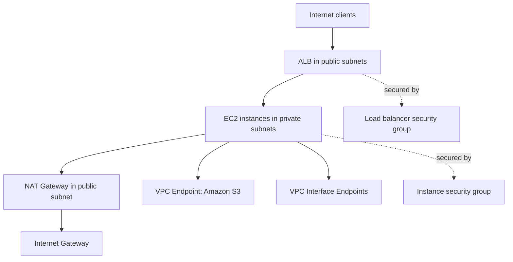

# Networking

Elastic Beanstalk environments run inside your Amazon VPC, where subnet design and security controls determine exposure, connectivity, and operational resilience.

This page explains public and private subnet patterns, load balancer choices, and outbound connectivity options.

## VPC Placement Model

You can place environment components across subnet tiers:

- Public subnets for internet-facing load balancers.
- Private subnets for application EC2 instances.
- Route tables that enforce controlled egress.

A common production baseline is internet-facing load balancer in public subnets and instances in private subnets.

## Public vs Private Subnets

| Component | Public Subnet | Private Subnet |
|---|---|---|
| Internet-facing ALB/NLB | Typical | Not typical |
| Application EC2 instances | Possible but less isolated | Recommended for production isolation |
| Internet gateway route | Direct | None |
| NAT gateway dependency for egress | Not required for direct egress | Required for public internet egress |

## Load Balancer Options

Elastic Beanstalk supports different load balancer types by platform capabilities and environment settings.

- **Application Load Balancer (ALB)** for Layer 7 HTTP/HTTPS routing.
- **Network Load Balancer (NLB)** for high-performance Layer 4 use cases.
- **Classic Load Balancer (CLB)** in legacy scenarios.

Choice depends on protocol requirements, routing controls, and operational constraints.

## Security Groups

Security groups enforce stateful traffic rules for:

- Load balancer ingress from clients.
- Instance ingress from load balancer security groups.
- Controlled egress to dependencies.

Prefer security group referencing between tiers rather than broad CIDR exposure.

## NAT Gateway for Private Instances

Private instances often require outbound access for:

- Package retrieval during deployment.
- Accessing AWS APIs over public endpoints.
- Reaching external services that do not support private connectivity.

NAT gateways in public subnets provide this path while keeping instances non-public.

## VPC Endpoints

Use VPC endpoints where available to reduce public internet dependency.

- Gateway endpoints for Amazon S3 and Amazon DynamoDB.
- Interface endpoints for many AWS APIs.

This can improve security posture and reduce reliance on NAT for AWS service access.

## Reference Network Architecture



## Configuration Steps to Plan

1. Select VPC and availability zones.
2. Assign load balancer subnets.
3. Assign instance subnets.
4. Define security groups for each tier.
5. Configure NAT and route tables for private egress.
6. Add VPC endpoints for required AWS services.

## CLI Example: Update Environment with VPC and Subnet Settings

```bash
aws elasticbeanstalk update-environment \
  --environment-name "$ENV_NAME" \
  --option-settings Namespace=aws:ec2:vpc,OptionName=VPCId,Value="$VPC_ID" \
                   Namespace=aws:ec2:vpc,OptionName=Subnets,Value="$PRIVATE_SUBNET_IDS" \
                   Namespace=aws:ec2:vpc,OptionName=ELBSubnets,Value="$PUBLIC_SUBNET_IDS" \
                   Namespace=aws:ec2:vpc,OptionName=AssociatePublicIpAddress,Value=false
```

## Operational Validation

- Confirm load balancer is reachable on intended listeners.
- Confirm instances are not publicly addressable when private design is intended.
- Verify outbound dependency access from private instances.
- Validate security group rules are least privilege.
- Inspect route tables for each subnet role.

!!! warning
    If instances run in private subnets without NAT or required VPC endpoints,
    deployments and runtime calls to dependencies can fail even when health checks look normal.

## Networking Failure Patterns

- Health check path accessible but application dependency unreachable.
- Security group mismatch between load balancer and instances.
- Incorrect subnet assignment causing cross-zone imbalance.
- Missing route entries for NAT or gateway endpoint paths.

## See Also

- [Request Lifecycle](./request-lifecycle.md)
- [Scaling](./scaling.md)
- [Security Architecture](./security-architecture.md)
- [Best Practices Networking](../best-practices/networking.md)

## Sources

- [Using Elastic Beanstalk with Amazon VPC](https://docs.aws.amazon.com/elasticbeanstalk/latest/dg/vpc.html)
- [Configuring Load Balancer for Your Elastic Beanstalk Environment](https://docs.aws.amazon.com/elasticbeanstalk/latest/dg/environments-cfg-alb.html)
- [Instance Security in Elastic Beanstalk](https://docs.aws.amazon.com/elasticbeanstalk/latest/dg/using-features.security.html)
