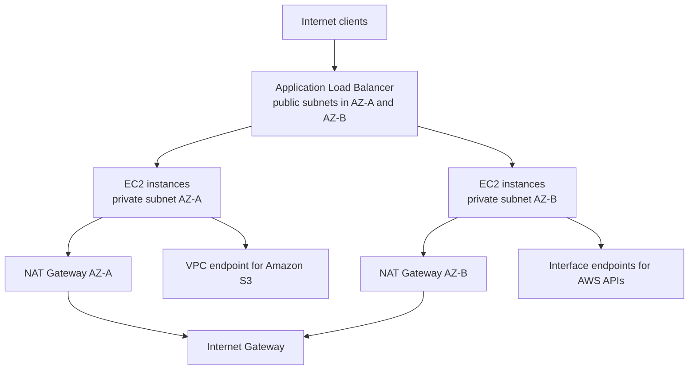
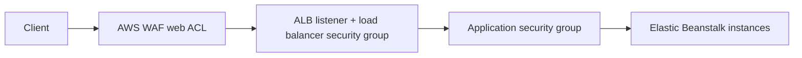

---
hide:
  - toc
---

# Networking

Elastic Beanstalk environments run inside your Amazon VPC, where subnet design, ingress filtering, egress paths, and Availability Zone placement determine exposure, connectivity, and operational resilience.

This page explains production VPC architecture patterns, inbound and outbound controls, private deployment designs, and network topology choices for Elastic Beanstalk web environments.

## VPC Placement Model

You can place environment components across subnet tiers:

- Public subnets for internet-facing load balancers.
- Private subnets for application EC2 instances.
- Separate route tables that enforce controlled ingress and egress.
- Multiple Availability Zones for load balancer and instance placement.

A common production baseline is an internet-facing load balancer in public subnets with instances in private subnets.

## Three Common VPC Architecture Patterns

| Pattern | Load balancer | Instances | Typical use | Main trade-off |
|---|---|---|---|---|
| Public web tier | Public subnets | Public or private subnets | Simple development or low-control environments | Larger attack surface |
| Public ALB + private app tier | Public subnets | Private subnets | Standard production web apps | Requires NAT or endpoints for outbound access |
| Internal-only environment | Internal load balancer or no public LB | Private subnets | Private APIs, internal tools, east-west services | Requires private client connectivity path |

## Network Topology Reference



This topology separates ingress from application runtime, preserves cross-AZ resilience, and lets you remove unnecessary public IP exposure from instances.

## Public vs Private Subnets

| Component | Public subnet | Private subnet |
|---|---|---|
| Internet-facing ALB/NLB | Typical | Not typical |
| Internal load balancer | Optional | Possible depending on design |
| Application EC2 instances | Possible but less isolated | Recommended for production isolation |
| Internet gateway route | Direct | None |
| NAT gateway dependency for public internet egress | Not required for direct egress | Required unless VPC endpoints cover dependencies |

## Inbound Controls

Ingress should be explicitly layered.

### Load balancer choices

Elastic Beanstalk supports different load balancer types by platform capabilities and environment settings.

- **Application Load Balancer (ALB)** for Layer 7 HTTP/HTTPS routing, host/path rules, and most web applications.
- **Network Load Balancer (NLB)** for Layer 4 TCP/TLS use cases.
- **Classic Load Balancer (CLB)** for legacy environments.

Choice depends on protocol requirements, health check behavior, and operational constraints.

### Security groups and listener exposure

Security groups enforce stateful traffic rules for:

- Load balancer ingress from clients.
- Instance ingress from load balancer security groups.
- Controlled administrative access.
- Egress to required dependencies.

Prefer security group references between tiers rather than broad CIDR exposure.

### AWS WAF at the edge

For ALB-based environments, AWS WAF can provide an additional inbound filtering layer for common web attack patterns. Treat it as a perimeter control in front of the load balancer, while keeping security group and application validation in place.



## Outbound Controls

Outbound connectivity matters because deployments, package installation, secret retrieval, logging, and downstream service access all depend on it.

### NAT Gateway patterns

Private instances often require outbound access for:

- Package retrieval during deployment.
- Accessing AWS APIs over public endpoints.
- Reaching external services that do not support private connectivity.

NAT gateways in public subnets provide this path while keeping instances non-public. For multi-AZ resilience, place one NAT Gateway per Availability Zone and keep private subnets routed to the same-AZ NAT where possible.

### VPC endpoints

Use VPC endpoints where available to reduce public internet dependency.

- Gateway endpoints for Amazon S3 and Amazon DynamoDB.
- Interface endpoints for many AWS APIs.

This improves security posture and can reduce NAT dependency for AWS service access.

## Private Deployment Patterns

### Internet-facing application with private instances

This is the most common production design:

1. Public ALB in at least two public subnets.
2. EC2 instances in private subnets.
3. NAT Gateway or endpoints for outbound package and API access.
4. Security groups that allow only ALB-to-instance ingress.

### Internal application pattern

Use an internal load balancer or internal-only topology when clients connect through private networks such as corporate connectivity, VPN, or peered VPC paths.

### Fully private dependency path

When compliance or egress controls require minimal internet access:

- Use private instances.
- Add Amazon S3 gateway endpoint for artifacts when applicable.
- Add interface endpoints for required AWS APIs.
- Minimize or eliminate NAT-based traffic.

## Cross-AZ Networking Considerations

Elastic Beanstalk relies on the subnet set you provide. Cross-AZ behavior is only as resilient as the subnets, route tables, and egress paths you assign.

Design rules:

- Put the load balancer in at least two subnets across different Availability Zones.
- Put Auto Scaling instance subnets in multiple Availability Zones.
- Keep security groups symmetric so replacement instances can launch without manual edits.
- Avoid a single NAT Gateway serving all private subnets if zone isolation matters.

## Configuration Steps to Plan

1. Select VPC and Availability Zones.
2. Assign load balancer subnets.
3. Assign instance subnets.
4. Define security groups for each tier.
5. Configure NAT and route tables for private egress.
6. Add VPC endpoints for required AWS services.
7. Validate load balancer scheme, listeners, and health check path.

## CLI Example: Update Environment with VPC and Subnet Settings

```bash
aws elasticbeanstalk update-environment \
    --environment-name "$ENV_NAME" \
    --option-settings Namespace=aws:ec2:vpc,OptionName=VPCId,Value="$VPC_ID" \
    Namespace=aws:ec2:vpc,OptionName=Subnets,Value="$PRIVATE_SUBNET_IDS" \
    Namespace=aws:ec2:vpc,OptionName=ELBSubnets,Value="$PUBLIC_SUBNET_IDS" \
    Namespace=aws:ec2:vpc,OptionName=AssociatePublicIpAddress,Value=false
```

## Operational Validation

- Confirm load balancer is reachable on intended listeners.
- Confirm instances are not publicly addressable when private design is intended.
- Verify outbound dependency access from private instances.
- Validate security group rules are least privilege.
- Inspect route tables for each subnet role.
- Confirm target groups register healthy instances across Availability Zones.

!!! warning
    If instances run in private subnets without NAT or required VPC endpoints,
    deployments and runtime calls to dependencies can fail even when health checks look normal.

## Networking Failure Patterns

- Health check path accessible but application dependency unreachable.
- Security group mismatch between load balancer and instances.
- Incorrect subnet assignment causing cross-zone imbalance.
- Missing route entries for NAT or gateway endpoint paths.
- Single-AZ egress design that fails during Availability Zone disruption.

## See Also

- [Request Lifecycle](./request-lifecycle.md)
- [Scaling](./scaling.md)
- [Security Architecture](./security-architecture.md)
- [Operations: Networking](../operations/networking.md)
- [Best Practices Networking](../best-practices/networking.md)
- [Troubleshooting: VPC Connectivity Issues](../troubleshooting/playbooks/networking/vpc-connectivity-issues.md)

## Sources

- [Using Elastic Beanstalk with Amazon VPC](https://docs.aws.amazon.com/elasticbeanstalk/latest/dg/vpc.html)
- [Configuring Load Balancer for Your Elastic Beanstalk Environment](https://docs.aws.amazon.com/elasticbeanstalk/latest/dg/environments-cfg-alb.html)
- [Instance Security in Elastic Beanstalk](https://docs.aws.amazon.com/elasticbeanstalk/latest/dg/using-features.security.html)
- [Application Load Balancers](https://docs.aws.amazon.com/elasticloadbalancing/latest/application/introduction.html)
- [What is Amazon VPC?](https://docs.aws.amazon.com/vpc/latest/userguide/what-is-amazon-vpc.html)
- [Access AWS services through AWS PrivateLink](https://docs.aws.amazon.com/vpc/latest/privatelink/what-is-privatelink.html)
