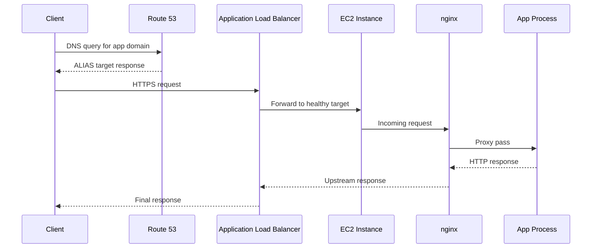
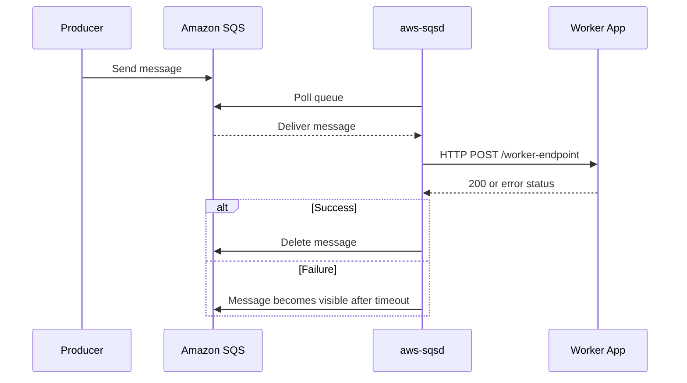

# Request Lifecycle

Understanding request lifecycle is essential for diagnosing latency, 5xx errors, and health transitions in Elastic Beanstalk environments.

This page covers both web request flow and worker message delivery flow.

## End-to-End Web Request Path

Typical path in a web server environment:

1. Client resolves DNS and connects to your domain.
2. Amazon Route 53 routes DNS lookup to the environment load balancer.
3. Load balancer accepts the connection and selects a healthy target.
4. Target EC2 instance receives traffic on listener target port.
5. Platform proxy such as nginx forwards request to the app process.
6. App returns response through proxy and load balancer to client.



## Health Check Flow

Health evaluation uses both infrastructure and application signals.

- Load balancer performs target health checks on configured path and port.
- Elastic Beanstalk aggregates health and event data.
- Environment health color and status update with observed behavior.

When health checks fail consistently:

- Targets can be marked unhealthy by the load balancer.
- Traffic routing shifts away from failing instances.
- Auto Scaling may replace impaired instances depending on policy and lifecycle state.

## Timeout Chain and Why It Matters

Multiple timeout layers govern a single request lifecycle.

- Load balancer idle timeout.
- Proxy timeout on instance.
- Application server request or worker timeout.
- Downstream dependency timeouts.

If timeouts are misaligned, you can see:

- Client-side disconnects before application completion.
- 502 or 504 style responses depending on where timeout is triggered.
- Retries amplifying load under partial failure.

### Practical Timeout Alignment Pattern

1. Set application timeout as lowest boundary that still meets workload requirements.
2. Set proxy timeout above application timeout.
3. Set load balancer idle timeout above proxy timeout.
4. Keep client timeout higher than load balancer timeout where feasible.

## Worker Tier Lifecycle

Worker environments handle asynchronous messages via `aws-sqsd`.

1. Producer writes message to SQS queue.
2. `aws-sqsd` polls queue and retrieves message.
3. `aws-sqsd` sends HTTP POST to local application endpoint.
4. Application processes payload and returns HTTP status.
5. Success deletes message; failure enables retry based on queue behavior.



## Common Lifecycle Breakpoints

- DNS alias points to wrong target.
- Listener or target group mismatch.
- Proxy cannot connect to app process port.
- Application path for health check returns error.
- Dependency latency exceeds timeout chain.
- Worker endpoint returns non-success status repeatedly.

## Debug Sequence During Incident

1. Confirm DNS resolution and certificate validity.
2. Check load balancer target health and health check path.
3. Verify proxy and app process are listening on expected port.
4. Compare configured timeout boundaries.
5. Inspect environment events and instance logs.

!!! warning
    Avoid changing multiple timeout layers simultaneously during an incident.
    Change one boundary at a time and observe impact to isolate the true bottleneck.

## Example CLI Commands for Inspection

```bash
aws elasticbeanstalk describe-environments \
  --application-name "$APP_NAME" \
  --environment-names "$ENV_NAME"

aws elasticbeanstalk describe-environment-health \
  --environment-name "$ENV_NAME" \
  --attribute-names Status HealthStatus Causes
```

## See Also

- [Environment Tiers](./environment-tiers.md)
- [Scaling](./scaling.md)
- [Networking](./networking.md)
- [Troubleshooting Architecture Overview](../troubleshooting/architecture-overview.md)

## Sources

- [Web Server Environments](https://docs.aws.amazon.com/elasticbeanstalk/latest/dg/concepts-webserver.html)
- [Health Monitoring and Reporting](https://docs.aws.amazon.com/elasticbeanstalk/latest/dg/health-enhanced.html)
- [Environment Tiers](https://docs.aws.amazon.com/elasticbeanstalk/latest/dg/concepts-tier.html)
