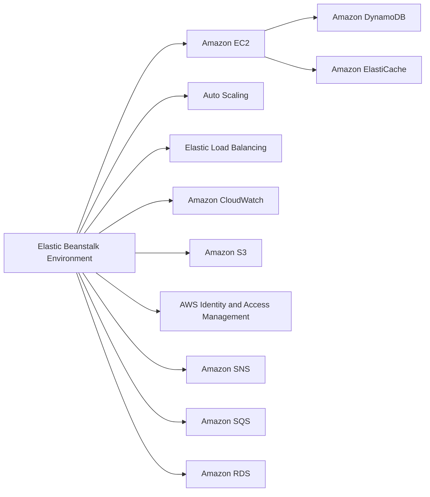

---
hide:
  - toc
---

# Resource Relationships

Elastic Beanstalk environments interact with multiple AWS services.

Understanding these relationships helps you decide which resources should be environment-coupled and which should be managed independently.

## Integrated Service Map



## Amazon RDS: Coupled vs Decoupled

Elastic Beanstalk can provision an RDS DB instance as part of environment creation, or you can use an external RDS resource.

| Model | Characteristics | Typical Use |
|---|---|---|
| Coupled RDS | Lifecycle linked to environment operations. | Development and short-lived testing environments. |
| Decoupled RDS | Database managed separately from environment lifecycle. | Production workloads requiring independent backup, upgrade, and retention control. |

Production systems usually prefer decoupled data layers.

## Amazon ElastiCache

ElastiCache is typically integrated as an external dependency.

- Improves read latency for frequently requested data.
- Reduces repeated database load.
- Requires VPC networking and security group planning.

## Amazon S3

Elastic Beanstalk uses Amazon S3 for several control-plane artifacts:

- Source bundles for application versions.
- Stored logs and rotated log bundles.
- Service-managed assets for deployment workflows.

Treat bucket lifecycle, retention, and encryption as part of platform governance.

## Amazon CloudWatch

CloudWatch provides metrics, alarms, and log integration points used by Elastic Beanstalk.

- Environment health and scaling depend on CloudWatch signals.
- Alarm thresholds drive Auto Scaling policies.
- Log forwarding and metric dashboards support operations and troubleshooting.

## IAM Roles and Profiles

Elastic Beanstalk relies on IAM roles for service orchestration and instance-level access.

- Service role allows Elastic Beanstalk to call AWS APIs on your behalf.
- Instance profile grants EC2 runtime permissions for application dependencies.
- Policy scoping controls blast radius for misconfiguration.

## SNS and SQS in Operations

- Amazon SNS can deliver environment notifications.
- Amazon SQS is central for worker tier asynchronous processing.
- Event-driven architectures often combine SNS fan-out and SQS buffering.

## Amazon DynamoDB Usage Pattern

DynamoDB is often consumed as an external application data service.

- Low-latency key-value workloads.
- Independent scaling model from environment EC2 capacity.
- IAM permissions and network access must still be configured appropriately.

## Relationship Boundaries

Classify each dependency:

- **Provisioned by Elastic Beanstalk**: Compute, scaling, load balancing baseline.
- **Attached by configuration**: Queue, notification, environment variables.
- **External shared service**: Databases, caches, data stores, event buses.

This classification supports safer deployment and teardown behavior.

!!! note
    Environment termination affects environment-managed resources.
    Externalized shared services should be managed with independent lifecycle controls.

## Dependency Design Checklist

- Is the resource disposable with the environment?
- Is data persistence required across environment rebuilds?
- Does the resource require independent scaling and patch windows?
- Is shared access needed by multiple environments or services?
- Are IAM permissions scoped to least privilege for each integration?

## Example CLI: Describe Environment Resources

```bash
aws elasticbeanstalk describe-environment-resources \
  --environment-name "$ENV_NAME"
```

Use this output to verify which resources are associated with an environment at runtime.

## See Also

- [How Elastic Beanstalk Works](./how-elastic-beanstalk-works.md)
- [Networking](./networking.md)
- [Authentication and Access](./authentication-and-access.md)
- [Security Architecture](./security-architecture.md)

## Sources

- [Using AWS Services with Elastic Beanstalk](https://docs.aws.amazon.com/elasticbeanstalk/latest/dg/AWSHowTo.html)
- [Environment Resources](https://docs.aws.amazon.com/elasticbeanstalk/latest/dg/using-features.managing.html)
- [Using Elastic Beanstalk with Amazon RDS](https://docs.aws.amazon.com/elasticbeanstalk/latest/dg/AWSHowTo.RDS.html)
