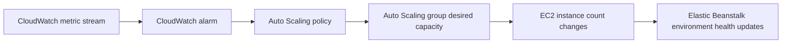

# Scaling

Elastic Beanstalk uses Amazon EC2 Auto Scaling to adjust capacity in response to demand and policy settings.

You control scaling behavior through environment configuration, CloudWatch alarm triggers, scheduled actions, and instance type selection.

## Scaling Building Blocks

- **Auto Scaling group**: Owns minimum, maximum, and desired instance count.
- **Scaling triggers**: CloudWatch metrics and thresholds that drive scale actions.
- **Cooldown and breach duration**: Guardrails to reduce oscillation.
- **Scheduled scaling**: Time-based capacity changes for predictable traffic windows.
- **Instance type selection**: Vertical capacity per instance.

## Scale Up vs Scale Out

| Strategy | Description | Typical Use |
|---|---|---|
| Scale up | Increase per-instance resources by choosing larger instance types. | CPU or memory constrained workload with low horizontal fan-out efficiency. |
| Scale out | Increase instance count in Auto Scaling group. | Stateless web workloads with increasing concurrent requests. |

Most production systems use scale out first, then scale up when workload characteristics require it.

## Common Trigger Metrics

Elastic Beanstalk documentation highlights metrics frequently used for policies:

- `CPUUtilization`
- `NetworkIn`
- `NetworkOut`
- `Latency`
- `RequestCount` or workload-specific alternatives through CloudWatch integration

Metric choice should align with user impact and bottleneck location.

## Scaling Control Flow



## Baseline Capacity Planning Inputs

- Minimum instances required for fault tolerance.
- Maximum instances permitted by budget and quotas.
- Instance warm-up behavior for your runtime.
- Deployment policy interaction with scaling windows.
- Dependency limits such as database connection ceilings.

## Time-Based Scaling

Use scheduled actions when demand is predictable:

- Business-hour traffic ramps.
- Batch processing windows.
- Regional peak patterns by timezone.

Scheduled actions reduce lag compared with purely reactive metric-triggered scaling.

## CLI Example: Configure Auto Scaling Option Settings

```bash
aws elasticbeanstalk update-environment \
  --environment-name "$ENV_NAME" \
  --option-settings Namespace=aws:autoscaling:asg,OptionName=MinSize,Value=2 \
                   Namespace=aws:autoscaling:asg,OptionName=MaxSize,Value=8 \
                   Namespace=aws:autoscaling:launchconfiguration,OptionName=InstanceType,Value=t3.small
```

## CLI Example: Add a Time-Based Scheduled Action

```bash
aws elasticbeanstalk update-environment \
  --environment-name "$ENV_NAME" \
  --option-settings Namespace=aws:autoscaling:scheduledaction,OptionName=StartTime,Value="2026-04-06T08:00:00Z" \
                   Namespace=aws:autoscaling:scheduledaction,OptionName=MinSize,Value=4 \
                   Namespace=aws:autoscaling:scheduledaction,OptionName=MaxSize,Value=12
```

## Interpreting Scaling Events

Review environment events with metric context.

- Frequent scale in and scale out cycles usually indicate threshold mismatch.
- Scaling without latency improvement may indicate downstream bottlenecks.
- Health degradation during rapid scale out can point to initialization issues.

## Guardrails to Prevent Thrashing

- Choose realistic metric periods and breach durations.
- Set cooldowns according to application warm-up time.
- Keep minimum capacity above single-instance risk where required.
- Validate target tracking or threshold behavior under load tests.

!!! tip
    Treat scaling policy as a performance control loop.
    Pair any threshold change with a test scenario and rollback criteria.

## Instance Type Considerations

- CPU-optimized families for compute-heavy services.
- Balanced families for mixed web workloads.
- Memory-optimized choices for in-memory caches and heavy object graphs.
- Network throughput limits can dominate performance before CPU saturation.

## Scale Validation Checklist

- CloudWatch metrics reflect intended pressure signals.
- Alarm thresholds match realistic operating ranges.
- Minimum and maximum values match availability and budget goals.
- Environment events confirm expected scale behavior.
- User-facing latency and error rates improve during demand changes.

## See Also

- [Request Lifecycle](./request-lifecycle.md)
- [Networking](./networking.md)
- [Operations Scaling](../operations/scaling.md)
- [Best Practices Scaling](../best-practices/scaling.md)

## Sources

- [Configuring Autoscaling in Elastic Beanstalk](https://docs.aws.amazon.com/elasticbeanstalk/latest/dg/using-features.managing.as.html)
- [Scaling Your Elastic Beanstalk Environment](https://docs.aws.amazon.com/elasticbeanstalk/latest/dg/environments-cfg-autoscaling.html)
- [Enhanced Health Reporting](https://docs.aws.amazon.com/elasticbeanstalk/latest/dg/health-enhanced.html)
