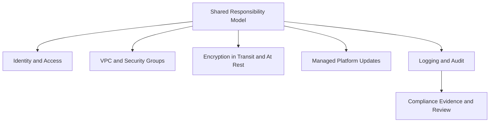

# Security Architecture

Security architecture for AWS Elastic Beanstalk is a layered system spanning IAM, networking, encryption, patching, and continuous verification. Strong results come from composing these controls rather than relying on one feature.

This page maps Elastic Beanstalk security responsibilities and control patterns to production design decisions.

## Main Content

### Security Control Stack



### Shared Responsibility Model for Elastic Beanstalk

Elastic Beanstalk follows the AWS shared responsibility model:

- AWS secures facilities, hardware, virtualization, and managed service control plane.
- You secure IAM configuration, application code, dependency posture, network boundaries, and data classification handling.

For platform operations, this means your team owns:

- Environment option settings and runtime behavior.
- Credential and secret usage patterns in application code.
- Validation that controls remain correct after updates and scaling changes.

### Data Encryption in Transit

Use TLS for all client-to-application paths and evaluate whether backend re-encryption is required by policy.

Common patterns:

- HTTPS termination at the load balancer with ACM-managed certificates.
- HTTP-to-HTTPS redirect at the load balancer layer.
- Optional TLS between load balancer and instances for end-to-end encryption.

| Pattern | Typical Use | Trade-off |
|---|---|---|
| Edge TLS termination | Standard web workloads | Simpler operations, lower backend overhead |
| End-to-end TLS | Higher assurance environments | More certificate and operational complexity |

### Data Encryption at Rest

At-rest encryption is configured at each dependent service and storage layer.

Security baseline:

- Encrypt data stores attached to workloads, such as relational databases.
- Encrypt deployment artifact buckets and log destinations.
- Use controlled key management strategy aligned with organizational policy.

Elastic Beanstalk simplifies orchestration, but it does not remove workload ownership of service-level encryption settings.

### VPC Isolation Model

Network isolation is a primary security boundary.

Recommended architecture:

- Load balancer in public subnets.
- Application instances in private subnets.
- Route tables and egress controls that limit unnecessary internet paths.
- VPC endpoints for supported AWS service access to reduce internet dependency.

### Security Group Architecture

Security groups should reflect explicit trust relationships:

- Internet ingress only to intended load balancer listeners.
- Instance ingress only from load balancer security groups where possible.
- Egress limited to required dependencies.

Avoid broad CIDR ingress when security group referencing is possible.

### Managed Platform Updates and Security Patches

Managed platform updates reduce vulnerability exposure in OS and platform components.

Operating model:

1. Enable managed updates with defined maintenance windows.
2. Validate health and application behavior after each update event.
3. Keep rollback and incident response paths documented.

### Compliance Considerations

Elastic Beanstalk can support regulated workloads when controls are documented and continuously verified.

Compliance-oriented practices:

- Keep auditable IAM role separation for service, instance, and operator access.
- Retain logs and API audit trails for change evidence.
- Document encryption decisions and certificate lifecycle ownership.
- Align patching cadence with internal control requirements.

### Security Validation Commands

Use AWS CLI checks to review resources and settings during security reviews.

```bash
aws elasticbeanstalk describe-environment-resources \
    --environment-name "$ENV_NAME"
```

```bash
aws elasticbeanstalk describe-configuration-settings \
    --application-name "$APP_NAME" \
    --environment-name "$ENV_NAME"
```

!!! note
    Security design is a continuous process.
    Revalidate controls after deployment policy changes, scale events, platform updates, and dependency additions.

## Advanced Topics

### Threat Modeling by Environment Tier

Web-tier and worker-tier environments can have different threat exposure.

Review per tier:

- External attack surface and ingress requirements.
- Credential scope needed by runtime processes.
- Data egress controls and dependency trust boundaries.

### Detective Controls and Response Coupling

Detection should map directly to response actions.

Minimum expectations:

- CloudWatch alarms tied to runbooks.
- Elastic Beanstalk event monitoring for failed updates and health regression.
- CloudTrail analysis for privileged API activity.

### Security Review Cadence

Implement recurring review checkpoints:

- Monthly: IAM policy and security group review.
- Quarterly: patch strategy and platform currency review.
- After major release: architecture and compliance evidence refresh.

## See Also

- [Authentication and Access](./authentication-and-access.md)
- [Networking](./networking.md)
- [Best Practices Security](../best-practices/security.md)
- [Operations Security](../operations/security.md)

## Sources

- [Security in Elastic Beanstalk](https://docs.aws.amazon.com/elasticbeanstalk/latest/dg/security.html)
- [Using Elastic Beanstalk with Amazon VPC](https://docs.aws.amazon.com/elasticbeanstalk/latest/dg/vpc.html)
- [Configuring HTTPS for Your Elastic Beanstalk Environment](https://docs.aws.amazon.com/elasticbeanstalk/latest/dg/configuring-https.html)
- [Managed Platform Updates](https://docs.aws.amazon.com/elasticbeanstalk/latest/dg/environment-platform-update-managed.html)
- [AWS Shared Responsibility Model](https://docs.aws.amazon.com/whitepapers/latest/aws-risk-and-compliance/shared-responsibility-model.html)
