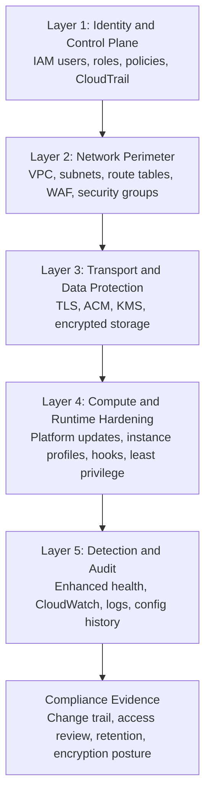
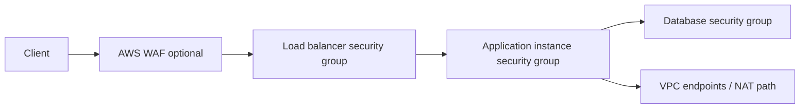

# Security Architecture

Security architecture for AWS Elastic Beanstalk is a layered system spanning IAM, networking, encryption, patching, secret distribution, and continuous verification. Strong results come from composing these controls so that a single failure does not expose the environment.

This page maps Elastic Beanstalk security responsibilities and control patterns to production design decisions for internet-facing and private environments.

## Defense-in-Depth Model



Each layer should assume the previous layer can fail:

- IAM limits who can change the environment.
- Network boundaries limit who can reach it.
- Encryption protects data even if traffic or storage is exposed.
- Runtime hardening constrains what instances can do.
- Detection and audit provide evidence and response triggers.

## Shared Responsibility Model for Elastic Beanstalk

Elastic Beanstalk follows the AWS shared responsibility model:

- AWS secures facilities, hardware, networking infrastructure, virtualization, and the Elastic Beanstalk managed control plane.
- You secure IAM configuration, application code, package dependencies, secret handling, VPC boundaries, load balancer exposure, and connected data services.

For platform operations, your team owns:

- Environment option settings and runtime behavior.
- Credential and secret usage patterns in application code.
- Validation that controls remain correct after deployments, scaling events, and platform updates.
- Evidence collection for audit, such as who changed the environment and when.

## Layer 1: Identity and Access

Identity is the first boundary because almost every Elastic Beanstalk action is an API-driven change. Split duties so that no single role owns every path.

### IAM role model

| Role type | Used by | Typical purpose | Security focus |
|---|---|---|---|
| Service role | Elastic Beanstalk service | Manage environment resources, health, managed updates | Restrict to required service actions and `iam:PassRole` paths |
| EC2 instance profile | Environment instances | Pull artifacts, write logs, call AWS APIs at runtime | Grant only workload-specific service access |
| Human operator role | Platform engineers, SREs | Create, update, swap, terminate, inspect environments | Enforce MFA, approval flow, least privilege |
| CI/CD role | Pipelines | Publish application versions and deploy tested artifacts | Separate build permissions from runtime permissions |

### IAM breakdown

Use different policy scopes for different change planes:

- **Environment lifecycle**: `elasticbeanstalk:CreateEnvironment`, `UpdateEnvironment`, `TerminateEnvironment`, `SwapEnvironmentCNAMEs`
- **Artifact lifecycle**: `elasticbeanstalk:CreateApplicationVersion`, Amazon S3 access to artifact bucket, and AWS KMS access if encryption is enabled
- **Role passing**: `iam:PassRole` only for approved service roles and instance profiles
- **Runtime service access**: instance profile permissions to databases, queues, secrets, or parameter stores that the application actually needs

IAM design rules:

1. Do not reuse broad administrator roles for routine deployments.
2. Keep the instance profile narrower than the operator role.
3. Prefer resource-scoped policies for specific applications and environments when practical.
4. Review trust policies as carefully as permissions policies.

## Layer 2: Network Perimeter and East-West Control

Network isolation is the primary runtime security boundary for Elastic Beanstalk.

### Recommended VPC isolation model

- Load balancer in public subnets when the application is internet-facing.
- EC2 instances in private subnets.
- Separate route tables for load balancer and application tiers.
- Outbound internet access through NAT Gateway only when required.
- VPC endpoints for AWS service access such as Amazon S3 to reduce internet dependency.

### Security group architecture

Security groups should express explicit trust relationships:

- Internet ingress only to intended load balancer listeners.
- Instance ingress only from the load balancer security group where possible.
- Administrative access limited to approved management paths.
- Egress limited to required destinations and ports.



Avoid broad CIDR ingress when security group referencing is possible. If you add AWS WAF in front of an Application Load Balancer, treat it as an additional filter, not a replacement for security groups.

## Layer 3: Encryption in Transit and at Rest

### Data encryption in transit

Use TLS for all client-to-application paths and evaluate whether backend re-encryption is required by policy.

Common patterns:

- HTTPS termination at the load balancer with ACM-managed certificates.
- HTTP-to-HTTPS redirect at the load balancer layer.
- Optional TLS between load balancer and instances for end-to-end encryption.

| Pattern | Typical use | Trade-off |
|---|---|---|
| Edge TLS termination | Standard web workloads | Simpler operations, lower backend overhead |
| End-to-end TLS | Higher-assurance environments | More certificate and operational complexity |

### Data encryption at rest

At-rest encryption is configured per storage service, not automatically by Elastic Beanstalk as a blanket control.

Security baseline:

- Encrypt relational databases, object storage, snapshots, and log destinations.
- Use AWS KMS key ownership and rotation policies aligned with internal requirements.
- Validate encryption posture on dependent services during environment review.

Elastic Beanstalk simplifies orchestration, but it does not remove workload ownership of service-level encryption settings.

## Layer 4: Runtime Hardening and Secrets Management

### Managed platform updates and security patches

Managed platform updates reduce exposure in operating system and platform components.

Operating model:

1. Enable managed updates with defined maintenance windows.
2. Validate health and application behavior after each update event.
3. Keep rollback and incident response paths documented.
4. Treat platform version changes and application version changes as separate review events.

### Secrets management patterns

Do not hardcode credentials in source bundles, `.ebextensions`, or shell scripts committed to the repository.

Prefer these patterns:

- Use Elastic Beanstalk environment secrets integration with AWS Secrets Manager or AWS Systems Manager Parameter Store for runtime injection.
- Grant the instance profile read access only to the specific secret paths the application needs.
- Separate secret rotation from code deployment so credential changes do not require a new artifact.
- Audit who changed secrets independently from who deployed the application.

### Runtime hardening checklist

- Use least-privilege instance profiles.
- Disable unnecessary inbound access paths.
- Keep platform branch current and monitored for managed updates.
- Store configuration in versioned source-controlled files when possible.
- Review `.platform` hooks and `.ebextensions` scripts as privileged code.

!!! note
    Security design is a continuous process.
    Revalidate controls after deployment policy changes, scale events, platform updates, and dependency additions.

## Layer 5: Detection, Audit, and Compliance

Detection should map directly to response actions.

Minimum expectations:

- CloudWatch alarms tied to runbooks.
- Elastic Beanstalk event monitoring for failed deployments and health regression.
- CloudTrail analysis for privileged API activity.
- Retained application, proxy, and platform logs for investigation.

### Compliance and audit trail

Elastic Beanstalk can support regulated workloads when controls are documented and continuously verified.

Compliance-oriented practices:

- Keep auditable IAM role separation for service, instance, operator, and pipeline access.
- Retain CloudTrail and environment event history as change evidence.
- Document encryption decisions, certificate ownership, and secret rotation process.
- Align platform update cadence with internal patch SLAs.
- Record exception handling for direct changes to underlying resources such as ALB-level integrations.

### Security review cadence

Implement recurring review checkpoints:

- Monthly: IAM policy review, secret access review, security group review.
- Quarterly: platform currency, patch strategy, encryption baseline verification.
- After major release: architecture and compliance evidence refresh.

## Security Validation Commands

Use CLI checks to review resources and settings during security reviews.

```bash
aws elasticbeanstalk describe-environment-resources \
    --environment-name "$ENV_NAME"
```

```bash
aws elasticbeanstalk describe-configuration-settings \
    --application-name "$APP_NAME" \
    --environment-name "$ENV_NAME"
```

```bash
aws elasticbeanstalk describe-events \
    --environment-name "$ENV_NAME" \
    --max-records 50
```

## Advanced Topics

### Threat modeling by environment tier

Web-tier and worker-tier environments have different threat exposure.

Review per tier:

- External attack surface and ingress requirements.
- Credential scope needed by runtime processes.
- Secret retrieval paths and key access.
- Data egress controls and dependency trust boundaries.

### Security change failure modes

Common failure patterns include:

- Instance profile narrowed too far and runtime AWS calls fail after deploy.
- Security group rule changes break load balancer-to-instance traffic.
- Secret rotation succeeds but environment lacks permission to read the new value.
- Platform update replaces instances that depended on unmanaged manual changes.

## See Also

- [Authentication and Access](./authentication-and-access.md)
- [Networking](./networking.md)
- [How Elastic Beanstalk Works](./how-elastic-beanstalk-works.md)
- [Best Practices Security](../best-practices/security.md)
- [Operations Security](../operations/security.md)
- [Reference: EB Diagnostics](../reference/eb-diagnostics.md)

## Sources

- [Security in Elastic Beanstalk](https://docs.aws.amazon.com/elasticbeanstalk/latest/dg/security.html)
- [Using Elastic Beanstalk with Amazon VPC](https://docs.aws.amazon.com/elasticbeanstalk/latest/dg/vpc.html)
- [Managing Elastic Beanstalk service roles](https://docs.aws.amazon.com/elasticbeanstalk/latest/dg/iam-servicerole.html)
- [Managing Elastic Beanstalk instance profiles](https://docs.aws.amazon.com/elasticbeanstalk/latest/dg/iam-instanceprofile.html)
- [Configuring HTTPS for Your Elastic Beanstalk Environment](https://docs.aws.amazon.com/elasticbeanstalk/latest/dg/configuring-https.html)
- [Fetching secrets and parameters to Elastic Beanstalk environment variables](https://docs.aws.amazon.com/elasticbeanstalk/latest/dg/AWSHowTo.secrets.env-vars.html)
- [Managed platform updates](https://docs.aws.amazon.com/elasticbeanstalk/latest/dg/environment-platform-update-managed.html)
- [AWS Shared Responsibility Model](https://docs.aws.amazon.com/whitepapers/latest/aws-risk-and-compliance/shared-responsibility-model.html)
