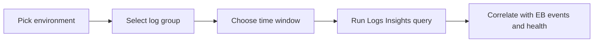

# CloudWatch Logs Insights Queries

This page is a fast lookup reference for common Amazon CloudWatch Logs Insights queries used with AWS Elastic Beanstalk environments.

## Query Flow



## Common Elastic Beanstalk Log Groups

| Log group pattern | Typical contents | Use first for |
|---|---|---|
| `/aws/elasticbeanstalk/$ENV_NAME/var/log/eb-engine.log` | Deployment engine activity | Failed deploy, hook failure, config apply issues |
| `/aws/elasticbeanstalk/$ENV_NAME/var/log/eb-hooks.log` | Platform hook output | Prebuild, predeploy, postdeploy failures |
| `/aws/elasticbeanstalk/$ENV_NAME/var/log/web.stdout.log` | App stdout | Startup errors, uncaught exceptions |
| `/aws/elasticbeanstalk/$ENV_NAME/var/log/web.stderr.log` | App stderr | Stack traces, runtime errors |
| `/aws/elasticbeanstalk/$ENV_NAME/var/log/nginx/access.log` | Reverse proxy access | Request volume, latency clues, status code mix |
| `/aws/elasticbeanstalk/$ENV_NAME/var/log/nginx/error.log` | Reverse proxy errors | Upstream timeout, bad gateway, config issues |

Log streaming must be enabled for the environment if you want these files continuously available in CloudWatch Logs.

## Logs Insights Syntax Cheatsheet

| Need | Syntax example | Notes |
|---|---|---|
| Select fields | `fields @timestamp, @message` | Start most queries this way |
| Filter rows | `filter @message like /ERROR/` | Regex-style filter |
| Sort | `sort @timestamp desc` | Common for recent failures |
| Limit | `limit 50` | Keep results readable |
| Aggregate | `stats count() by bin(5m)` | Time-bucket trends |
| Parse message | `parse @message /(?<status>\d{3})/` | Extract structured values |

## Quick Queries

### Recent deployment failures

```sql
fields @timestamp, @message
| filter @logStream like /eb-engine/
| filter @message like /ERROR|Failed|Command hooks failed/
| sort @timestamp desc
| limit 50
```

### Hook failures

```sql
fields @timestamp, @message
| filter @logStream like /eb-hooks/
| filter @message like /fail|error|non-zero/
| sort @timestamp desc
| limit 50
```

### Application exceptions

```sql
fields @timestamp, @message, @logStream
| filter @message like /Exception|Traceback|ERROR|Unhandled/
| sort @timestamp desc
| limit 100
```

### NGINX 5xx trend over time

```sql
fields @timestamp, @message
| parse @message /"\s(?<status>\d{3})\s/
| filter status like /5../
| stats count() as errors by bin(5m), status
| sort bin(5m) desc
```

### Slow requests from access logs

```sql
fields @timestamp, @message
| parse @message /"(?<method>\S+) (?<path>\S+) \S+" (?<status>\d{3}) .* (?<request_time>[0-9.]+)$/
| filter request_time > 1
| sort request_time desc
| limit 50
```

### Top noisy paths

```sql
fields @timestamp, @message
| parse @message /"(?<method>\S+) (?<path>\S+) \S+" (?<status>\d{3})/
| stats count() as requests by path, status
| sort requests desc
| limit 20
```

### Correlate deploy window with errors

```sql
fields @timestamp, @message, @log
| filter @timestamp >= ago(30m)
| filter @message like /ERROR|Failed|Exception|deployment/
| sort @timestamp desc
| limit 100
```

## Operator Usage Notes

| Situation | Query first | Then correlate with |
|---|---|---|
| Deploy failed | `eb-engine.log` failure query | Elastic Beanstalk events |
| Health degraded after deploy | Exceptions and NGINX 5xx query | `eb health` and target health |
| Slow site complaint | Slow requests query | ALB latency metrics and instance health |
| Unknown spike | Top noisy paths query | CloudWatch metrics and scaling events |

## See Also

- [Reference Home](./index.md)
- [EB Diagnostics](./eb-diagnostics.md)
- [Troubleshooting Reference](./troubleshooting.md)
- [Operations: Health Monitoring](../operations/health-monitoring.md)
- [Troubleshooting CloudWatch Hub](../troubleshooting/cloudwatch/index.md)

## Sources

- [Viewing logs from Amazon EC2 instances in your Elastic Beanstalk environment](https://docs.aws.amazon.com/elasticbeanstalk/latest/dg/AWSHowTo.cloudwatchlogs.html)
- [Using CloudWatch Logs Insights to analyze log data](https://docs.aws.amazon.com/AmazonCloudWatch/latest/logs/AnalyzingLogData.html)
- [Enhanced health reporting and monitoring in Elastic Beanstalk](https://docs.aws.amazon.com/elasticbeanstalk/latest/dg/health-enhanced.html)
