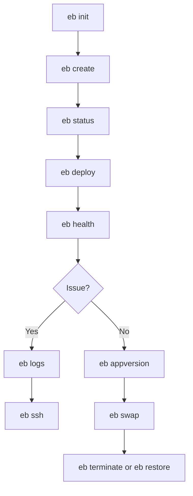

---
hide:
  - toc
---

# EB CLI Cheatsheet

This page is a quick lookup reference for high-usage Elastic Beanstalk CLI commands with long flags and practical operator context.

## Command Coverage

| Coverage Area | Commands Included |
|---|---|
| Environment lifecycle | `eb create`, `eb terminate`, `eb clone`, `eb restore`, `eb swap` |
| Deployment and versions | `eb deploy`, `eb appversion` |
| Visibility and diagnostics | `eb status`, `eb health`, `eb logs` |
| Access and runtime actions | `eb ssh`, `eb scale` |
| Configuration and metadata | `eb init`, `eb config`, `eb tags` |

## Workflow Map



## EB Command Reference

| Command | Description | Common Flags |
|---|---|---|
| `eb init` | Initialize EB CLI configuration in a local project directory. | `--region`, `--platform`, `--profile`, `--keyname` |
| `eb create` | Create a new environment and associated AWS resources. | `--environment_name`, `--cname`, `--instance_type`, `--single`, `--elb-type`, `--vpc.id`, `--scale` |
| `eb deploy` | Deploy source bundle or specific application version to an environment. | `--label`, `--message`, `--staged`, `--timeout`, `--process` |
| `eb status` | Show high-level environment state and deployment metadata. | `--environment`, `--verbose`, `--profile`, `--region` |
| `eb health` | View enhanced health status and instance-level metrics. | `--environment`, `--refresh`, `--verbose`, `--profile`, `--region` |
| `eb logs` | Retrieve environment logs or stream generated logs. | `--all`, `--zip`, `--stream`, `--cloudwatch-logs`, `--environment` |
| `eb ssh` | Open SSH session to an environment instance. | `--environment`, `--instance`, `--command`, `--keep_open` |
| `eb terminate` | Terminate an environment and remove its managed resources. | `--environment`, `--force`, `--timeout` |
| `eb config` | Open, save, and apply environment option settings. | `--environment`, `--display`, `--cfg`, `--timeout` |
| `eb scale` | Update Auto Scaling desired capacity for an environment. | `--environment`, `--timeout`, `--profile`, `--region` |
| `eb swap` | Swap CNAMEs between two environments for blue/green promotion. | `--destination_name`, `--source_name`, `--timeout` |
| `eb clone` | Clone an environment including configuration and tags. | `--clone_name`, `--cname`, `--exact`, `--scale`, `--envvars` |
| `eb restore` | Restore environment from a saved configuration. | `--environment`, `--cfg`, `--timeout` |
| `eb tags` | Add, update, or remove tags from environment resources. | `--add`, `--delete`, `--list`, `--environment` |
| `eb appversion` | List, create, or delete application versions. | `--create`, `--delete`, `--label`, `--message`, `--process` |

## AWS CLI Equivalents (Where Relevant)

| EB Command | AWS CLI Equivalent | Notes |
|---|---|---|
| `eb init` | `aws elasticbeanstalk create-application` | `eb init` also writes local `.elasticbeanstalk/config.yml` metadata. |
| `eb create` | `aws elasticbeanstalk create-environment` | EB CLI can also package source and apply local defaults. |
| `eb deploy` | `aws elasticbeanstalk create-application-version` + `aws elasticbeanstalk update-environment` | Deployment usually maps to two API calls. |
| `eb status` | `aws elasticbeanstalk describe-environments` | Add `describe-events` for recent activity detail. |
| `eb health` | `aws elasticbeanstalk describe-environment-health` + `aws elasticbeanstalk describe-instances-health` | Requires enhanced health support in environment. |
| `eb logs` | `aws elasticbeanstalk request-environment-info` + `aws elasticbeanstalk retrieve-environment-info` | CloudWatch Logs workflows may also be involved. |
| `eb terminate` | `aws elasticbeanstalk terminate-environment` | Supports forced termination mode in EB CLI. |
| `eb config` | `aws elasticbeanstalk describe-configuration-settings` + `aws elasticbeanstalk update-environment` | EB CLI editor flow is local and interactive. |
| `eb scale` | `aws elasticbeanstalk update-environment --option-settings ...` | Updates Auto Scaling group size option values. |
| `eb swap` | `aws elasticbeanstalk swap-environment-cnames` | Primary blue/green traffic cutover API. |
| `eb clone` | `aws elasticbeanstalk create-environment --template-name ...` | EB CLI clone may copy additional local context. |
| `eb appversion` | `aws elasticbeanstalk describe-application-versions` and related app-version APIs | Version lifecycle and cleanup support. |

## Long-Flag Command Examples

```bash
# Initialize a repository for Elastic Beanstalk usage
eb init \
    --region "us-east-1" \
    --platform "Python 3.11 running on 64bit Amazon Linux 2023" \
    --profile "eb-ops"

# Create a load-balanced web environment
eb create "my-app-prod" \
    --cname "my-app-prod" \
    --instance_type "t3.small" \
    --elb-type "application" \
    --profile "eb-ops" \
    --region "us-east-1"

# Deploy a pre-labeled application version
eb deploy "my-app-prod" \
    --label "release-2026-04-05" \
    --message "Promote tested artifact" \
    --timeout 20 \
    --profile "eb-ops" \
    --region "us-east-1"
```

## Common Operator Tasks

| Task | Primary Command | Helpful Secondary Command |
|---|---|---|
| Confirm current deployment health | `eb status` | `eb health --verbose` |
| Investigate degraded instance behavior | `eb health` | `eb logs --all --zip` |
| Pull logs during active incident | `eb logs --stream` | `eb ssh --command "sudo journalctl -xe"` |
| Roll traffic to new green environment | `eb swap` | `eb status` on both environments |
| Recover from bad config change | `eb restore --cfg` | `eb events` in console or AWS CLI |
| Reduce spend in low-traffic window | `eb scale 1` | `eb config` to update MinSize and MaxSize |
| Retire obsolete environments safely | `eb terminate` | `eb tags --list` before removal |

## Exit Codes and Behavior Notes

| Behavior | Practical Meaning | Operator Action |
|---|---|---|
| Immediate command failure | Local validation or credentials issue before API update | Verify AWS profile, region, and project initialization |
| Environment update accepted but later fails | API call succeeded, async deployment failed | Check environment events and fetch logs |
| Interactive editor path via `eb config` | Command may open local editor before update | Review generated YAML carefully before saving |
| Timeout reached on long operation | Environment update still running or stalled | Use `eb status` and `describe-events` for final state |

## Guardrails for Production Usage

| Guardrail | Why It Matters |
|---|---|
| Prefer explicit `--profile` and `--region` in automation | Prevents accidental cross-account or cross-region updates |
| Use immutable version labels for promotion | Keeps rollback deterministic and auditable |
| Avoid relying only on local defaults in CI/CD | Pipeline behavior should be explicit and reproducible |
| Validate health after each deploy before swap | Detects runtime defects before full traffic shift |

## See Also

- [Reference Home](./index.md)
- [Platform Limits](./platform-limits.md)
- [Environment Properties](./environment-properties.md)
- [Operations: Environment Management](../operations/environment-management.md)
- [Operations: Health Monitoring](../operations/health-monitoring.md)
- [Troubleshooting Hub](../troubleshooting/index.md)

## Sources

- [Elastic Beanstalk Command Line Interface (EB CLI)](https://docs.aws.amazon.com/elasticbeanstalk/latest/dg/eb-cli3.html)
- [EB CLI Command Reference](https://docs.aws.amazon.com/elasticbeanstalk/latest/dg/eb3-cmd-commands.html)
- [AWS CLI Elastic Beanstalk Command Reference](https://docs.aws.amazon.com/cli/latest/reference/elasticbeanstalk/)
