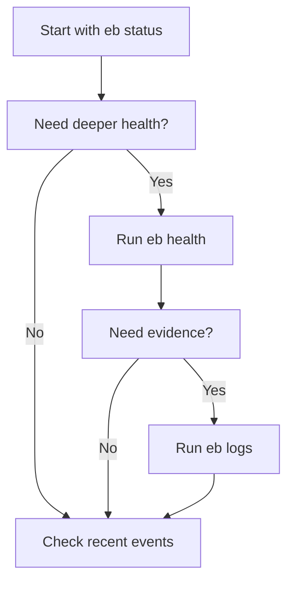

# Elastic Beanstalk Diagnostics Reference

This page is a fast lookup reference for interpreting common Elastic Beanstalk operator outputs, health colors, and platform events.

## Diagnostic Flow



## `eb status` Output Interpretation

`eb status` is the fastest summary view for current environment identity and lifecycle state.

| Output field | What it means | Why it matters |
|---|---|---|
| Environment name | Current target environment | Confirms you are inspecting the right environment |
| Application name | Elastic Beanstalk application container | Useful in multi-app accounts |
| Region | AWS Region of the environment | Prevents cross-region confusion |
| Deployed Version | Current application version label | Confirms rollout target |
| Environment ID | Control plane identifier | Useful for API-based diagnostics |
| Platform | Current platform branch and version | Distinguishes code issue from platform issue |
| Status | Lifecycle state such as `Ready` or `Updating` | Tells whether a change is still running |
| Health | High-level health color | Fast risk signal, not full diagnosis |

## `eb health` Output Interpretation

`eb health` adds enhanced health context, including color state, causes, and instance-level view.

| Signal | Interpretation | Typical next step |
|---|---|---|
| Green | Environment is healthy by current rules | Validate application-level SLOs if users still report issues |
| Yellow | Warning or partial degradation | Inspect causes and recent events |
| Red | Severe health issue | Pull events and logs immediately |
| Grey | Pending, suspended, or not enough data | Check lifecycle state and health reporting configuration |
| Info / Causes | Health engine explanation text | Use as the first branch in troubleshooting |
| Instance list | Per-instance state | Detects replacement churn or one-bad-node pattern |

## `eb logs` Output Interpretation

`eb logs` is the bridge from control plane symptoms to instance evidence.

| Command mode | What you get | Best use |
|---|---|---|
| `eb logs` | Snapshot of standard logs | Quick inspection after a failed update |
| `eb logs --all` | Logs from all instances | Multi-instance comparison |
| `eb logs --zip` | Archive for offline analysis | Incident evidence retention |
| `eb logs --stream` | Live log stream | Active incident or deploy watch |
| `eb logs --cloudwatch-logs` | CloudWatch-backed retrieval | Environments with log streaming enabled |

Common log interpretation shortcuts:

- `eb-engine.log` usually explains deployment, configuration, and hook failures.
- Proxy error logs usually explain 502, 503, or timeout patterns.
- Application stdout and stderr reveal startup crashes and runtime exceptions.

## Enhanced Health Reporting Signals

Enhanced health uses multiple inputs, not only load balancer health checks.

| Signal family | Example | What it reveals |
|---|---|---|
| Availability | Instance reachable and in service | Infrastructure readiness |
| Response | App or proxy returns expected responses | Runtime correctness |
| Latency | Slow processing or timeouts | Early saturation or dependency delay |
| Deployment | Version mismatch or failed rollout | Release process defect |
| Instance-level anomalies | One node unhealthy, others fine | Partial fleet issue |

## Health Color Codes and Typical Causes

| Color | Meaning | Typical causes |
|---|---|---|
| Green | Healthy | Requests succeed, instances pass checks, no major warning signals |
| Yellow | Warning | Elevated latency, intermittent failures, one or more instances degraded |
| Red | Severe | Health check failure, app crash loop, dependency outage, deploy failure |
| Grey | Unknown / pending | Launching, updating, suspended reporting, or insufficient health data |

## Platform Event Interpretation

Environment events give the control plane timeline around launches, updates, swaps, scaling, and failures.

| Event pattern | Likely meaning | Operator action |
|---|---|---|
| `Environment update is starting.` | New config, deploy, or platform update accepted | Watch until status returns to `Ready` |
| `Successfully deployed new configuration` | Control plane update completed | Validate runtime behavior, not only the event |
| `Failed to deploy application` | Instance-level deploy or startup failure | Pull `eb logs` and inspect hooks and app startup |
| `Added instance ...` repeatedly | Replacement churn | Inspect per-instance health and bootstrap logs |
| `Environment health has transitioned` | Material health change | Correlate with recent config, traffic, or dependency events |

## Fast Diagnostic Command Set

```bash
eb status "my-app-prod" \
    --profile "eb-ops" \
    --region "us-east-1"

eb health "my-app-prod" \
    --verbose \
    --refresh \
    --profile "eb-ops" \
    --region "us-east-1"

eb logs "my-app-prod" \
    --all \
    --zip \
    --profile "eb-ops" \
    --region "us-east-1"
```

## See Also

- [Reference Home](./index.md)
- [EB CLI Cheatsheet](./eb-cli-cheatsheet.md)
- [CloudWatch Logs Insights Queries](./cloudwatch-queries.md)
- [Troubleshooting Reference](./troubleshooting.md)
- [Operations: Health Monitoring](../operations/health-monitoring.md)
- [Troubleshooting Hub](../troubleshooting/index.md)

## Sources

- [Elastic Beanstalk Command Line Interface (EB CLI)](https://docs.aws.amazon.com/elasticbeanstalk/latest/dg/eb-cli3.html)
- [EB CLI command reference](https://docs.aws.amazon.com/elasticbeanstalk/latest/dg/eb3-cmd-commands.html)
- [Enhanced health reporting and monitoring in Elastic Beanstalk](https://docs.aws.amazon.com/elasticbeanstalk/latest/dg/health-enhanced.html)
- [Viewing logs from Amazon EC2 instances in your Elastic Beanstalk environment](https://docs.aws.amazon.com/elasticbeanstalk/latest/dg/using-features.logging.html)
