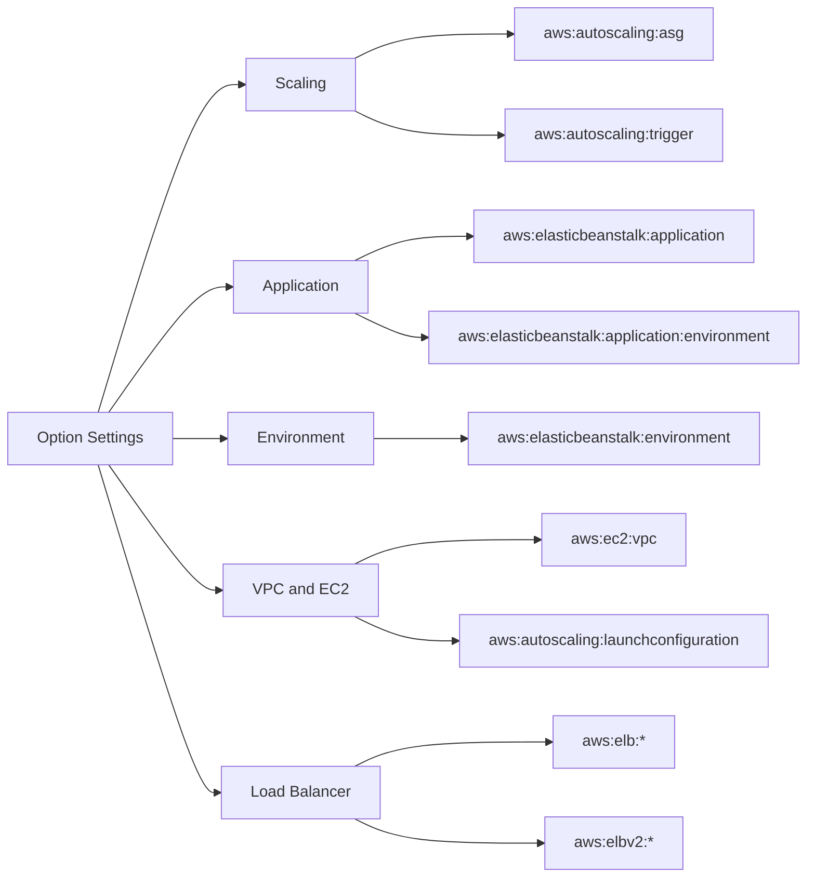

---
hide:
  - toc
---

# Environment Properties

This page is a quick lookup reference for high-impact Elastic Beanstalk configuration namespaces and option settings.

Defaults can vary by platform branch, environment tier, and selected load balancer type. Validate final values in environment configuration output.

## Namespace Map



## Auto Scaling Group Namespace

| Namespace | Option | Description | Default |
|---|---|---|---|
| `aws:autoscaling:asg` | `MinSize` | Minimum number of instances in the Auto Scaling group. | Platform default, often `1` |
| `aws:autoscaling:asg` | `MaxSize` | Maximum number of instances in the Auto Scaling group. | Platform default, often `4` |
| `aws:autoscaling:asg` | `Cooldown` | Cooldown period between scaling activities (seconds). | Platform-specific default |
| `aws:autoscaling:asg` | `Availability Zones` | Zone selection strategy for instances. | `Any` or environment-calculated |

## Auto Scaling Trigger Namespace

| Namespace | Option | Description | Default |
|---|---|---|---|
| `aws:autoscaling:trigger` | `MeasureName` | CloudWatch metric used for scaling decisions. | Platform preset (commonly CPU metric) |
| `aws:autoscaling:trigger` | `Statistic` | Metric statistic used by alarm evaluation. | Platform preset |
| `aws:autoscaling:trigger` | `Unit` | Metric unit for trigger threshold values. | Metric-derived |
| `aws:autoscaling:trigger` | `Period` | Alarm period length in seconds. | Platform preset |
| `aws:autoscaling:trigger` | `BreachDuration` | Duration of threshold breach before scaling action. | Platform preset |
| `aws:autoscaling:trigger` | `UpperThreshold` | Threshold that triggers scale-out action. | Platform preset |
| `aws:autoscaling:trigger` | `LowerThreshold` | Threshold that triggers scale-in action. | Platform preset |

## Application Namespace

| Namespace | Option | Description | Default |
|---|---|---|---|
| `aws:elasticbeanstalk:application` | `Application Healthcheck URL` | HTTP path used by EB for application-level health check. | `/` |

## Application Environment Variables Namespace

| Namespace | Option | Description | Default |
|---|---|---|---|
| `aws:elasticbeanstalk:application:environment` | `ENV_VAR_NAME` | Runtime environment variable key/value pair exposed to app process. | None |
| `aws:elasticbeanstalk:application:environment` | `LOG_LEVEL` | Example custom variable used by app logging configuration. | App-defined |
| `aws:elasticbeanstalk:application:environment` | `DATABASE_URL` | Example dependency endpoint variable (mask credentials in docs). | App-defined |
| `aws:elasticbeanstalk:application:environment` | `FEATURE_FLAG_X` | Example feature toggle value consumed by app code. | App-defined |

## Environment Behavior Namespace

| Namespace | Option | Description | Default |
|---|---|---|---|
| `aws:elasticbeanstalk:environment` | `EnvironmentType` | Deployment mode: single instance or load balanced. | `LoadBalanced` |
| `aws:elasticbeanstalk:environment` | `LoadBalancerType` | Load balancer family for web tier. | `application` (current default) |
| `aws:elasticbeanstalk:environment` | `ServiceRole` | IAM service role used by Elastic Beanstalk. | Account/region default service role |

## VPC Namespace

| Namespace | Option | Description | Default |
|---|---|---|---|
| `aws:ec2:vpc` | `VPCId` | VPC where environment resources are launched. | Default VPC if not specified |
| `aws:ec2:vpc` | `Subnets` | EC2 instance subnet list. | Platform/console-selected |
| `aws:ec2:vpc` | `ELBSubnets` | Load balancer subnet list. | Platform/console-selected |
| `aws:ec2:vpc` | `AssociatePublicIpAddress` | Whether instances get public IP addresses. | Environment topology dependent |
| `aws:ec2:vpc` | `ELBScheme` | `public` or `internal` load balancer scheme. | `public` in public web deployments |
| `aws:ec2:vpc` | `DBSubnets` | Subnets for integrated RDS resources when managed by EB. | Not set unless RDS integration used |

## Launch Configuration Namespace

| Namespace | Option | Description | Default |
|---|---|---|---|
| `aws:autoscaling:launchconfiguration` | `InstanceType` | EC2 instance type for environment instances. | Platform default |
| `aws:autoscaling:launchconfiguration` | `IamInstanceProfile` | IAM instance profile attached to EC2 instances. | Account/solution default profile |
| `aws:autoscaling:launchconfiguration` | `EC2KeyName` | EC2 key pair name for SSH access. | None |
| `aws:autoscaling:launchconfiguration` | `SecurityGroups` | Security groups attached to EC2 instances. | Environment-created SG by default |
| `aws:autoscaling:launchconfiguration` | `RootVolumeType` | Root EBS volume type. | Platform default |
| `aws:autoscaling:launchconfiguration` | `RootVolumeSize` | Root EBS volume size in GiB. | Platform default |

## Classic Load Balancer Namespaces (`aws:elb:*`)

| Namespace | Option | Description | Default |
|---|---|---|---|
| `aws:elb:loadbalancer` | `CrossZone` | Enables cross-zone load balancing behavior. | Depends on ELB defaults |
| `aws:elb:loadbalancer` | `ManagedSecurityGroup` | Security group controlled by EB for ELB. | EB-managed |
| `aws:elb:listener` | `ListenerProtocol` | Listener protocol for front-end port. | `HTTP` unless HTTPS configured |
| `aws:elb:listener` | `InstanceProtocol` | Protocol between ELB and instances. | `HTTP` common default |
| `aws:elb:listener` | `ListenerEnabled` | Whether listener is active. | `true` |
| `aws:elb:listener:443` | `SSLCertificateId` | ACM/IAM certificate identifier for TLS listener. | None |
| `aws:elb:listener:443` | `ListenerProtocol` | Typically `HTTPS` for port 443. | None unless enabled |

## Application Load Balancer Namespaces (`aws:elbv2:*`)

| Namespace | Option | Description | Default |
|---|---|---|---|
| `aws:elbv2:loadbalancer` | `SecurityGroups` | Security groups attached to ALB. | EB-managed SG unless overridden |
| `aws:elbv2:loadbalancer` | `ManagedSecurityGroup` | EB-managed ALB security group ID. | Auto-generated |
| `aws:elbv2:listener:80` | `ListenerEnabled` | Enables HTTP listener on port 80. | `true` in default web setups |
| `aws:elbv2:listener:443` | `ListenerEnabled` | Enables HTTPS listener on port 443. | `false` unless configured |
| `aws:elbv2:listener:443` | `Protocol` | Front-end protocol for listener. | `HTTPS` when enabled |
| `aws:elbv2:listener:443` | `SSLCertificateArns` | One or more ACM certificate ARNs for TLS. | None |

## Logging and Health Namespaces

| Namespace | Option | Description | Default |
|---|---|---|---|
| `aws:elasticbeanstalk:cloudwatch:logs` | `StreamLogs` | Stream instance logs to CloudWatch Logs. | `false` unless enabled |
| `aws:elasticbeanstalk:cloudwatch:logs` | `RetentionInDays` | CloudWatch Logs retention period. | Service default unless set |
| `aws:elasticbeanstalk:healthreporting:system` | `SystemType` | Basic or enhanced health reporting mode. | `enhanced` for modern environments |
| `aws:elasticbeanstalk:healthreporting:system` | `ConfigDocument` | JSON health reporting configuration document. | Platform default |

## Deployment Policy Namespace

| Namespace | Option | Description | Default |
|---|---|---|---|
| `aws:elasticbeanstalk:command` | `DeploymentPolicy` | Deployment strategy (all-at-once, rolling, immutable, etc.). | Platform default |
| `aws:elasticbeanstalk:command` | `BatchSizeType` | Percent or fixed batch size unit. | Platform default |
| `aws:elasticbeanstalk:command` | `BatchSize` | Batch size value for rolling deployments. | Platform default |
| `aws:elasticbeanstalk:command` | `IgnoreHealthCheck` | Continue deployment despite health checks. | `false` |
| `aws:elasticbeanstalk:command` | `Timeout` | Timeout for command/deployment phases. | Platform default |

## Option Settings Example (Long Flags)

```bash
aws elasticbeanstalk update-environment \
    --application-name "my-app" \
    --environment-name "my-app-prod" \
    --option-settings Namespace=aws:autoscaling:asg,OptionName=MinSize,Value=2 \
    --option-settings Namespace=aws:autoscaling:asg,OptionName=MaxSize,Value=6 \
    --option-settings Namespace=aws:ec2:vpc,OptionName=VPCId,Value=vpc-xxxxxxxx \
    --region "us-east-1" \
    --profile "eb-ops"
```

## Validation Commands

| Goal | Command |
|---|---|
| View effective option settings | `aws elasticbeanstalk describe-configuration-settings --application-name "my-app" --environment-name "my-app-prod" --region "us-east-1" --profile "eb-ops"` |
| Export current environment configuration | `eb config save --cfg "my-app-prod-baseline" --environment "my-app-prod" --profile "eb-ops" --region "us-east-1"` |
| Confirm environment state after update | `aws elasticbeanstalk describe-environments --application-name "my-app" --environment-names "my-app-prod" --region "us-east-1" --profile "eb-ops"` |

## See Also

- [Reference Home](./index.md)
- [EB CLI Cheatsheet](./eb-cli-cheatsheet.md)
- [Platform Limits](./platform-limits.md)
- [Platform: Networking](../platform/networking.md)
- [Operations: Scaling](../operations/scaling.md)
- [Operations: Security](../operations/security.md)
- [Troubleshooting Hub](../troubleshooting/index.md)

## Sources

- [Configuration Options](https://docs.aws.amazon.com/elasticbeanstalk/latest/dg/command-options-general.html)
- [Namespaces for Environment Configuration](https://docs.aws.amazon.com/elasticbeanstalk/latest/dg/command-options.html)
- [VPC Configuration](https://docs.aws.amazon.com/elasticbeanstalk/latest/dg/vpc.html)
- [Enhanced Health Reporting](https://docs.aws.amazon.com/elasticbeanstalk/latest/dg/health-enhanced.html)
