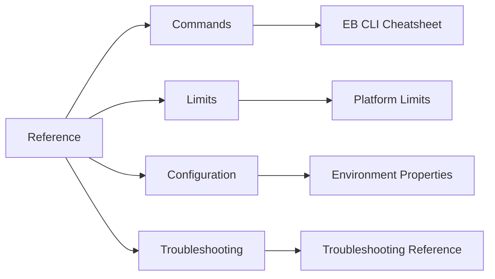

# Reference

The Reference section is the fast lookup layer for operators who already know the workflow and need exact commands, limits, and option names.

Use these pages during deployment windows, incident triage, and change reviews when speed and precision matter.

## Reference Pages

| Page | Primary Use | Typical Moment | Scope |
|---|---|---|---|
| [EB CLI Cheatsheet](./eb-cli-cheatsheet.md) | Find exact `eb` commands and long flags | Deploy, inspect, or recover an environment | Command-level |
| [Platform Limits](./platform-limits.md) | Check service quotas and fixed platform constraints | Capacity planning and preflight checks | Quotas and limits |
| [Environment Properties](./environment-properties.md) | Find namespace + option names for `.ebextensions` and API updates | Configuration design and review | Option settings |
| [Troubleshooting Reference](./troubleshooting.md) | Map common errors to likely causes and first fixes | Incident response | Error-to-resolution |

## Reference Categories

## Lookup Matrix

| If You Need To... | Open This Page First | Then Validate In | Why |
|---|---|---|---|
| Initialize a new project or application | [EB CLI Cheatsheet](./eb-cli-cheatsheet.md) | [Platform: How Elastic Beanstalk Works](../platform/how-elastic-beanstalk-works.md) | Confirms command syntax and platform resource model |
| Tune Auto Scaling min/max and alarms | [Environment Properties](./environment-properties.md) | [Operations: Scaling](../operations/scaling.md) | Matches namespace options to runtime operations |
| Confirm whether an environment-count limit can be raised | [Platform Limits](./platform-limits.md) | AWS Service Quotas console and API | Distinguishes adjustable quotas from fixed behavior |
| Interpret deployment event failures quickly | [Troubleshooting Reference](./troubleshooting.md) | [Operations: Environment Management](../operations/environment-management.md) | Accelerates initial diagnosis and rollback decisions |
| Decide between ALB and CLB behavior assumptions | [Platform Limits](./platform-limits.md) | [Platform: Networking](../platform/networking.md) | Connects capability constraints to design choices |
| Map error text to probable IAM gaps | [Troubleshooting Reference](./troubleshooting.md) | [Platform: Authentication and Access](../platform/authentication-and-access.md) | Aligns symptom with permission boundary ownership |

## Quick Navigation by Task

| Task Category | Fast Path | What to Extract |
|---|---|---|
| Deployments | Cheatsheet -> Troubleshooting | `eb deploy` flags, failed update error mappings |
| Capacity Planning | Platform Limits -> Environment Properties | Account quotas, Auto Scaling and VPC options |
| Configuration Audits | Environment Properties -> Platform docs | Namespace defaults and drift candidates |
| Incident Triage | Troubleshooting -> Operations runbooks | Error family, first safe remediation |

## Command and Option Conventions

| Convention | Rule | Example |
|---|---|---|
| CLI flags | Use long flags only | `--application-name`, `--environment-name`, `--region` |
| Placeholders | Mask account and resource PII | `<account-id>`, `i-xxxxxxxxxxxxxxxxx`, `10.0.x.x` |
| Source policy | AWS docs only | `https://docs.aws.amazon.com/elasticbeanstalk/latest/dg/...` |
| Tail sections | Always end with `See Also` then `Sources` | Required for every page |

## Operator Workflow in 30 Seconds

| Step | Action | Output |
|---|---|---|
| 1 | Identify symptom (deployment, health, quota, permission) | Problem class |
| 2 | Open the matching reference page | Canonical command, limit, or namespace |
| 3 | Execute with long flags and masked placeholders | Reproducible, reviewable change |
| 4 | Cross-check in Platform or Operations section | Architectural and operational fit |
| 5 | If unresolved, pivot to troubleshooting playbooks | Deeper root-cause workflow |

## Reference by Role

| Role | Primary Page | Secondary Page | Typical Output |
|---|---|---|---|
| Platform engineer | [Platform Limits](./platform-limits.md) | [Environment Properties](./environment-properties.md) | Quota-aware architecture baseline |
| Release engineer | [EB CLI Cheatsheet](./eb-cli-cheatsheet.md) | [Troubleshooting Reference](./troubleshooting.md) | Repeatable deploy and rollback flow |
| SRE / on-call | [Troubleshooting Reference](./troubleshooting.md) | [EB CLI Cheatsheet](./eb-cli-cheatsheet.md) | Fast symptom-to-command path |
| Security engineer | [Environment Properties](./environment-properties.md) | [Platform: Authentication and Access](../platform/authentication-and-access.md) | Auditable config controls |

## Internal Cross-Link Index

| Topic | Platform Context | Operations Context | Reference Page |
|---|---|---|---|
| Environment lifecycle | [How Elastic Beanstalk Works](../platform/how-elastic-beanstalk-works.md) | [Environment Management](../operations/environment-management.md) | [EB CLI Cheatsheet](./eb-cli-cheatsheet.md) |
| Networking boundaries | [Networking](../platform/networking.md) | [Networking Operations](../operations/networking.md) | [Platform Limits](./platform-limits.md) |
| Scaling policy | [Scaling Model](../platform/scaling.md) | [Scaling Runbook](../operations/scaling.md) | [Environment Properties](./environment-properties.md) |
| Incident response | [Request Lifecycle](../platform/request-lifecycle.md) | [Health Monitoring](../operations/health-monitoring.md) | [Troubleshooting Reference](./troubleshooting.md) |

## AWS API Alignment

| Reference Topic | Primary AWS API Family |
|---|---|
| EB CLI command actions | `elasticbeanstalk:*` control plane APIs |
| Quotas and service ceilings | `service-quotas:*` APIs |
| Environment option updates | `update-environment` with option settings |
| Health diagnostics | `describe-environment-health` and `describe-instances-health` |

## See Also

- [Guide Home](../index.md)
- [Start Here Overview](../start-here/overview.md)
- [Platform](../platform/index.md)
- [Operations](../operations/index.md)
- [Troubleshooting Hub](../troubleshooting/index.md)

## Sources

- [AWS Elastic Beanstalk Developer Guide](https://docs.aws.amazon.com/elasticbeanstalk/latest/dg/Welcome.html)
- [Elastic Beanstalk Command Line Interface (EB CLI)](https://docs.aws.amazon.com/elasticbeanstalk/latest/dg/eb-cli3.html)
- [Configuration Options](https://docs.aws.amazon.com/elasticbeanstalk/latest/dg/command-options-general.html)
- [Platforms](https://docs.aws.amazon.com/elasticbeanstalk/latest/dg/concepts.platforms.html)
- [Troubleshooting](https://docs.aws.amazon.com/elasticbeanstalk/latest/dg/troubleshooting.html)
