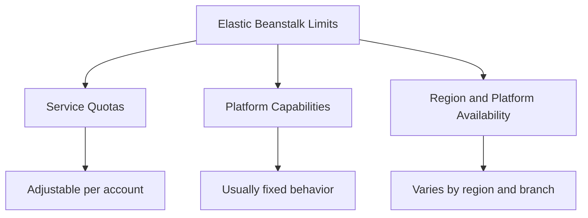

# Platform Limits

This page is a quick lookup for Elastic Beanstalk quotas, platform constraints, and capability boundaries that commonly affect design and operations.

For quota values that can vary by account or region, treat AWS Service Quotas as the source of truth.

## Limit Types



## Core Elastic Beanstalk Quotas

| Limit | Default | Adjustable? |
|---|---|---|
| Applications per account | 75 (typical default quota) | Yes |
| Application versions per application | 1000 (typical default quota) | Yes |
| Environments per account | 200 (typical default quota) | Yes |
| Configuration templates per application | 200 (typical default quota) | Yes |
| Saved configurations per application | 200 (typical default quota) | Yes |
| Custom platforms per region | Service quota default in your account | Yes |

## Interpreting Requested Planning Limits

| Requested Planning Item | Practical Interpretation |
|---|---|
| Applications per account | Count all EB applications in one AWS account and region scope where quota applies. |
| Environments per application | No single fixed per-application hard limit is the common planning control; environment-related quotas are usually account-level in Service Quotas. |
| Application versions | Version count accumulates quickly in CI/CD; enforce lifecycle cleanup policy. |
| Configuration templates | Use templates sparingly and keep naming standards to avoid quota sprawl. |
| Custom platforms | Relevant only when using Packer-based custom platform pipelines. |

## Compute and Load Balancing Constraints

| Limit | Default | Adjustable? |
|---|---|---|
| Supported EC2 instance types | Any instance type supported by EB platform branch and region | No (capability boundary) |
| Web tier load balancer types | Application Load Balancer (default) and Classic Load Balancer (legacy support) | No (capability boundary) |
| Worker tier load balancer | Not required for queue-driven worker environments | N/A |
| Single-instance environment | One EC2 instance, no load balancer | N/A |

## Platform Branch Constraints

| Limit | Default | Adjustable? |
|---|---|---|
| Platform branch availability | Region- and language-specific available branches only | No |
| Managed platform update cadence | AWS-managed release lifecycle by platform branch | No |
| Branch deprecation schedule | AWS-announced timeline | No |
| Runtime version availability | Determined by selected platform branch | No |

## Quota Check Commands

Use explicit long flags and placeholders in automation.

```bash
aws service-quotas list-service-quotas \
    --service-code "elasticbeanstalk" \
    --region "us-east-1" \
    --profile "eb-ops"

aws service-quotas get-service-quota \
    --service-code "elasticbeanstalk" \
    --quota-code "L-4EADE6B6" \
    --region "us-east-1" \
    --profile "eb-ops"

aws service-quotas request-service-quota-increase \
    --service-code "elasticbeanstalk" \
    --quota-code "<quota-code>" \
    --desired-value 300 \
    --region "us-east-1" \
    --profile "eb-ops"
```

## Limit-Driven Failure Signals

| Signal | Likely Limit Category | Immediate Action |
|---|---|---|
| Environment launch fails with quota message | Service quota exceeded | Check Service Quotas and request increase |
| Deployment fails when creating new version | Application version quota pressure | Delete stale versions and retry |
| Inability to select expected runtime branch | Platform branch availability | Validate region + branch support matrix |
| Unexpected inability to use an instance family | Region/platform compatibility | Check EC2 and platform support by region |

## Capacity Planning Checklist

| Check | Why It Matters |
|---|---|
| Validate quotas before production launch | Prevents launch-time resource creation failure |
| Forecast application-version growth | Prevents blocked deploy pipelines |
| Verify platform branch lifecycle dates | Avoids unplanned upgrade pressure |
| Confirm ALB/CLB assumptions early | Prevents mismatch between design and EB capabilities |

## See Also

- [Reference Home](./index.md)
- [EB CLI Cheatsheet](./eb-cli-cheatsheet.md)
- [Environment Properties](./environment-properties.md)
- [Platform: Environment Tiers](../platform/environment-tiers.md)
- [Platform: Networking](../platform/networking.md)
- [Operations: Environment Management](../operations/environment-management.md)
- [Troubleshooting Hub](../troubleshooting/index.md)

## Sources

- [Elastic Beanstalk Platforms](https://docs.aws.amazon.com/elasticbeanstalk/latest/dg/concepts.platforms.html)
- [Elastic Beanstalk Quotas and Limits](https://docs.aws.amazon.com/elasticbeanstalk/latest/dg/using-features.limits.html)
- [Elastic Beanstalk Environments](https://docs.aws.amazon.com/elasticbeanstalk/latest/dg/using-features.managing.html)
- [Service Quotas User Guide](https://docs.aws.amazon.com/servicequotas/latest/userguide/intro.html)
