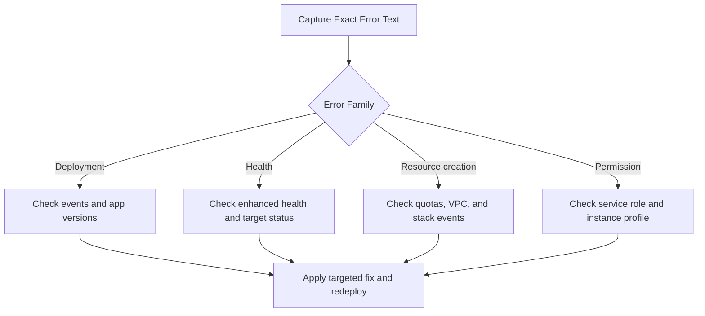

# Troubleshooting Reference

This page maps common Elastic Beanstalk error signals to likely causes and first-response actions.

Use it as a fast triage index before running deeper troubleshooting workflows.

## Triage Flow



## Common Deployment Errors

| Error Message | Likely Cause | Resolution |
|---|---|---|
| `Failed to deploy application.` | Application startup failed or deployment hook failed. | Pull logs (`eb logs --all --zip`), validate platform hooks, redeploy known-good version. |
| `Command hooks failed` | `.platform/hooks` or `.ebextensions` commands exited non-zero. | Fix script permissions and exit codes, then redeploy with a new version label. |
| `Environment update is in progress.` | Another update is active; concurrent deployment blocked. | Wait for update completion and retry after `Ready` status. |
| `No Application Version named ... found.` | Target version label does not exist in application. | List versions and redeploy using an existing label. |
| `Source bundle does not contain a valid application.` | Missing platform-required entry point or invalid package layout. | Confirm bundle structure and runtime configuration for platform branch. |
| `Failed to create the AWS Elastic Beanstalk application version.` | S3 upload failure, permissions issue, or invalid artifact. | Validate artifact upload path and IAM permissions for version creation. |
| `ERROR: NotAuthorizedError` (EB CLI context) | CLI principal lacks required Elastic Beanstalk action. | Attach required IAM permissions and retry command. |
| `The CNAME is already in use.` | Requested environment CNAME already assigned. | Choose another CNAME or swap with existing environment intentionally. |

## Health and Availability Errors

| Error Message | Likely Cause | Resolution |
|---|---|---|
| `Severe` or persistent `Degraded` health | App endpoint failures, resource pressure, or dependency errors. | Check enhanced health causes, instance metrics, and application logs. |
| `Incorrect application version found on all instances.` | Rollout stuck or failed update left mismatch across instances. | Redeploy target version and verify deployment policy behavior. |
| `ELB health is failing or has insufficient data.` | Health check path/port mismatch or application not responding in time. | Validate health check URL, listener ports, and app startup readiness. |
| `Target.ResponseCodeMismatch` (ALB target health) | App returns unexpected status code on health path. | Adjust application health endpoint or ALB matcher expectations. |
| `Target.Timeout` | App failed to respond before health check timeout. | Investigate startup latency, dependency timeouts, and instance saturation. |
| `Instance has failed at least the Unhealthy Threshold number of health checks consecutively.` | Repeated failing checks from load balancer perspective. | Review app logs and security group/network path from LB to instances. |
| `Environment health has transitioned from Green to Yellow/Red.` | Deployment regression or infrastructure-level instability. | Correlate event timeline with recent changes and rollback if needed. |

## Resource Creation and Environment Launch Errors

| Error Message | Likely Cause | Resolution |
|---|---|---|
| `The stack ... failed to create.` | CloudFormation resource creation failed during environment launch. | Review environment events and CloudFormation failure reason, then retry with corrected config. |
| `Insufficient privileges to create service-linked role.` | Missing IAM permission for service-linked role creation. | Grant IAM rights to create required service-linked roles. |
| `Your quota allows for 0 more running instance(s).` | EC2 or related service quota reached. | Request quota increase or reduce existing capacity usage. |
| `VPC not found` or `subnet not found` | Invalid VPC/subnet IDs in option settings. | Validate IDs and region alignment, then relaunch update. |
| `Security group ... does not exist.` | Referenced security group removed or in wrong VPC. | Correct security group IDs and ensure VPC consistency. |
| `Cannot launch in Availability Zone ...` | Subnet/AZ mismatch, capacity constraints, or unsupported config. | Update subnet selection and verify AZ availability for instance type. |
| `Invalid IAM Instance Profile` | Missing instance profile or incorrect profile name. | Create/attach valid instance profile with required permissions. |
| `Configuration validation exception` | Invalid option name/value or incompatible namespace settings. | Compare settings with configuration option docs and fix invalid keys. |

## Permission and Access Errors

| Error Message | Likely Cause | Resolution |
|---|---|---|
| `AccessDenied` for Elastic Beanstalk API call | User/role policy missing required action. | Grant least-privilege policy for required EB actions and resource scope. |
| `User is not authorized to perform: iam:PassRole` | Caller cannot pass service role or instance profile. | Add `iam:PassRole` permission for required role ARNs. |
| `Unable to assume role ...` | Trust policy does not allow expected principal. | Fix trust relationship for Elastic Beanstalk service principal. |
| `S3 Access Denied` during deploy | Artifact bucket access blocked by policy or encryption key settings. | Allow required S3 and KMS permissions for deploy principal and service role. |
| `Failed to retrieve credentials from instance profile` | Instance profile missing or IMDS access issue. | Validate instance profile attachment and metadata access settings. |
| `SSH connection refused` or `Permission denied (publickey)` | Key pair mismatch, SG restrictions, or SSH disabled pattern. | Verify key pair, inbound SG rule for port 22, and instance reachability path. |

## Event Pattern to Action Mapping

| Event Pattern | Meaning | First Action |
|---|---|---|
| `Successfully launched environment` followed by immediate warnings | Launch succeeded but post-launch config failed. | Review latest warning events and instance logs before redeploy. |
| `Added instance [i-xxxxxxxxxxxxxxxxx] to your environment` loops repeatedly | Instance replacement churn due to failed health or config. | Inspect boot logs and health causes; stabilize app startup path. |
| `Environment health has transitioned` with no code deploy | Infrastructure, dependency, or networking drift issue. | Check dependency endpoints, SG/NACL changes, and upstream health checks. |
| `Failed to deploy configuration` | Option settings invalid or conflicting. | Diff current vs known-good config and apply minimal fix set. |

## Fast Verification Commands

```bash
aws elasticbeanstalk describe-events \
    --environment-name "my-app-prod" \
    --max-records 50 \
    --region "us-east-1" \
    --profile "eb-ops"

aws elasticbeanstalk describe-environment-health \
    --environment-name "my-app-prod" \
    --attribute-names "All" \
    --region "us-east-1" \
    --profile "eb-ops"

aws elasticbeanstalk describe-instances-health \
    --environment-name "my-app-prod" \
    --attribute-names "All" \
    --region "us-east-1" \
    --profile "eb-ops"
```

## Escalation Triggers

| Trigger | Escalate When |
|---|---|
| Repeated failed deployments | Same error persists after config correction and known-good rollback attempt |
| Persistent Red health | Health remains Red after dependency, app, and capacity checks |
| Quota-blocked launches | Quota increase requests are pending but production incident is active |
| Access-denied loops | IAM policy changes are blocked by organizational guardrails |

## See Also

- [Reference Home](./index.md)
- [EB CLI Cheatsheet](./eb-cli-cheatsheet.md)
- [Platform Limits](./platform-limits.md)
- [Environment Properties](./environment-properties.md)
- [Operations: Health Monitoring](../operations/health-monitoring.md)
- [Operations: Environment Management](../operations/environment-management.md)
- [Troubleshooting Hub](../troubleshooting/index.md)

## Sources

- [Troubleshooting Environments](https://docs.aws.amazon.com/elasticbeanstalk/latest/dg/troubleshooting.html)
- [Troubleshooting Deployments](https://docs.aws.amazon.com/elasticbeanstalk/latest/dg/troubleshooting.html#troubleshooting-deployments)
- [Troubleshooting Environment Health](https://docs.aws.amazon.com/elasticbeanstalk/latest/dg/troubleshooting.html#troubleshooting-environment-health)
- [Enhanced Health Reporting](https://docs.aws.amazon.com/elasticbeanstalk/latest/dg/health-enhanced.html)
- [Common Configuration Options](https://docs.aws.amazon.com/elasticbeanstalk/latest/dg/command-options-general.html)
