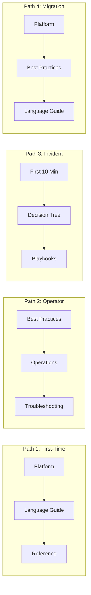

---
hide:
  - toc
---

# Learning Paths

Different roles need different paths through this guide. Choose the path that matches your current goal, then follow it in order.

## Path 1: First-Time Deployer

For developers new to Elastic Beanstalk who want to deploy their first application.

1. [Platform — How Elastic Beanstalk Works](../platform/how-elastic-beanstalk-works.md)
2. [Platform — Environment Tiers](../platform/environment-tiers.md)
3. [Language Guide — Local Run](../language-guides/python/01-local-run.md) (Python) or [Node.js](../language-guides/nodejs/01-local-run.md)
4. [Language Guide — First Deploy](../language-guides/python/02-first-deploy.md) (Python) or [Node.js](../language-guides/nodejs/02-first-deploy.md)
5. [Language Guide — Configuration](../language-guides/python/03-configuration.md) (Python) or [Node.js](../language-guides/nodejs/03-configuration.md)
6. [Reference — EB CLI Cheatsheet](../reference/eb-cli-cheatsheet.md)

## Path 2: Production Operator

For SREs and operators responsible for running EB environments in production.

1. [Best Practices — Production Baseline](../best-practices/production-baseline.md)
2. [Best Practices — Security](../best-practices/security.md)
3. [Best Practices — Deployment](../best-practices/deployment.md)
4. [Operations — Health Monitoring](../operations/health-monitoring.md)
5. [Operations — Scaling](../operations/scaling.md)
6. [Operations — Updates and Patching](../operations/updates-and-patching.md)
7. [Troubleshooting — Decision Tree](../troubleshooting/decision-tree.md)

## Path 3: Incident Responder

For on-call engineers who need to diagnose and resolve issues quickly.

1. [Troubleshooting — First 10 Minutes](../troubleshooting/first-10-minutes/index.md)
2. [Troubleshooting — Decision Tree](../troubleshooting/decision-tree.md)
3. [Troubleshooting — Playbooks](../troubleshooting/playbooks/index.md)
4. [Reference — EB CLI Cheatsheet](../reference/eb-cli-cheatsheet.md)
5. [Reference — Troubleshooting Quick Reference](../reference/troubleshooting.md)

## Path 4: Migration from Other Platforms

For teams migrating from Heroku, Azure App Service, or other PaaS platforms.

1. [Platform — How Elastic Beanstalk Works](../platform/how-elastic-beanstalk-works.md)
2. [Platform — Networking](../platform/networking.md)
3. [Platform — Security Architecture](../platform/security-architecture.md)
4. [Best Practices — Production Baseline](../best-practices/production-baseline.md)
5. Select a [Language Guide](../language-guides/index.md)
6. [Best Practices — Common Anti-Patterns](../best-practices/common-anti-patterns.md)

## See Also

- [Overview](./overview.md)
- [Repository Map](./repository-map.md)

## Sources

- [AWS Elastic Beanstalk Developer Guide](https://docs.aws.amazon.com/elasticbeanstalk/latest/dg/Welcome.html)
