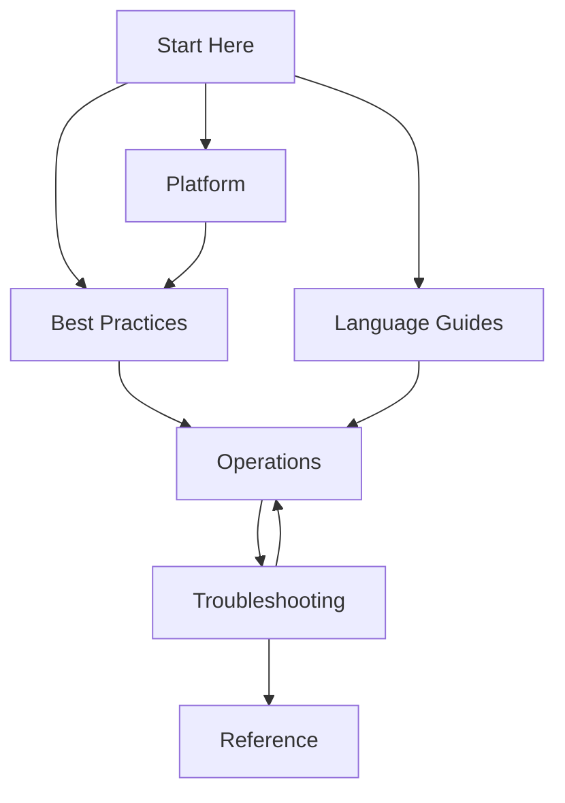

---
hide:
  - toc
---

# AWS Elastic Beanstalk Practical Guide

This repository is a comprehensive practical guide for building, deploying, operating, and troubleshooting web applications on AWS Elastic Beanstalk. Use this Start Here section to understand the guide layout and choose the right path for your role.

## Guide Scope and Audience

This guide is built for:

- Developers deploying web applications to AWS Elastic Beanstalk
- SREs and operators running production workloads
- Troubleshooting engineers resolving incidents under pressure

This is an independent community project. Not affiliated with or endorsed by Amazon Web Services.

## Guide Structure

The documentation is organized into seven core sections:

| Section | Purpose | Entry Link |
|---|---|---|
| Start Here | Orientation, learning paths, and repository map | [Start Here](../index.md) |
| Platform | Core Elastic Beanstalk architecture and platform behavior | [Platform](../platform/index.md) |
| Best Practices | Production patterns for security, networking, deployment, scaling, reliability | [Best Practices](../best-practices/index.md) |
| Language Guides | End-to-end implementation guides by stack | [Language Guides](../language-guides/index.md) |
| Operations | Day-2 operational execution for production | [Operations](../operations/index.md) |
| Troubleshooting | Methodology, playbooks, and diagnostic guides | [Troubleshooting](../troubleshooting/index.md) |
| Reference | EB CLI cheatsheet, platform limits, environment properties | [Reference](../reference/index.md) |

## How to Use This Guide

1. Begin with this section to understand navigation and scope.
2. Read Platform before deep implementation or production hardening.
3. Review Best Practices for production patterns and anti-patterns.
4. Select one Language Guide for your runtime stack.
5. Move to Operations to establish reliability, security, and scale practices.
6. Use Troubleshooting during incident response and for preventive learning.
7. Consult Reference for quick CLI, limits, and environment property lookups.

## See Also

- [Learning Paths](./learning-paths.md)
- [Repository Map](./repository-map.md)
- [Platform](../platform/index.md)
- [Operations](../operations/index.md)
- [Troubleshooting](../troubleshooting/index.md)
- [Reference](../reference/index.md)

## Sources

- [AWS Elastic Beanstalk Developer Guide](https://docs.aws.amazon.com/elasticbeanstalk/latest/dg/Welcome.html)
- [What is AWS Elastic Beanstalk?](https://docs.aws.amazon.com/elasticbeanstalk/latest/dg/Welcome.html)
