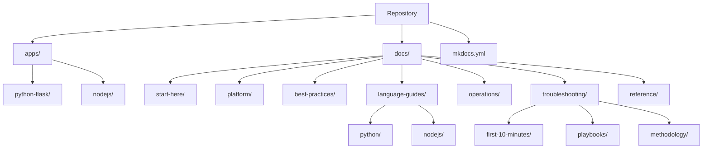

# Repository Map

This page explains the repository structure and where to find each type of content.

## Directory Structure

```text
.
├── .github/
│   └── workflows/              # GitHub Pages deployment
├── apps/
│   ├── python-flask/           # Python reference application
│   │   ├── application.py      # Flask WSGI entry point
│   │   ├── requirements.txt    # Python dependencies
│   │   └── Procfile            # Gunicorn startup command
│   └── nodejs/                 # Node.js reference application
│       ├── app.js              # Express entry point
│       ├── package.json        # Node.js dependencies
│       └── Procfile            # Node.js startup command
├── docs/
│   ├── start-here/             # Orientation and learning paths
│   ├── platform/               # Architecture and concepts
│   ├── best-practices/         # Production patterns
│   ├── language-guides/        # Per-language tutorials
│   │   ├── python/             # Python (Flask) guide + recipes
│   │   └── nodejs/             # Node.js (Express) guide + recipes
│   ├── operations/             # Day-2 operational guides
│   ├── troubleshooting/        # Diagnosis and resolution
│   │   ├── first-10-minutes/   # Quick checklists
│   │   ├── playbooks/          # Hypothesis-driven playbooks
│   │   └── methodology/        # Systematic approach
│   └── reference/              # Quick lookups
└── mkdocs.yml                  # MkDocs Material configuration
```

## Content by Section

| Section | Pages | Description |
|---|---|---|
| Start Here | 3 | Orientation, learning paths, repository map |
| Platform | 9 | Architecture, environment tiers, scaling, networking, security |
| Best Practices | 8 | Production baseline, deployment, scaling, reliability, anti-patterns |
| Language Guides | 28 | Python and Node.js tutorials with recipes |
| Operations | 8 | Scaling, environments, health, updates, cost |
| Troubleshooting | 20+ | Decision tree, playbooks, methodology |
| Reference | 5 | EB CLI, limits, environment properties |



## Reference Applications

The `apps/` directory contains minimal reference applications:

- **`apps/python-flask/`** — Flask application with Gunicorn. Demonstrates the `application.py` entry point convention, health check endpoint, and environment property reading.
- **`apps/nodejs/`** — Express application. Demonstrates the `PORT` environment variable convention, health check endpoint, and `package.json` engines field.

These applications are designed for local development and testing. They mirror the patterns expected by Elastic Beanstalk platforms.

## See Also

- [Overview](./overview.md)
- [Learning Paths](./learning-paths.md)

## Sources

- [AWS Elastic Beanstalk Developer Guide](https://docs.aws.amazon.com/elasticbeanstalk/latest/dg/Welcome.html)
