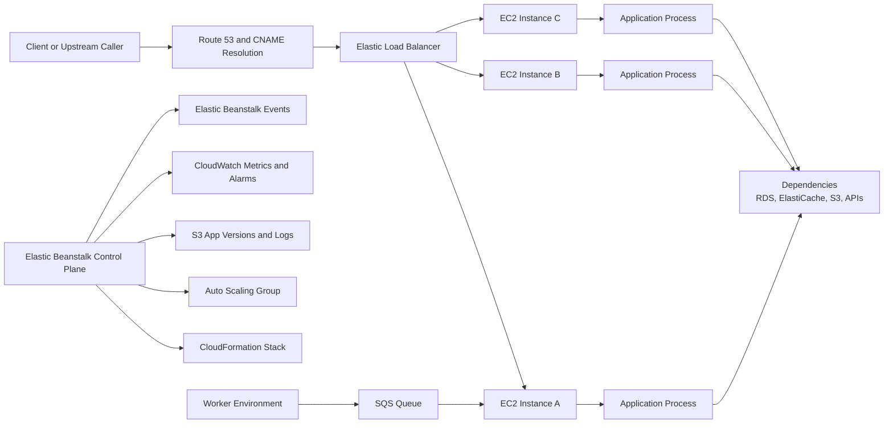

# Troubleshooting Architecture Overview

Elastic Beanstalk troubleshooting is fastest when you diagnose by component ownership and failure domain instead of by individual error messages.

## Scope

This page maps core Elastic Beanstalk-related services and clarifies where failures originate:

-    Amazon EC2 instances (application runtime and host-level behavior).
-    Elastic Load Balancing listeners, target health checks, and request routing.
-    Auto Scaling groups and scaling policy behavior.
-    AWS CloudFormation stack orchestration for environment lifecycle.
-    Amazon S3 application versions and deployment artifacts.
-    Amazon CloudWatch metrics, alarms, and optional logs pipelines.
-    Amazon SQS queue behavior for worker tier environments.

## Component Topology for Troubleshooting

## Failure Domains and Blast Radius

| Component | Typical Failure Signal | Blast Radius | First Check |
|---|---|---|---|
| DNS / CNAME | Name does not resolve or points to wrong target | Global for that hostname | `nslookup`, Route 53 records, EB environment CNAME |
| Load Balancer | 502/503/504, unhealthy targets, listener mismatch | All traffic behind that load balancer | Target health and listener rules |
| EC2 Instance | Crash loops, failed startup, high CPU or memory | Partial if multiple instances; total if single instance | Instance health and process status |
| Application Process | HTTP 5xx, startup failure, dependency timeout | Per instance process, then environment-wide | App logs and runtime error traces |
| Auto Scaling | No scale-out, excess scale-in, stuck replacement | Capacity and availability degradation | Auto Scaling activities and alarm triggers |
| CloudFormation | Environment update/launch failure | Environment creation or update blocked | Stack events and failed resource logical ID |
| S3 App Versions | Wrong artifact, missing application version | Deployments blocked or bad release deployed | Application versions and source bundle metadata |
| CloudWatch | Missing alarms, delayed metrics visibility | Slower detection, poor scaling decisions | Alarm state, metric dimensions, timestamps |
| SQS (worker tier) | Queue backlog growth, visibility timeout churn | Delayed async jobs, retries, duplicate processing risk | Queue depth, worker health, dead-letter handling |

## Control Plane vs Data Plane

-    Control plane: Elastic Beanstalk service APIs and CloudFormation orchestration.
-    Data plane: Load balancer traffic, EC2 runtime, app process behavior, dependency calls.
-    A green control-plane update does not guarantee data-plane health.
-    Always verify both planes after deployment or configuration changes.

## Ownership Boundaries

| Domain | Primary Owner | Typical Escalation Trigger |
|---|---|---|
| Application runtime and code | App team | uncaught exceptions, startup command failure |
| Platform configuration | Platform/SRE team | deployment hooks, platform branch regressions |
| Networking and DNS | Network/Infra team | no route, blocked ports, listener or SG mismatch |
| AWS service behavior | Shared with AWS Support | unexplained managed service errors after evidence collection |

## Request and Event Correlation Pattern

-    Match user-facing symptom timestamp with Elastic Beanstalk events first.
-    Then correlate load balancer health and HTTP code patterns.
-    Then inspect instance and application logs for causal error chains.
-    Finally map to dependency metrics (database latency, cache connectivity, API quotas).

## Worker Tier Specific Considerations

-    Worker environments consume from SQS through `aws-sqsd` and publish to application handlers.
-    Queue spikes can represent producer bursts, worker failures, or visibility timeout misconfiguration.
-    Distinguish throughput bottlenecks from poison messages using retries and dead-letter queues.

## Common Misdiagnosis Patterns

-    Treating load balancer 5xx as always application bugs.
-    Assuming healthy instances mean healthy endpoints.
-    Ignoring CloudFormation stack event failures during environment updates.
-    Debugging dependency latency before confirming request reaches application process.

## See Also

-    [Troubleshooting Hub](./index.md)
-    [Decision Tree](./decision-tree.md)
-    [Mental Model](./mental-model.md)
-    [Log Sources Map](./methodology/log-sources-map.md)
-    [First 10 Minutes: Connectivity Issues](./first-10-minutes/connectivity-issues.md)
-    [Playbooks Hub](./playbooks/index.md)

## Sources

-    https://docs.aws.amazon.com/elasticbeanstalk/latest/dg/concepts.concepts.html
-    https://docs.aws.amazon.com/elasticbeanstalk/latest/dg/using-features.managing.html
-    https://docs.aws.amazon.com/elasticbeanstalk/latest/dg/environment-resources.html
-    https://docs.aws.amazon.com/elasticbeanstalk/latest/dg/using-features.logging.html
-    https://docs.aws.amazon.com/elasticbeanstalk/latest/dg/using-features.worker.html
