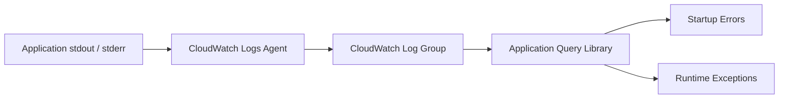

# Application Query Library

Use these CloudWatch Logs Insights queries against application stdout and stderr logs to isolate startup failures, uncaught exceptions, and recurring error signatures in Elastic Beanstalk application processes.

## When to Use

-    Use when an environment turns Severe or Degraded immediately after deployment and you suspect application startup crashes.
-    Use when recurring exceptions appear in health cause messages and you need the full stack trace and frequency.
-    Use during triage to distinguish between platform-level failures and application-level bugs.
-    Use after code changes to verify that no new exception patterns have been introduced.

## Prerequisites

-    CloudWatch Logs agent enabled on the Elastic Beanstalk environment (`aws:elasticbeanstalk:cloudwatch:logs` namespace).
-    Application stdout log group streaming to CloudWatch: `/aws/elasticbeanstalk/$ENV_NAME/var/log/web.stdout.log`.
-    IAM permissions for `logs:StartQuery`, `logs:GetQueryResults`, and `logs:FilterLogEvents`.
-    Familiarity with your application's logging format and exception output patterns.

## Log Group Pattern

```text
/aws/elasticbeanstalk/$ENV_NAME/var/log/web.stdout.log
```

Replace `$ENV_NAME` with your environment name. Some platforms also emit to `var/log/eb-engine.log` for platform-level application lifecycle events.



## Interpretation Guidance

-    **Startup errors within seconds of deployment** indicate missing dependencies, configuration errors, or port binding failures. Cross-reference with the [Deployment Events](../platform/deployment-events.md) platform query to confirm timing.
-    **Recurring runtime exceptions with increasing frequency** suggest a progressive failure such as connection pool exhaustion or memory leak. Check the [Instance Degraded Health](../../playbooks/performance/instance-degraded-health.md) playbook.
-    **Exceptions only on specific instances** may indicate instance-level issues rather than application bugs. Compare per-instance logs and check [CPU and Memory Exhaustion](../../playbooks/performance/cpu-memory-exhaustion.md).

## Queries

| Query | Description | Link |
| --- | --- | --- |
| Startup Errors | Find boot-time crashes, bind failures, and dependency initialization errors | [startup-errors.md](./startup-errors.md) |
| Runtime Exceptions | Count recurring exceptions and stack-trace prefixes during normal traffic | [runtime-exceptions.md](./runtime-exceptions.md) |

## See Also

-    [CloudWatch Query Library Overview](../index.md)
-    [Platform Query Library](../platform/index.md)
-    [Health Red After Deploy Playbook](../../playbooks/deployment-availability/health-red-after-deploy.md)
-    [Instance Degraded Health Playbook](../../playbooks/performance/instance-degraded-health.md)

## Sources

-    https://docs.aws.amazon.com/elasticbeanstalk/latest/dg/AWSHowTo.cloudwatchlogs.html
-    https://docs.aws.amazon.com/AmazonCloudWatch/latest/logs/CWL_QuerySyntax.html
-    https://docs.aws.amazon.com/AmazonCloudWatch/latest/logs/AnalyzingLogData.html
