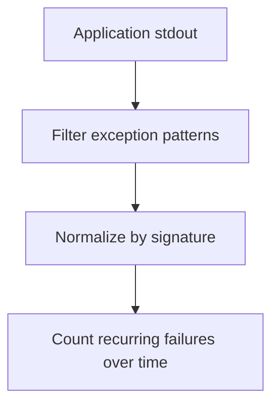

# Runtime Exceptions

## When to Use
Use this query when the application starts successfully but requests fail later with stack traces, unhandled exceptions, or repeated language runtime errors.



## Prerequisites
-    Log group: `/aws/elasticbeanstalk/$ENV_NAME/var/log/web.stdout.log`
-    Related log group to correlate: `/aws/elasticbeanstalk/$ENV_NAME/var/log/nginx/error.log`
-    IAM permissions: `logs:StartQuery`, `logs:GetQueryResults`, and `logs:DescribeLogGroups`

## Query
```text
fields @timestamp, @message
| filter @message like /Exception|Traceback|ERROR|UnhandledPromiseRejection|Unhandled exception/
| parse @message /(?<signature>[A-Za-z0-9_.]+(Error|Exception))/
| stats count() as exceptionCount, min(@timestamp) as firstSeen, max(@timestamp) as lastSeen by signature
| sort exceptionCount desc
| limit 20
```

## Example Output
| signature | exceptionCount | firstSeen | lastSeen |
| --- | ---: | --- | --- |
| TimeoutError | 57 | 2026-04-07 13:48:11 | 2026-04-07 14:24:52 |
| OperationalError | 22 | 2026-04-07 13:49:02 | 2026-04-07 14:20:13 |
| TypeError | 8 | 2026-04-07 14:02:45 | 2026-04-07 14:18:09 |

## How to Read the Results
!!! tip
    Treat the most frequent signature as a symptom cluster, not automatically the root cause. `TimeoutError` often points to a downstream dependency, while `TypeError` or `ReferenceError` more often indicates an application bug introduced by code or configuration drift.

## Variations
-    Trend exceptions by 5-minute buckets:

    ```text
    fields @timestamp, @message
    | filter @message like /Exception|Traceback|ERROR|UnhandledPromiseRejection|Unhandled exception/
    | parse @message /(?<signature>[A-Za-z0-9_.]+(Error|Exception))/
    | stats count() as exceptionCount by bin(5m) as timeWindow, signature
    | sort timeWindow desc, exceptionCount desc
    ```

-    Focus on one known signature:

    ```text
    fields @timestamp, @logStream, @message
    | filter @message like /TimeoutError/
    | sort @timestamp desc
    | limit 50
    ```

## See Also
-    `troubleshooting/cloudwatch/application/index.md`
-    `troubleshooting/cloudwatch/http/5xx-trend-over-time.md`
-    `troubleshooting/playbooks/performance/instance-degraded-health.md`
-    `troubleshooting/playbooks/performance/high-latency-under-load.md`

## Sources
-    https://docs.aws.amazon.com/AmazonCloudWatch/latest/logs/CWL_QuerySyntax.html
-    https://docs.aws.amazon.com/elasticbeanstalk/latest/dg/AWSHowTo.cloudwatchlogs.html
-    https://docs.aws.amazon.com/elasticbeanstalk/latest/dg/using-features.logging.html
