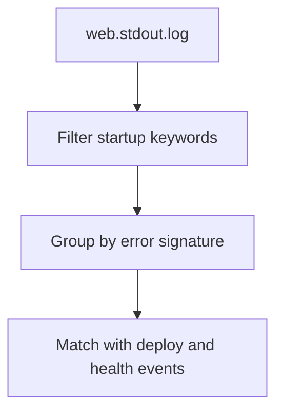

# Startup Errors

## When to Use
Use this query when a deployment completes but instances never become healthy, application processes restart immediately, or the health check path fails right after a boot cycle.



## Prerequisites
-    Log group: `/aws/elasticbeanstalk/$ENV_NAME/var/log/web.stdout.log`
-    Related log group to inspect next: `/aws/elasticbeanstalk/$ENV_NAME/var/log/eb-activity.log`
-    IAM permissions: `logs:StartQuery`, `logs:GetQueryResults`, and `logs:DescribeLogGroups`

## Query
```text
fields @timestamp, @message
| filter @message like /ERROR|Error|Exception|Traceback|address already in use|EADDRINUSE|ModuleNotFoundError|Cannot find module|failed to start/
| stats count() as occurrences, min(@timestamp) as firstSeen, max(@timestamp) as lastSeen by @logStream
| sort lastSeen desc
```

## Example Output
| @logStream | occurrences | firstSeen | lastSeen |
| --- | ---: | --- | --- |
| i-xxxxxxxxxxxxxxxxx.log | 14 | 2026-04-07 14:02:18 | 2026-04-07 14:03:01 |
| i-yyyyyyyyyyyyyyyyy.log | 9 | 2026-04-07 14:02:20 | 2026-04-07 14:02:47 |

## How to Read the Results
!!! tip
    Startup failures usually cluster tightly in time right after a deployment, instance replacement, or process restart. If `firstSeen` lines up with a deploy event and every instance log stream shows the same signature, treat the release artifact or environment configuration as the leading hypothesis.

## Variations
-    Show raw startup failure lines instead of counts:

    ```text
    fields @timestamp, @logStream, @message
    | filter @message like /ERROR|Error|Exception|Traceback|address already in use|EADDRINUSE|ModuleNotFoundError|Cannot find module|failed to start/
    | sort @timestamp desc
    | limit 50
    ```

-    Focus on port binding issues:

    ```text
    fields @timestamp, @logStream, @message
    | filter @message like /address already in use|EADDRINUSE|bind/
    | sort @timestamp desc
    | limit 50
    ```

## See Also
-    `troubleshooting/cloudwatch/application/index.md`
-    `troubleshooting/cloudwatch/platform/deployment-events.md`
-    `troubleshooting/playbooks/deployment-availability/health-red-after-deploy.md`
-    `troubleshooting/playbooks/deployment-availability/deployment-failed.md`

## Sources
-    https://docs.aws.amazon.com/AmazonCloudWatch/latest/logs/CWL_QuerySyntax.html
-    https://docs.aws.amazon.com/elasticbeanstalk/latest/dg/AWSHowTo.cloudwatchlogs.html
-    https://docs.aws.amazon.com/elasticbeanstalk/latest/dg/troubleshooting.html
