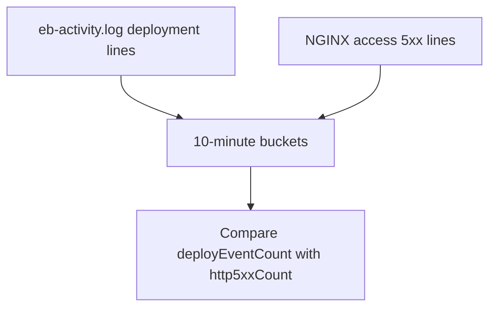

# Deploy vs Errors

## When to Use
Use this query when you need to test whether a deployment directly overlaps with a burst of HTTP 5xx responses instead of assuming the release caused the incident.



## Prerequisites
-    Log groups: `/aws/elasticbeanstalk/$ENV_NAME/var/log/eb-activity.log` and `/aws/elasticbeanstalk/$ENV_NAME/var/log/nginx/access.log`
-    IAM permissions: `logs:StartQuery`, `logs:GetQueryResults`, and `logs:DescribeLogGroups`
-    Run the query across both selected log groups in the same CloudWatch Logs Insights session

## Query
```text
fields @timestamp, @message, @log
| parse @message '* - - [*] "* * *" * * "*" "*" *' as remoteAddr, dateTime, method, path, protocol, status, bytes, referer, userAgent, requestTime
| fields bin(10m) as timeWindow,
         if(@log like /eb-activity/, 1, 0) as isPlatform,
         if(@log like /access.log/ and status >= 500, 1, 0) as isHttp5xx,
         if(@log like /eb-activity/ and @message like /deploy|deployment|Successfully deployed|failed/, 1, 0) as isDeployEvent
| stats sum(isDeployEvent) as deployEventCount, sum(isHttp5xx) as http5xxCount by timeWindow
| filter deployEventCount > 0 or http5xxCount > 0
| sort timeWindow desc
```

## Example Output
| timeWindow | deployEventCount | http5xxCount |
| --- | ---: | ---: |
| 2026-04-07 14:00:00 | 6 | 81 |
| 2026-04-07 13:50:00 | 0 | 4 |
| 2026-04-07 13:40:00 | 0 | 2 |

## How to Read the Results
!!! tip
    If `http5xxCount` jumps only in buckets that also contain deployment activity, the release is a strong candidate. If 5xx traffic begins well before `deployEventCount` rises, look for pre-existing application or dependency instability instead.

## Variations
-    Use 5-minute buckets for short incidents:

    ```text
    fields @timestamp, @message, @log
    | parse @message '* - - [*] "* * *" * * "*" "*" *' as remoteAddr, dateTime, method, path, protocol, status, bytes, referer, userAgent, requestTime
    | fields bin(5m) as timeWindow,
             if(@log like /access.log/ and status >= 500, 1, 0) as isHttp5xx,
             if(@log like /eb-activity/ and @message like /deploy|deployment|Successfully deployed|failed/, 1, 0) as isDeployEvent
    | stats sum(isDeployEvent) as deployEventCount, sum(isHttp5xx) as http5xxCount by timeWindow
    | filter deployEventCount > 0 or http5xxCount > 0
    | sort timeWindow desc
    ```

-    Restrict errors to one path:

    ```text
    fields @timestamp, @message, @log
    | parse @message '* - - [*] "* * *" * * "*" "*" *' as remoteAddr, dateTime, method, path, protocol, status, bytes, referer, userAgent, requestTime
    | fields bin(10m) as timeWindow,
             if(@log like /access.log/ and status >= 500 and path = "/api/orders", 1, 0) as isHttp5xx,
             if(@log like /eb-activity/ and @message like /deploy|deployment|Successfully deployed|failed/, 1, 0) as isDeployEvent
    | stats sum(isDeployEvent) as deployEventCount, sum(isHttp5xx) as http5xxCount by timeWindow
    | filter deployEventCount > 0 or http5xxCount > 0
    | sort timeWindow desc
    ```

## See Also
-    `troubleshooting/cloudwatch/correlation/index.md`
-    `troubleshooting/cloudwatch/platform/deployment-events.md`
-    `troubleshooting/cloudwatch/http/5xx-trend-over-time.md`
-    `troubleshooting/playbooks/deployment-availability/health-red-after-deploy.md`

## Sources
-    https://docs.aws.amazon.com/AmazonCloudWatch/latest/logs/CWL_QuerySyntax.html
-    https://docs.aws.amazon.com/AmazonCloudWatch/latest/logs/AnalyzingLogData.html
-    https://docs.aws.amazon.com/elasticbeanstalk/latest/dg/AWSHowTo.cloudwatchlogs.html
