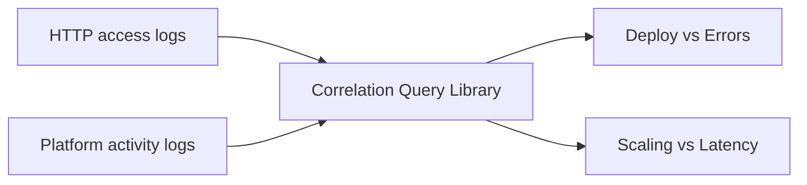

# Correlation Query Library

Use these multi-log-group CloudWatch Logs Insights queries to align platform activity with request symptoms so you can test whether deployments, scaling events, or health changes coincide with user-visible failures.

## When to Use

-    Use when you suspect a deployment caused an error spike but need time-aligned evidence to confirm the hypothesis.
-    Use when latency increases during scaling events and you need to determine whether new instances are the cause.
-    Use during post-incident review to build a unified timeline across platform and application log streams.
-    Use to disprove coincidental correlation — if deployment timing does not match the error window, look elsewhere.

## Prerequisites

-    CloudWatch Logs agent enabled on the Elastic Beanstalk environment (`aws:elasticbeanstalk:cloudwatch:logs` namespace).
-    Both HTTP access logs and platform activity logs streaming to CloudWatch.
-    IAM permissions for `logs:StartQuery` and `logs:GetQueryResults` across multiple log groups.
-    Familiarity with CloudWatch Logs Insights multi-log-group query syntax (selecting multiple log groups in the console or API).

## Log Group Patterns

```text
/aws/elasticbeanstalk/$ENV_NAME/var/log/nginx/access.log
/aws/elasticbeanstalk/$ENV_NAME/var/log/eb-activity.log
```

Correlation queries join time-bucketed data from at least two log groups. Select both log groups in the CloudWatch Logs Insights console before running.



## Interpretation Guidance

-    **Deploy timestamps that precede the error spike by 1–5 minutes** strongly suggest the deployment introduced the regression. Check the [Deployment Events](../platform/deployment-events.md) query for the specific failing hook or version.
-    **Error spikes with no deployment activity in the same window** rule out deployment as a cause and point toward traffic surges, dependency failures, or resource exhaustion.
-    **Latency increases that begin exactly when new instances join** suggest cold-start overhead or incomplete warm-up. Monitor until latency stabilizes after the scaling event completes.
-    **Latency increases that precede scaling activity** indicate that scaling was reactive, not causal — the root cause is the load itself.

## Queries

| Query | Description | Link |
| --- | --- | --- |
| Deploy vs Errors | Align deployment activity with HTTP 5xx counts in the same time buckets | [deploy-vs-errors.md](./deploy-vs-errors.md) |
| Scaling vs Latency | Compare scaling-related platform activity against p95 request latency | [scaling-vs-latency.md](./scaling-vs-latency.md) |

## See Also

-    [CloudWatch Query Library Overview](../index.md)
-    [Platform Query Library](../platform/index.md)
-    [High Latency Under Load Playbook](../../playbooks/performance/high-latency-under-load.md)
-    [Health Red After Deploy Playbook](../../playbooks/deployment-availability/health-red-after-deploy.md)

## Sources

-    https://docs.aws.amazon.com/elasticbeanstalk/latest/dg/AWSHowTo.cloudwatchlogs.html
-    https://docs.aws.amazon.com/AmazonCloudWatch/latest/logs/CWL_QuerySyntax.html
-    https://docs.aws.amazon.com/AmazonCloudWatch/latest/logs/CWL_QuerySyntax-examples.html
