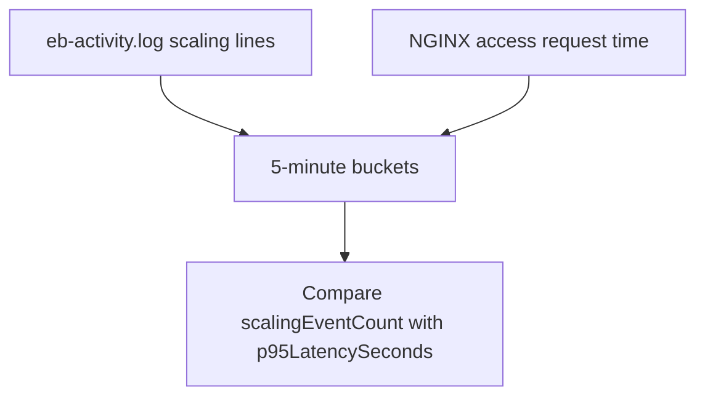

# Scaling vs Latency

## When to Use
Use this query when latency rises during traffic growth and you need to see whether scaling activity is keeping up, lagging behind, or coinciding with request slowdowns.



## Prerequisites
-    Log groups: `/aws/elasticbeanstalk/$ENV_NAME/var/log/eb-activity.log` and `/aws/elasticbeanstalk/$ENV_NAME/var/log/nginx/access.log`
-    IAM permissions: `logs:StartQuery`, `logs:GetQueryResults`, and `logs:DescribeLogGroups`
-    Access log format must include the request time field used for latency calculations

## Query
```text
fields @timestamp, @message, @log
| parse @message '* - - [*] "* * *" * * "*" "*" *' as remoteAddr, dateTime, method, path, protocol, status, bytes, referer, userAgent, requestTime
| fields bin(5m) as timeWindow,
         if(@log like /eb-activity/ and @message like /scale|Scaling|Adding instance|Terminating instance|Launching EC2 instance/, 1, 0) as isScalingEvent,
         if(@log like /access.log/, requestTime, null) as latencyValue
| stats sum(isScalingEvent) as scalingEventCount, pct(latencyValue, 95) as p95LatencySeconds, avg(latencyValue) as avgLatencySeconds by timeWindow
| filter scalingEventCount > 0 or ispresent(p95LatencySeconds)
| sort timeWindow desc
```

## Example Output
| timeWindow | scalingEventCount | p95LatencySeconds | avgLatencySeconds |
| --- | ---: | ---: | ---: |
| 2026-04-07 14:20:00 | 3 | 4.92 | 1.66 |
| 2026-04-07 14:15:00 | 0 | 5.11 | 1.84 |
| 2026-04-07 14:10:00 | 2 | 2.41 | 0.73 |

## How to Read the Results
!!! tip
    If latency peaks before scaling events appear, capacity reaction may be too slow for the workload. If scaling activity is frequent but p95 latency remains high, the bottleneck may be application startup time, slow dependencies, or instance-level saturation rather than target capacity alone.

## Variations
-    Focus on one endpoint during scaling:

    ```text
    fields @timestamp, @message, @log
    | parse @message '* - - [*] "* * *" * * "*" "*" *' as remoteAddr, dateTime, method, path, protocol, status, bytes, referer, userAgent, requestTime
    | fields bin(5m) as timeWindow,
             if(@log like /eb-activity/ and @message like /scale|Scaling|Adding instance|Terminating instance|Launching EC2 instance/, 1, 0) as isScalingEvent,
             if(@log like /access.log/ and path = "/api/orders", requestTime, null) as latencyValue
    | stats sum(isScalingEvent) as scalingEventCount, pct(latencyValue, 95) as p95LatencySeconds by timeWindow
    | filter scalingEventCount > 0 or ispresent(p95LatencySeconds)
    | sort timeWindow desc
    ```

-    Increase the bucket size for long incidents:

    ```text
    fields @timestamp, @message, @log
    | parse @message '* - - [*] "* * *" * * "*" "*" *' as remoteAddr, dateTime, method, path, protocol, status, bytes, referer, userAgent, requestTime
    | fields bin(15m) as timeWindow,
             if(@log like /eb-activity/ and @message like /scale|Scaling|Adding instance|Terminating instance|Launching EC2 instance/, 1, 0) as isScalingEvent,
             if(@log like /access.log/, requestTime, null) as latencyValue
    | stats sum(isScalingEvent) as scalingEventCount, pct(latencyValue, 95) as p95LatencySeconds, avg(latencyValue) as avgLatencySeconds by timeWindow
    | filter scalingEventCount > 0 or ispresent(p95LatencySeconds)
    | sort timeWindow desc
    ```

## See Also
-    `troubleshooting/cloudwatch/correlation/index.md`
-    `troubleshooting/cloudwatch/http/latency-by-endpoint.md`
-    `troubleshooting/cloudwatch/platform/health-transitions.md`
-    `troubleshooting/playbooks/performance/high-latency-under-load.md`

## Sources
-    https://docs.aws.amazon.com/AmazonCloudWatch/latest/logs/CWL_QuerySyntax.html
-    https://docs.aws.amazon.com/AmazonCloudWatch/latest/logs/AnalyzingLogData.html
-    https://docs.aws.amazon.com/elasticbeanstalk/latest/dg/environments-cfg-autoscaling-triggers.html
