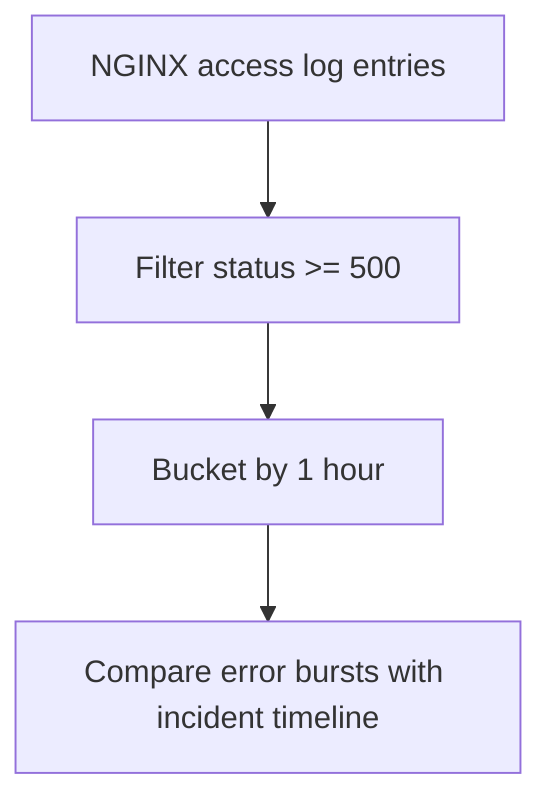

# 5xx Trend Over Time

## When to Use
Use this query when users report failed requests, the load balancer shows HTTP 5xx responses, or you need to confirm whether server-side errors started before, during, or after a deployment.



## Prerequisites
-    Log group: `/aws/elasticbeanstalk/$ENV_NAME/var/log/nginx/access.log`
-    IAM permissions: `logs:StartQuery`, `logs:GetQueryResults`, and `logs:DescribeLogGroups`
-    Access log format must include request line, status code, byte count, and request time fields

## Query
```text
fields @timestamp, @message
| parse @message '* - - [*] "* * *" * * "*" "*" *' as remoteAddr, dateTime, method, path, protocol, status, bytes, referer, userAgent, requestTime
| filter status >= 500
| stats count() as errorCount by bin(1h) as timeWindow
| sort timeWindow desc
```

## Example Output
| timeWindow | errorCount |
| --- | ---: |
| 2026-04-07 14:00:00 | 87 |
| 2026-04-07 13:00:00 | 16 |
| 2026-04-07 12:00:00 | 3 |

## How to Read the Results
!!! tip
    A sharp rise in `errorCount` usually means a deployment regression, upstream dependency failure, or application resource saturation. Compare the first spike with Elastic Beanstalk deployment events and health causes before changing capacity.

## Variations
-    Reduce noise to one endpoint:

    ```text
    fields @timestamp, @message
    | parse @message '* - - [*] "* * *" * * "*" "*" *' as remoteAddr, dateTime, method, path, protocol, status, bytes, referer, userAgent, requestTime
    | filter status >= 500 and path = "/api/orders"
    | stats count() as errorCount by bin(5m) as timeWindow
    | sort timeWindow desc
    ```

-    Break down by status code:

    ```text
    fields @timestamp, @message
    | parse @message '* - - [*] "* * *" * * "*" "*" *' as remoteAddr, dateTime, method, path, protocol, status, bytes, referer, userAgent, requestTime
    | filter status >= 500
    | stats count() as errorCount by bin(15m) as timeWindow, status
    | sort timeWindow desc, status asc
    ```

## See Also
-    `troubleshooting/cloudwatch/http/index.md`
-    `troubleshooting/cloudwatch/correlation/deploy-vs-errors.md`
-    `troubleshooting/playbooks/networking/load-balancer-5xx.md`
-    `troubleshooting/playbooks/deployment-availability/health-red-after-deploy.md`

## Sources
-    https://docs.aws.amazon.com/AmazonCloudWatch/latest/logs/CWL_QuerySyntax.html
-    https://docs.aws.amazon.com/elasticbeanstalk/latest/dg/AWSHowTo.cloudwatchlogs.html
-    https://docs.aws.amazon.com/elasticloadbalancing/latest/application/load-balancer-troubleshooting.html
