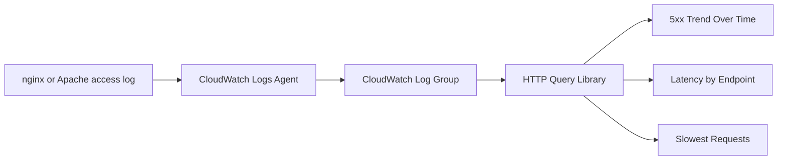

# HTTP Query Library

Use these CloudWatch Logs Insights queries against Elastic Beanstalk web server access logs to diagnose request failures, latency distribution, and the heaviest endpoints during an incident.

## When to Use

-    Use when HTTP 5xx error rates spike and you need to identify whether the source is the application, the platform, or the load balancer.
-    Use when users report slow responses and you need to compare endpoint-level latency percentiles.
-    Use when you need to find the specific requests consuming the most time during a load event.
-    Use during post-incident review to quantify the blast radius and recovery timeline of a failure window.

## Prerequisites

-    CloudWatch Logs agent enabled on the Elastic Beanstalk environment (`aws:elasticbeanstalk:cloudwatch:logs` namespace).
-    Web server access log group streaming to CloudWatch: `/aws/elasticbeanstalk/$ENV_NAME/var/log/nginx/access.log` (nginx) or `/aws/elasticbeanstalk/$ENV_NAME/var/log/httpd/access_log` (Apache).
-    IAM permissions for `logs:StartQuery`, `logs:GetQueryResults`, and `logs:FilterLogEvents`.
-    Familiarity with CloudWatch Logs Insights query syntax and time range selection.

## Log Group Pattern

```text
/aws/elasticbeanstalk/$ENV_NAME/var/log/nginx/access.log
```

Replace `$ENV_NAME` with your environment name. If your platform uses Apache instead of nginx, substitute `httpd/access_log`.



## Interpretation Guidance

-    **5xx spikes aligned with deployments** suggest application startup failures or configuration regressions. Cross-reference with the [Deploy vs Errors](../correlation/deploy-vs-errors.md) correlation query.
-    **High latency on specific endpoints** points to application-level bottlenecks such as slow database queries or external API calls. Check instance-level metrics in the [Performance playbooks](../../playbooks/performance/high-latency-under-load.md).
-    **Scattered slowest requests across all endpoints** may indicate infrastructure saturation rather than application logic issues. Correlate with [Scaling vs Latency](../correlation/scaling-vs-latency.md).

## Queries

| Query | Description | Link |
| --- | --- | --- |
| 5xx Trend Over Time | Count server-side failures by time bucket to spot bursts and recovery | [5xx-trend-over-time.md](./5xx-trend-over-time.md) |
| Latency by Endpoint | Compare average and tail latency per path | [latency-by-endpoint.md](./latency-by-endpoint.md) |
| Slowest Requests | Surface the individual requests with the highest response times | [slowest-requests.md](./slowest-requests.md) |

## See Also

-    [CloudWatch Query Library Overview](../index.md)
-    [Application Query Library](../application/index.md)
-    [High Latency Under Load Playbook](../../playbooks/performance/high-latency-under-load.md)
-    [Load Balancer 5xx Playbook](../../playbooks/networking/load-balancer-5xx.md)

## Sources

-    https://docs.aws.amazon.com/elasticbeanstalk/latest/dg/AWSHowTo.cloudwatchlogs.html
-    https://docs.aws.amazon.com/AmazonCloudWatch/latest/logs/CWL_QuerySyntax.html
-    https://docs.aws.amazon.com/AmazonCloudWatch/latest/logs/AnalyzingLogData.html
