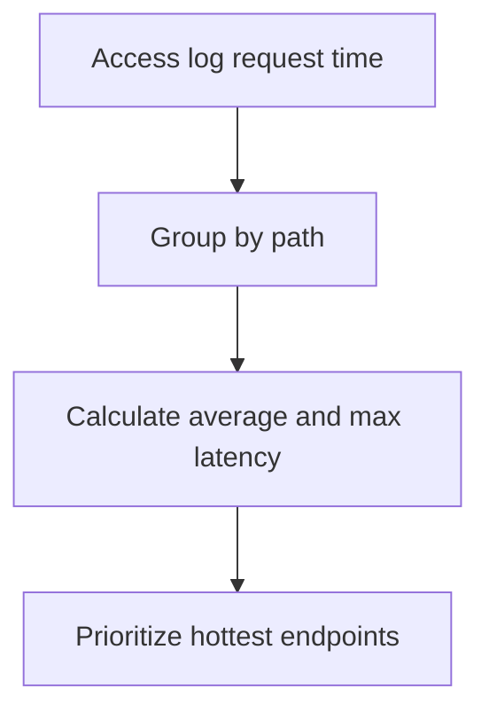

# Latency by Endpoint

## When to Use
Use this query when average environment latency is rising and you need to know whether one route, one API surface, or one static path is dominating the slowdown.



## Prerequisites
-    Log group: `/aws/elasticbeanstalk/$ENV_NAME/var/log/nginx/access.log`
-    IAM permissions: `logs:StartQuery`, `logs:GetQueryResults`, and `logs:DescribeLogGroups`
-    Access log format must include the request time field at the end of the log line

## Query
```text
fields @timestamp, @message
| parse @message '* - - [*] "* * *" * * "*" "*" *' as remoteAddr, dateTime, method, path, protocol, status, bytes, referer, userAgent, requestTime
| filter ispresent(path) and ispresent(requestTime)
| stats avg(requestTime) as avgLatencySeconds, max(requestTime) as maxLatencySeconds, count() as requestCount by path
| sort avgLatencySeconds desc
| limit 20
```

## Example Output
| path | avgLatencySeconds | maxLatencySeconds | requestCount |
| --- | ---: | ---: | ---: |
| /api/reports/daily | 2.84 | 9.17 | 143 |
| /api/orders | 1.62 | 6.45 | 921 |
| /health | 0.03 | 0.08 | 1800 |

## How to Read the Results
!!! tip
    Focus first on endpoints that are both slow and busy. A very high `avgLatencySeconds` with only a handful of requests may be less urgent than a moderately slow path with heavy traffic and growing user impact.

## Variations
-    Filter to successful requests only:

    ```text
    fields @timestamp, @message
    | parse @message '* - - [*] "* * *" * * "*" "*" *' as remoteAddr, dateTime, method, path, protocol, status, bytes, referer, userAgent, requestTime
    | filter status < 500 and ispresent(requestTime)
    | stats avg(requestTime) as avgLatencySeconds, count() as requestCount by path
    | sort avgLatencySeconds desc
    | limit 20
    ```

-    Compare methods on the same path pattern:

    ```text
    fields @timestamp, @message
    | parse @message '* - - [*] "* * *" * * "*" "*" *' as remoteAddr, dateTime, method, path, protocol, status, bytes, referer, userAgent, requestTime
    | filter path like /\/api\// and ispresent(requestTime)
    | stats avg(requestTime) as avgLatencySeconds, count() as requestCount by method, path
    | sort avgLatencySeconds desc
    | limit 20
    ```

## See Also
-    `troubleshooting/cloudwatch/http/index.md`
-    `troubleshooting/cloudwatch/http/slowest-requests.md`
-    `troubleshooting/cloudwatch/correlation/scaling-vs-latency.md`
-    `troubleshooting/playbooks/performance/high-latency-under-load.md`

## Sources
-    https://docs.aws.amazon.com/AmazonCloudWatch/latest/logs/CWL_QuerySyntax.html
-    https://docs.aws.amazon.com/elasticbeanstalk/latest/dg/AWSHowTo.cloudwatchlogs.html
-    https://docs.aws.amazon.com/elasticbeanstalk/latest/dg/health-enhanced-status.html
