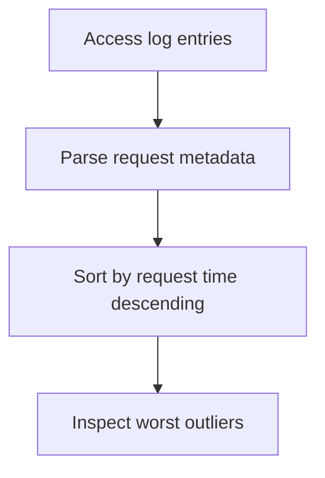

# Slowest Requests

## When to Use
Use this query when you want the exact requests that took the longest to serve so you can inspect paths, methods, and response codes around the worst outliers.



## Prerequisites
-    Log group: `/aws/elasticbeanstalk/$ENV_NAME/var/log/nginx/access.log`
-    IAM permissions: `logs:StartQuery`, `logs:GetQueryResults`, and `logs:DescribeLogGroups`
-    Access log format must include request time after the user agent field

## Query
```text
fields @timestamp, @message
| parse @message '* - - [*] "* * *" * * "*" "*" *' as remoteAddr, dateTime, method, path, protocol, status, bytes, referer, userAgent, requestTime
| filter ispresent(requestTime)
| sort requestTime desc
| limit 20
| display @timestamp, method, path, status, requestTime, bytes
```

## Example Output
| @timestamp | method | path | status | requestTime | bytes |
| --- | --- | --- | ---: | ---: | ---: |
| 2026-04-07 14:22:09 | GET | /api/reports/daily | 504 | 12.84 | 561 |
| 2026-04-07 14:21:44 | POST | /api/orders | 500 | 10.77 | 913 |
| 2026-04-07 14:21:13 | GET | /api/orders/summary | 200 | 8.32 | 4128 |

## How to Read the Results
!!! tip
    Sort the outliers into patterns: repeated timeouts on one endpoint suggest slow backend work, while mixed paths with similar delays suggest shared bottlenecks such as CPU pressure, exhausted connections, or dependency slowness.

## Variations
-    Look only at failing slow requests:

    ```text
    fields @timestamp, @message
    | parse @message '* - - [*] "* * *" * * "*" "*" *' as remoteAddr, dateTime, method, path, protocol, status, bytes, referer, userAgent, requestTime
    | filter status >= 500 and ispresent(requestTime)
    | sort requestTime desc
    | limit 20
    | display @timestamp, method, path, status, requestTime
    ```

-    Restrict to a single method:

    ```text
    fields @timestamp, @message
    | parse @message '* - - [*] "* * *" * * "*" "*" *' as remoteAddr, dateTime, method, path, protocol, status, bytes, referer, userAgent, requestTime
    | filter method = "POST" and ispresent(requestTime)
    | sort requestTime desc
    | limit 20
    | display @timestamp, method, path, status, requestTime
    ```

## See Also
-    `troubleshooting/cloudwatch/http/index.md`
-    `troubleshooting/cloudwatch/http/latency-by-endpoint.md`
-    `troubleshooting/playbooks/performance/high-latency-under-load.md`
-    `troubleshooting/playbooks/performance/cpu-memory-exhaustion.md`

## Sources
-    https://docs.aws.amazon.com/AmazonCloudWatch/latest/logs/CWL_QuerySyntax.html
-    https://docs.aws.amazon.com/elasticbeanstalk/latest/dg/AWSHowTo.cloudwatchlogs.html
