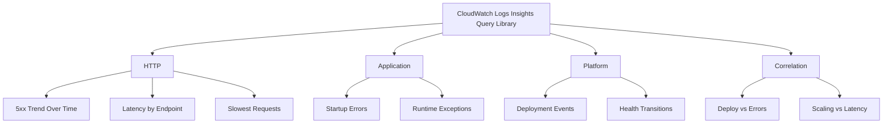

# CloudWatch Logs Insights Query Library

Use this library to turn Elastic Beanstalk log streams into repeatable troubleshooting queries for HTTP failures, application crashes, platform events, and cross-signal correlation.

## Categories
| Category | Focus | Index link |
| --- | --- | --- |
| HTTP | Request errors, latency, and endpoint hot spots from NGINX access logs | `troubleshooting/cloudwatch/http/index.md` |
| Application | Startup failures and runtime exceptions from application stdout logs | `troubleshooting/cloudwatch/application/index.md` |
| Platform | Deployment lifecycle and health status changes from Elastic Beanstalk activity logs | `troubleshooting/cloudwatch/platform/index.md` |
| Correlation | Time-aligned views that compare platform changes with request symptoms | `troubleshooting/cloudwatch/correlation/index.md` |

## Usage Notes
1.    Select the correct log groups for the query before running it; most pages call out the exact Elastic Beanstalk paths to include.
2.    Set the CloudWatch time range first, then adjust `bin()` windows to match the incident length.
3.    Start with broad filters, then add environment-specific paths, status codes, or keywords to narrow the result set.
4.    Use these queries together with environment events, enhanced health, and playbooks instead of treating one result set as root cause by itself.

!!! note
    CloudWatch Logs Insights queries run against the log groups you select in the console or API. The same query can return different answers if the incident window or selected Elastic Beanstalk environment is wrong.

## See Also
-    `troubleshooting/index.md`
-    `troubleshooting/methodology/log-sources-map.md`
-    `troubleshooting/methodology/troubleshooting-method.md`
-    `troubleshooting/playbooks/index.md`

## Sources
-    https://docs.aws.amazon.com/AmazonCloudWatch/latest/logs/AnalyzingLogData.html
-    https://docs.aws.amazon.com/AmazonCloudWatch/latest/logs/CWL_QuerySyntax.html
-    https://docs.aws.amazon.com/elasticbeanstalk/latest/dg/AWSHowTo.cloudwatchlogs.html
