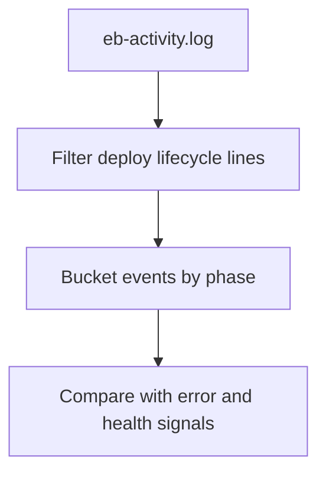

# Deployment Events

## When to Use
Use this query when a deployment appears to stall, partially succeeds, or causes immediate unhealthy instances and you need a time-ordered view of platform activity.



## Prerequisites
-    Log group: `/aws/elasticbeanstalk/$ENV_NAME/var/log/eb-activity.log`
-    Related log groups: `/aws/elasticbeanstalk/$ENV_NAME/var/log/web.stdout.log` and `/aws/elasticbeanstalk/$ENV_NAME/var/log/nginx/error.log`
-    IAM permissions: `logs:StartQuery`, `logs:GetQueryResults`, and `logs:DescribeLogGroups`

## Query
```text
fields @timestamp, @message
| filter @message like /deploy|deployment|command|failed|Successfully deployed|Hook/
| parse @message /(?<phase>deploy|deployment|command|Hook|failed|Successfully deployed)/
| stats count() as eventCount, min(@timestamp) as firstSeen, max(@timestamp) as lastSeen by phase
| sort lastSeen desc
```

## Example Output
| phase | eventCount | firstSeen | lastSeen |
| --- | ---: | --- | --- |
| deploy | 12 | 2026-04-07 14:00:11 | 2026-04-07 14:04:32 |
| failed | 2 | 2026-04-07 14:03:18 | 2026-04-07 14:03:21 |
| Successfully deployed | 1 | 2026-04-07 14:04:32 | 2026-04-07 14:04:32 |

## How to Read the Results
!!! tip
    A `Successfully deployed` line does not prove the application is healthy. If failures or command retries appear immediately before that marker, check startup logs and health transitions next to see whether the platform delivered the version but the process failed after launch.

## Variations
-    Show raw deployment lines in order:

    ```text
    fields @timestamp, @message
    | filter @message like /deploy|deployment|command|failed|Successfully deployed|Hook/
    | sort @timestamp asc
    | limit 100
    ```

-    Narrow to failed command activity:

    ```text
    fields @timestamp, @message
    | filter @message like /failed|Command hooks failed|Hook/
    | sort @timestamp desc
    | limit 50
    ```

## See Also
-    `troubleshooting/cloudwatch/platform/index.md`
-    `troubleshooting/cloudwatch/application/startup-errors.md`
-    `troubleshooting/cloudwatch/correlation/deploy-vs-errors.md`
-    `troubleshooting/playbooks/deployment-availability/deployment-failed.md`

## Sources
-    https://docs.aws.amazon.com/AmazonCloudWatch/latest/logs/CWL_QuerySyntax.html
-    https://docs.aws.amazon.com/elasticbeanstalk/latest/dg/using-features.logging.html
-    https://docs.aws.amazon.com/elasticbeanstalk/latest/dg/troubleshooting.html
