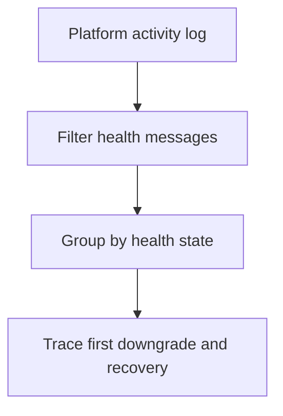

# Health Transitions

## When to Use
Use this query when environment color changes from Green to Yellow or Red, instances flap between healthy and severe, or you need the exact timing of health cause messages.



## Prerequisites
-    Log group: `/aws/elasticbeanstalk/$ENV_NAME/var/log/eb-activity.log`
-    Related log groups: `/aws/elasticbeanstalk/$ENV_NAME/var/log/nginx/access.log` and `/aws/elasticbeanstalk/$ENV_NAME/var/log/web.stdout.log`
-    IAM permissions: `logs:StartQuery`, `logs:GetQueryResults`, and `logs:DescribeLogGroups`

## Query
```text
fields @timestamp, @message
| filter @message like /health|Green|Yellow|Red|Severe|Degraded/
| parse @message /(?<healthState>Green|Yellow|Red|Severe|Degraded|Info|Ok)/
| stats count() as transitionCount, min(@timestamp) as firstSeen, max(@timestamp) as lastSeen by healthState
| sort lastSeen desc
```

## Example Output
| healthState | transitionCount | firstSeen | lastSeen |
| --- | ---: | --- | --- |
| Yellow | 4 | 2026-04-07 13:58:12 | 2026-04-07 14:12:06 |
| Red | 2 | 2026-04-07 14:03:40 | 2026-04-07 14:06:51 |
| Green | 3 | 2026-04-07 14:07:23 | 2026-04-07 14:18:02 |

## How to Read the Results
!!! tip
    The first non-green state is usually the most valuable timestamp in the incident. Use it as the pivot point for HTTP error, latency, and application exception queries so you can see what changed immediately before the downgrade.

## Variations
-    Display raw health-cause lines:

    ```text
    fields @timestamp, @message
    | filter @message like /health|Green|Yellow|Red|Severe|Degraded/
    | sort @timestamp asc
    | limit 100
    ```

-    Focus only on severe transitions:

    ```text
    fields @timestamp, @message
    | filter @message like /Red|Severe/
    | sort @timestamp desc
    | limit 50
    ```

## See Also
-    `troubleshooting/cloudwatch/platform/index.md`
-    `troubleshooting/cloudwatch/http/5xx-trend-over-time.md`
-    `troubleshooting/cloudwatch/correlation/scaling-vs-latency.md`
-    `troubleshooting/playbooks/deployment-availability/health-red-after-deploy.md`

## Sources
-    https://docs.aws.amazon.com/AmazonCloudWatch/latest/logs/CWL_QuerySyntax.html
-    https://docs.aws.amazon.com/elasticbeanstalk/latest/dg/health-enhanced-status.html
-    https://docs.aws.amazon.com/elasticbeanstalk/latest/dg/using-features.logging.html
