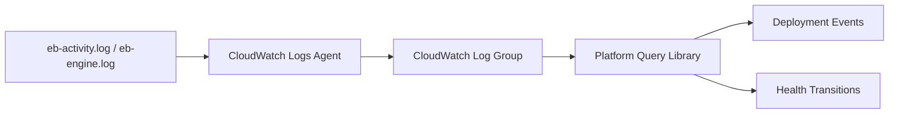

# Platform Query Library

Use these CloudWatch Logs Insights queries against Elastic Beanstalk activity logs to inspect deployment lifecycle steps, environment operations, and health state transitions at the platform level.

## When to Use

-    Use when a deployment fails or takes longer than expected and you need to identify which lifecycle phase stalled.
-    Use when environment health oscillates and you need a timeline of health state changes with cause messages.
-    Use during platform updates or managed action windows to monitor update progress and detect rollback triggers.
-    Use after scaling events to verify that new instances completed initialization successfully.

## Prerequisites

-    CloudWatch Logs agent enabled on the Elastic Beanstalk environment (`aws:elasticbeanstalk:cloudwatch:logs` namespace).
-    Platform activity log group streaming to CloudWatch: `/aws/elasticbeanstalk/$ENV_NAME/var/log/eb-activity.log`.
-    IAM permissions for `logs:StartQuery`, `logs:GetQueryResults`, and `logs:FilterLogEvents`.
-    Understanding of Elastic Beanstalk deployment lifecycle phases: download, extract, pre-deploy hooks, application start, post-deploy hooks, health check.

## Log Group Pattern

```text
/aws/elasticbeanstalk/$ENV_NAME/var/log/eb-activity.log
```

Replace `$ENV_NAME` with your environment name. For Amazon Linux 2023 environments, the engine log at `var/log/eb-engine.log` provides additional detail on hook execution.



## Interpretation Guidance

-    **Deployment phase failures** typically show `[ERROR]` entries with hook script names and exit codes. The failing hook identifies the exact lifecycle step to investigate.
-    **Health transitions from Green to Severe during deploy** indicate that the new application version is crashing. Cross-reference with [Startup Errors](../application/startup-errors.md) to see the application-side failure.
-    **Repeated health transitions without deployment activity** suggest infrastructure instability such as instance termination, AZ issues, or resource exhaustion. Check [Health Transitions](./health-transitions.md) alongside CloudWatch EC2 metrics.

## Queries

| Query | Description | Link |
| --- | --- | --- |
| Deployment Events | Summarize deploy phases, failures, and completion markers from activity logs | [deployment-events.md](./deployment-events.md) |
| Health Transitions | Show environment health changes and cause messages over time | [health-transitions.md](./health-transitions.md) |

## See Also

-    [CloudWatch Query Library Overview](../index.md)
-    [Correlation Query Library](../correlation/index.md)
-    [Troubleshooting Playbooks Hub](../../playbooks/index.md)
-    [Troubleshooting Method](../../methodology/troubleshooting-method.md)

## Sources

-    https://docs.aws.amazon.com/elasticbeanstalk/latest/dg/AWSHowTo.cloudwatchlogs.html
-    https://docs.aws.amazon.com/AmazonCloudWatch/latest/logs/CWL_QuerySyntax.html
-    https://docs.aws.amazon.com/elasticbeanstalk/latest/dg/using-features.logging.html
