# Troubleshooting Decision Tree

Use this triage flow to route symptoms to the right diagnostic lane and playbook category.

## How to Use This Page

-    Start from the user-visible symptom, not from a suspected cause.
-    Confirm whether impact is deployment-time, runtime, or scaling-time.
-    Follow a single branch until you reach a checklist or playbook destination.
-    Capture evidence at each branch so escalation includes verified observations.

## Symptom Routing Matrix

| Primary Symptom | First Category | First Checklist | Typical Next Stop |
|---|---|---|---|
| Deployment failed | Deployment pipeline and environment update | [Deployment Failures](./first-10-minutes/deployment-failures.md) | Deployment & Availability playbooks |
| Health Yellow / Red / Grey | Environment health and host state | [Health Degradation](./first-10-minutes/health-degradation.md) | Deployment & Availability playbooks |
| HTTP 5xx errors | Load balancer, app process, dependencies | [Health Degradation](./first-10-minutes/health-degradation.md) | Deployment/Performance playbooks |
| High latency | Capacity, dependency latency, warm-up | [Health Degradation](./first-10-minutes/health-degradation.md) | Performance playbooks |
| Cannot connect / timeout | DNS, listener, SG/NACL, route path | [Connectivity Issues](./first-10-minutes/connectivity-issues.md) | Networking playbooks |
| Environment does not launch | CloudFormation or configuration validity | [Deployment Failures](./first-10-minutes/deployment-failures.md) | Deployment & Availability playbooks |

## Full Triage Flowchart

```mermaid
flowchart TD
    A[Start: Incident or Alert] --> B{Primary Symptom?}

    B -->|Deploy failed| C1[Check EB Events and CloudFormation Events]
    C1 --> C2{Error Type?}
    C2 -->|Application version invalid| C3[Go to Deployment Failures checklist]
    C2 -->|Platform hook failed| C3
    C2 -->|Dependency install failed| C3
    C2 -->|Missing IAM permission| C4[Collect failed action and role policy evidence]
    C4 --> C5[Deployment and Availability playbooks]
    C3 --> C5

    B -->|Health Red Yellow Grey| D1[Run eb health and read causes]
    D1 --> D2{Health Color?}
    D2 -->|Grey| D3[Check ongoing update or command timeout]
    D2 -->|Yellow| D4[Check per-instance degradation and error trends]
    D2 -->|Red| D5[Check target health and process availability immediately]
    D3 --> D6[Health Degradation checklist]
    D4 --> D6
    D5 --> D6
    D6 --> D7[Deployment and Availability playbooks]

    B -->|HTTP 5xx| E1{Where are 5xx generated?}
    E1 -->|Load balancer 502 503 504| E2[Validate target health, listener, and health check path]
    E1 -->|Application 500| E3[Inspect application logs and startup command]
    E1 -->|Unknown| E4[Correlate ALB access logs with app logs]
    E2 --> E5[Connectivity and health check lanes]
    E3 --> E6[Application dependency and runtime lanes]
    E4 --> E5
    E4 --> E6

    B -->|High latency| F1{Latency Scope?}
    F1 -->|Single endpoint| F2[Profile app endpoint and downstream calls]
    F1 -->|All endpoints| F3[Check CPU, memory, request count, target response]
    F1 -->|Only during deploy/scale| F4[Check rolling batch and warm-up behavior]
    F2 --> F5[Performance playbooks]
    F3 --> F5
    F4 --> F5

    B -->|Cannot connect| G1[Run DNS and endpoint reachability checks]
    G1 --> G2{Failure Layer?}
    G2 -->|DNS resolution| G3[Check CNAME, Route 53 alias, TTL]
    G2 -->|TCP TLS listener| G4[Check load balancer listener and cert]
    G2 -->|Network path| G5[Check SG, NACL, route tables, subnets]
    G2 -->|App not listening| G6[Check instance process and port binding]
    G3 --> G7[Connectivity Issues checklist]
    G4 --> G7
    G5 --> G7
    G6 --> G7
    G7 --> G8[Networking playbooks]

    B -->|Environment will not launch| H1[Inspect CloudFormation stack events]
    H1 --> H2{Failed Resource Type?}
    H2 -->|IAM or service role| H3[Validate permissions and trust policy]
    H2 -->|VPC resource| H4[Validate subnet, route, SG constraints]
    H2 -->|Capacity or quotas| H5[Check account limits and instance availability]
    H2 -->|Configuration option| H6[Validate namespace option values]
    H3 --> H7[Deployment Failures checklist]
    H4 --> H7
    H5 --> H7
    H6 --> H7

    C5 --> Z[Proceed to Playbooks Hub]
    D7 --> Z
    E5 --> Z
    E6 --> Z
    F5 --> Z
    G8 --> Z
    H7 --> Z
    Z --> Y[Document hypothesis, tests, and conclusion]
```



## Rapid Branch Questions

-    Did the issue begin immediately after a deployment or configuration change?
-    Is health degradation isolated to one instance or all instances?
-    Are 5xx responses visible at load balancer logs, app logs, or both?
-    Is connectivity failure DNS-level, TLS/listener-level, network-policy-level, or process-level?
-    Are there CloudFormation resource failures blocking environment state transitions?

## First Commands by Branch

```bash
eb events --environment "$ENV_NAME" --profile "eb-ops"

eb health --environment "$ENV_NAME" --profile "eb-ops" --refresh

eb logs --environment "$ENV_NAME" --profile "eb-ops"

aws cloudformation describe-stack-events \
    --stack-name "awseb-e-xxxxxxxx-stack" \
    --profile "eb-ops" \
    --region "$REGION"
```

## Destination Map

| Decision Outcome | Next Page |
|---|---|
| Deploy/launch issues confirmed | [first-10-minutes/deployment-failures.md](./first-10-minutes/deployment-failures.md) |
| Health color degraded with causes | [first-10-minutes/health-degradation.md](./first-10-minutes/health-degradation.md) |
| Network reachability uncertain | [first-10-minutes/connectivity-issues.md](./first-10-minutes/connectivity-issues.md) |
| Need structured hypothesis testing | [methodology/troubleshooting-method.md](./methodology/troubleshooting-method.md) |
| Need exact log locations | [methodology/log-sources-map.md](./methodology/log-sources-map.md) |
| Need remediation runbooks | [playbooks/index.md](./playbooks/index.md) |

## See Also

-    [Troubleshooting Hub](./index.md)
-    [Architecture Overview](./architecture-overview.md)
-    [Mental Model](./mental-model.md)
-    [First 10 Minutes](./first-10-minutes/index.md)
-    [Troubleshooting Method](./methodology/troubleshooting-method.md)
-    [Playbooks Hub](./playbooks/index.md)

## Sources

-    https://docs.aws.amazon.com/elasticbeanstalk/latest/dg/troubleshooting.html
-    https://docs.aws.amazon.com/elasticbeanstalk/latest/dg/using-features.events.html
-    https://docs.aws.amazon.com/elasticbeanstalk/latest/dg/health-enhanced.html
-    https://docs.aws.amazon.com/elasticbeanstalk/latest/dg/environment-resources.html
-    https://docs.aws.amazon.com/elasticbeanstalk/latest/dg/using-features.logging.html
