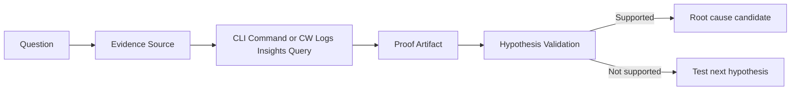

# Evidence Map for Elastic Beanstalk Troubleshooting

Use this page when you know the investigation question but need the fastest path to defensible proof. It maps common Elastic Beanstalk incident questions to the AWS evidence source, the first CLI command to run, the CloudWatch Logs Insights query to use, and the artifact that can confirm or disprove a hypothesis.



## Why an evidence map

Elastic Beanstalk incidents often span multiple layers at once: environment orchestration, load balancing, instance health, application logs, and dependency behavior. An evidence map reduces guesswork by forcing each question to resolve into:

1.    A primary AWS evidence source.
2.    A repeatable CLI command.
3.    A log query scoped to the incident window.
4.    A concrete proof artifact such as restart lines, 5xx spikes, failed health checks, or scaling activity.

Use it to keep timeline alignment tight across events, metrics, and logs before changing configuration or rolling back a deployment.

## Quick Map (Question → Source → Command → Log Group)

| Question | Primary source | First CLI command | Log group for correlated query |
|---|---|---|---|
| Was the app restarting? | Elastic Beanstalk events, `eb-activity.log` | `aws elasticbeanstalk describe-events --application-name "$APP_NAME" --environment-name "$ENV_NAME" --max-records 100 --region "$REGION"` | `/aws/elasticbeanstalk/$ENV_NAME/var/log/eb-activity.log` |
| Were requests failing? | ALB access evidence, CloudWatch metrics | `aws cloudwatch get-metric-statistics --namespace "AWS/ApplicationELB" --metric-name "HTTPCode_Target_5XX_Count" --dimensions Name=LoadBalancer,Value=app/<load-balancer-name>/<hash> --start-time "2026-04-07T00:00:00Z" --end-time "2026-04-07T01:00:00Z" --period 60 --statistics Sum --region "$REGION"` | `/aws/elasticbeanstalk/$ENV_NAME/var/log/nginx/access.log` |
| Was deployment failing? | `eb-activity.log`, deployment events | `aws elasticbeanstalk describe-events --application-name "$APP_NAME" --environment-name "$ENV_NAME" --max-records 200 --region "$REGION"` | `/aws/elasticbeanstalk/$ENV_NAME/var/log/eb-activity.log` |
| Was a dependency slow? | Application stdout/stderr logs | `aws elasticbeanstalk request-environment-info --environment-name "$ENV_NAME" --info-type "tail" --region "$REGION"` | `/aws/elasticbeanstalk/$ENV_NAME/var/log/web.stdout.log` |
| Was health check failing? | Enhanced health, health causes | `aws elasticbeanstalk describe-environment-health --environment-name "$ENV_NAME" --attribute-names "Status" "Color" "Causes" "ApplicationMetrics" "InstancesHealth" --region "$REGION"` | `/aws/elasticbeanstalk/$ENV_NAME/var/log/nginx/access.log` |
| Was there a config change? | Elastic Beanstalk events, configuration settings | `aws elasticbeanstalk describe-configuration-settings --application-name "$APP_NAME" --environment-name "$ENV_NAME" --region "$REGION"` | `/aws/elasticbeanstalk/$ENV_NAME/var/log/eb-activity.log` |
| Were instances terminating? | Auto Scaling activity, environment resources | `aws elasticbeanstalk describe-environment-resources --environment-name "$ENV_NAME" --region "$REGION"` | `/aws/elasticbeanstalk/$ENV_NAME/var/log/eb-activity.log` |
| Was there an AMI or platform issue? | Platform engine logs, platform events | `aws elasticbeanstalk describe-platform-version --platform-arn "arn:aws:elasticbeanstalk:$REGION::<platform-arn>" --region "$REGION"` | `/aws/elasticbeanstalk/$ENV_NAME/var/log/eb-activity.log` |
| Was there a VPC or networking issue? | VPC Flow Logs, security path evidence | `aws ec2 describe-flow-logs --filter Name=resource-id,Values=vpc-xxxxxxxx Name=log-destination-type,Values=cloud-watch-logs --region "$REGION"` | `/aws/elasticbeanstalk/$ENV_NAME/var/log/nginx/error.log` |
| Was memory exhausted? | CloudWatch agent metrics, application crash evidence | `aws cloudwatch get-metric-statistics --namespace "CWAgent" --metric-name "mem_used_percent" --dimensions Name=AutoScalingGroupName,Value=awseb-e-xxxxxxxx-stack-AWSEBAutoScalingGroup-xxxxxxxxxxxx --start-time "2026-04-07T00:00:00Z" --end-time "2026-04-07T01:00:00Z" --period 60 --statistics Average Maximum --region "$REGION"` | `/aws/elasticbeanstalk/$ENV_NAME/var/log/web.stdout.log` |
| Was CPU saturated? | CloudWatch instance metrics | `aws cloudwatch get-metric-statistics --namespace "AWS/EC2" --metric-name "CPUUtilization" --dimensions Name=AutoScalingGroupName,Value=awseb-e-xxxxxxxx-stack-AWSEBAutoScalingGroup-xxxxxxxxxxxx --start-time "2026-04-07T00:00:00Z" --end-time "2026-04-07T01:00:00Z" --period 60 --statistics Average Maximum --region "$REGION"` | `/aws/elasticbeanstalk/$ENV_NAME/var/log/nginx/access.log` |
| Was disk full? | Instance log write failures, platform activity | `aws elasticbeanstalk request-environment-info --environment-name "$ENV_NAME" --info-type "bundle" --region "$REGION"` | `/aws/elasticbeanstalk/$ENV_NAME/var/log/eb-activity.log` |
| Was there a scaling event? | Auto Scaling activity, EB events | `aws autoscaling describe-scaling-activities --auto-scaling-group-name "awseb-e-xxxxxxxx-stack-AWSEBAutoScalingGroup-xxxxxxxxxxxx" --max-records 20 --region "$REGION"` | `/aws/elasticbeanstalk/$ENV_NAME/var/log/eb-activity.log` |
| Was there an ELB issue? | ELB target health, ELB metrics | `aws elbv2 describe-target-health --target-group-arn "arn:aws:elasticloadbalancing:$REGION:<account-id>:targetgroup/<target-group-name>/<hash>" --region "$REGION"` | `/aws/elasticbeanstalk/$ENV_NAME/var/log/nginx/error.log` |
| Was there an RDS issue? | RDS metrics and error logs | `aws rds describe-db-instances --db-instance-identifier "<db-instance-identifier>" --region "$REGION"` | `/aws/elasticbeanstalk/$ENV_NAME/var/log/web.stdout.log` |
| Was SSL/TLS breaking? | ALB access evidence, listener behavior | `aws elbv2 describe-listeners --load-balancer-arn "arn:aws:elasticloadbalancing:$REGION:<account-id>:loadbalancer/app/<load-balancer-name>/<hash>" --region "$REGION"` | `/aws/elasticbeanstalk/$ENV_NAME/var/log/nginx/error.log` |

## Detailed Evidence Recipes

### 1. Was the app restarting?

Proof artifact: repeated start or restart messages in `eb-activity.log` aligned with environment events and short health drops.

#### CLI

```bash
aws elasticbeanstalk describe-events \
    --application-name "$APP_NAME" \
    --environment-name "$ENV_NAME" \
    --max-records 100 \
    --region "$REGION"
```

#### CloudWatch Logs Insights

Run against: `/aws/elasticbeanstalk/$ENV_NAME/var/log/eb-activity.log`

```sql
fields @timestamp, @message
| filter @message like /restart|Restart|starting|Stopping app|Launching|systemd/
| sort @timestamp desc
| limit 50
```

### 2. Were requests failing?

Proof artifact: spike in 4xx or 5xx responses, high upstream times, or repeated gateway errors during the incident window.

#### CLI

```bash
aws cloudwatch get-metric-statistics \
    --namespace "AWS/ApplicationELB" \
    --metric-name "HTTPCode_Target_5XX_Count" \
    --dimensions Name=LoadBalancer,Value=app/<load-balancer-name>/<hash> \
    --start-time "2026-04-07T00:00:00Z" \
    --end-time "2026-04-07T01:00:00Z" \
    --period 60 \
    --statistics Sum \
    --region "$REGION"
```

#### CloudWatch Logs Insights

Run against: `/aws/elasticbeanstalk/$ENV_NAME/var/log/nginx/access.log`

```sql
fields @timestamp, @message
| parse @message /"(?<method>\S+) (?<path>\S+) \S+" (?<status>\d{3}) .* (?<request_time>\S+)$/
| filter status like /4\d\d|5\d\d/
| stats count(*) as failed_requests, pct(request_time, 95) as p95_request_time by status, bin(5m)
| sort bin(5m) desc
```

### 3. Was deployment failing?

Proof artifact: deployment command, hook, package install, or application startup failures in `eb-activity.log` that match deployment events.

#### CLI

```bash
aws elasticbeanstalk describe-events \
    --application-name "$APP_NAME" \
    --environment-name "$ENV_NAME" \
    --max-records 200 \
    --region "$REGION"
```

#### CloudWatch Logs Insights

Run against: `/aws/elasticbeanstalk/$ENV_NAME/var/log/eb-activity.log`

```sql
fields @timestamp, @message
| filter @message like /ERROR|Failed|failed|Hook|command failed|Deployment failed/
| sort @timestamp desc
| limit 100
```

### 4. Was a dependency slow?

Proof artifact: application logs showing slow downstream calls, connection timeouts, or request spans dominated by database or API wait time.

#### CLI

```bash
aws elasticbeanstalk request-environment-info \
    --environment-name "$ENV_NAME" \
    --info-type "tail" \
    --region "$REGION"
```

#### CloudWatch Logs Insights

Run against: `/aws/elasticbeanstalk/$ENV_NAME/var/log/web.stdout.log`

```sql
fields @timestamp, @message
| filter @message like /timeout|timed out|latency|slow query|upstream|dependency|connection refused/
| sort @timestamp desc
| limit 100
```

### 5. Was health check failing?

Proof artifact: health endpoint failures, readiness mismatch, or repeated unsuccessful probes around target registration changes.

#### CLI

```bash
aws elasticbeanstalk describe-environment-health \
    --environment-name "$ENV_NAME" \
    --attribute-names "Status" "Color" "Causes" "ApplicationMetrics" "InstancesHealth" \
    --region "$REGION"
```

#### CloudWatch Logs Insights

Run against: `/aws/elasticbeanstalk/$ENV_NAME/var/log/nginx/access.log`

```sql
fields @timestamp, @message
| parse @message /"(?<method>\S+) (?<path>\S+) \S+" (?<status>\d{3})/
| filter path like /health|ready|status/
| stats count(*) as requests, countif(status not like /2\d\d|3\d\d/) as failed_checks by path, bin(5m)
| sort bin(5m) desc
```

### 6. Was there a config change?

Proof artifact: a settings update, saved configuration application, or option change immediately before the symptom started.

#### CLI

```bash
aws elasticbeanstalk describe-configuration-settings \
    --application-name "$APP_NAME" \
    --environment-name "$ENV_NAME" \
    --region "$REGION"
```

#### CloudWatch Logs Insights

Run against: `/aws/elasticbeanstalk/$ENV_NAME/var/log/eb-activity.log`

```sql
fields @timestamp, @message
| filter @message like /Configuration update|Updated environment|OptionSettings|Applying new configuration/
| sort @timestamp desc
| limit 50
```

### 7. Were instances terminating?

Proof artifact: environment resource churn, instance replacement messages, or termination-related platform activity.

#### CLI

```bash
aws elasticbeanstalk describe-environment-resources \
    --environment-name "$ENV_NAME" \
    --region "$REGION"
```

#### CloudWatch Logs Insights

Run against: `/aws/elasticbeanstalk/$ENV_NAME/var/log/eb-activity.log`

```sql
fields @timestamp, @message
| filter @message like /Terminating instance|Launching a new EC2 instance|Instance deployment failed|Replacing instance/
| sort @timestamp desc
| limit 50
```

### 8. Was there an AMI or platform issue?

Proof artifact: platform update failures, platform hook errors, or environment instability that starts right after a platform version change.

#### CLI

```bash
aws elasticbeanstalk describe-platform-version \
    --platform-arn "arn:aws:elasticbeanstalk:$REGION::<platform-arn>" \
    --region "$REGION"
```

#### CloudWatch Logs Insights

Run against: `/aws/elasticbeanstalk/$ENV_NAME/var/log/eb-activity.log`

```sql
fields @timestamp, @message
| filter @message like /platform|AMI|Platform update|hook failed|proxy configuration/
| sort @timestamp desc
| limit 100
```

### 9. Was there a VPC or networking issue?

Proof artifact: rejected flows, unreachable upstreams, connection resets, or proxy connection failures aligned to the same time window.

#### CLI

```bash
aws ec2 describe-flow-logs \
    --filter Name=resource-id,Values=vpc-xxxxxxxx Name=log-destination-type,Values=cloud-watch-logs \
    --region "$REGION"
```

#### CloudWatch Logs Insights

Run against: `/aws/elasticbeanstalk/$ENV_NAME/var/log/nginx/error.log`

```sql
fields @timestamp, @message
| filter @message like /connect\(\) failed|Connection timed out|No route to host|Network is unreachable|upstream prematurely closed/
| sort @timestamp desc
| limit 100
```

### 10. Was memory exhausted?

Proof artifact: high memory usage followed by worker termination, out-of-memory text, or abrupt process exits.

#### CLI

```bash
aws cloudwatch get-metric-statistics \
    --namespace "CWAgent" \
    --metric-name "mem_used_percent" \
    --dimensions Name=AutoScalingGroupName,Value=awseb-e-xxxxxxxx-stack-AWSEBAutoScalingGroup-xxxxxxxxxxxx \
    --start-time "2026-04-07T00:00:00Z" \
    --end-time "2026-04-07T01:00:00Z" \
    --period 60 \
    --statistics Average Maximum \
    --region "$REGION"
```

#### CloudWatch Logs Insights

Run against: `/aws/elasticbeanstalk/$ENV_NAME/var/log/web.stdout.log`

```sql
fields @timestamp, @message
| filter @message like /OutOfMemory|OOM|Killed process|Cannot allocate memory|memory exhausted/
| sort @timestamp desc
| limit 100
```

### 11. Was CPU saturated?

Proof artifact: CPU spikes aligned with request latency, backlog growth, or proxy timeouts under load.

#### CLI

```bash
aws cloudwatch get-metric-statistics \
    --namespace "AWS/EC2" \
    --metric-name "CPUUtilization" \
    --dimensions Name=AutoScalingGroupName,Value=awseb-e-xxxxxxxx-stack-AWSEBAutoScalingGroup-xxxxxxxxxxxx \
    --start-time "2026-04-07T00:00:00Z" \
    --end-time "2026-04-07T01:00:00Z" \
    --period 60 \
    --statistics Average Maximum \
    --region "$REGION"
```

#### CloudWatch Logs Insights

Run against: `/aws/elasticbeanstalk/$ENV_NAME/var/log/nginx/access.log`

```sql
fields @timestamp, @message
| parse @message /"(?<method>\S+) (?<path>\S+) \S+" (?<status>\d{3}) .* (?<request_time>\S+)$/
| stats count(*) as requests, pct(request_time, 95) as p95_request_time by bin(5m)
| sort bin(5m) desc
```

### 12. Was disk full?

Proof artifact: log write failures, no space errors, or deployment unpack failures on instance storage.

#### CLI

```bash
aws elasticbeanstalk request-environment-info \
    --environment-name "$ENV_NAME" \
    --info-type "bundle" \
    --region "$REGION"
```

#### CloudWatch Logs Insights

Run against: `/aws/elasticbeanstalk/$ENV_NAME/var/log/eb-activity.log`

```sql
fields @timestamp, @message
| filter @message like /No space left on device|disk full|write failed|cannot create|unzip failed/
| sort @timestamp desc
| limit 100
```

### 13. Was there a scaling event?

Proof artifact: scale-out or scale-in activity just before latency changes, health degradation, or instance warm-up failures.

#### CLI

```bash
aws autoscaling describe-scaling-activities \
    --auto-scaling-group-name "awseb-e-xxxxxxxx-stack-AWSEBAutoScalingGroup-xxxxxxxxxxxx" \
    --max-records 20 \
    --region "$REGION"
```

#### CloudWatch Logs Insights

Run against: `/aws/elasticbeanstalk/$ENV_NAME/var/log/eb-activity.log`

```sql
fields @timestamp, @message
| filter @message like /Successfully launched new EC2 instance|Added instance|Removed instance|Scaling activity initiated/
| sort @timestamp desc
| limit 50
```

### 14. Was there an ELB issue?

Proof artifact: unhealthy targets, listener-level failures, or error bursts at the load balancer boundary.

#### CLI

```bash
aws elbv2 describe-target-health \
    --target-group-arn "arn:aws:elasticloadbalancing:$REGION:<account-id>:targetgroup/<target-group-name>/<hash>" \
    --region "$REGION"
```

#### CloudWatch Logs Insights

Run against: `/aws/elasticbeanstalk/$ENV_NAME/var/log/nginx/error.log`

```sql
fields @timestamp, @message
| filter @message like /upstream timed out|connect\(\) failed|recv\(\) failed|bad gateway|connection reset by peer/
| stats count(*) as upstream_errors by bin(5m)
| sort bin(5m) desc
```

### 15. Was there an RDS issue?

Proof artifact: database connection errors, authentication failures, or dependency wait time spikes from the application side aligned with RDS metrics.

#### CLI

```bash
aws rds describe-db-instances \
    --db-instance-identifier "<db-instance-identifier>" \
    --region "$REGION"
```

#### CloudWatch Logs Insights

Run against: `/aws/elasticbeanstalk/$ENV_NAME/var/log/web.stdout.log`

```sql
fields @timestamp, @message
| filter @message like /SQLSTATE|database|RDS|connection refused|too many connections|deadlock|read timeout/
| sort @timestamp desc
| limit 100
```

### 16. Was SSL/TLS breaking?

Proof artifact: handshake errors, certificate mismatches, or HTTPS listener behavior inconsistent with application expectations.

#### CLI

```bash
aws elbv2 describe-listeners \
    --load-balancer-arn "arn:aws:elasticloadbalancing:$REGION:<account-id>:loadbalancer/app/<load-balancer-name>/<hash>" \
    --region "$REGION"
```

#### CloudWatch Logs Insights

Run against: `/aws/elasticbeanstalk/$ENV_NAME/var/log/nginx/error.log`

```sql
fields @timestamp, @message
| filter @message like /SSL|TLS|handshake|certificate|peer closed connection in SSL handshake/
| sort @timestamp desc
| limit 100
```

## See Also

-    [Troubleshooting Hub](./index.md)
-    [Troubleshooting Mental Model](./mental-model.md)
-    [Decision Tree](./decision-tree.md)
-    [Troubleshooting Method](./methodology/troubleshooting-method.md)
-    [Log Sources Map](./methodology/log-sources-map.md)

## Sources

-    https://docs.aws.amazon.com/elasticbeanstalk/latest/dg/troubleshooting.html
-    https://docs.aws.amazon.com/elasticbeanstalk/latest/dg/using-features.logging.html
-    https://docs.aws.amazon.com/elasticbeanstalk/latest/dg/AWSHowTo.cloudwatchlogs.html
-    https://docs.aws.amazon.com/elasticbeanstalk/latest/dg/health-enhanced.html
-    https://docs.aws.amazon.com/elasticbeanstalk/latest/dg/health-enhanced-status.html
-    https://docs.aws.amazon.com/elasticbeanstalk/latest/dg/environments-cfg-softwaresettings.html
-    https://docs.aws.amazon.com/elasticbeanstalk/latest/dg/using-features.managing.as.html
-    https://docs.aws.amazon.com/elasticbeanstalk/latest/dg/using-features.managing.elb.html
-    https://docs.aws.amazon.com/AmazonCloudWatch/latest/logs/CWL_QuerySyntax.html
-    https://docs.aws.amazon.com/elasticloadbalancing/latest/application/load-balancer-access-logs.html
-    https://docs.aws.amazon.com/vpc/latest/userguide/flow-logs.html
-    https://docs.aws.amazon.com/AmazonCloudWatch/latest/monitoring/working_with_metrics.html
-    https://docs.aws.amazon.com/AmazonRDS/latest/UserGuide/USER_LogAccess.html
-    https://docs.aws.amazon.com/elasticloadbalancing/latest/application/load-balancer-listeners.html
