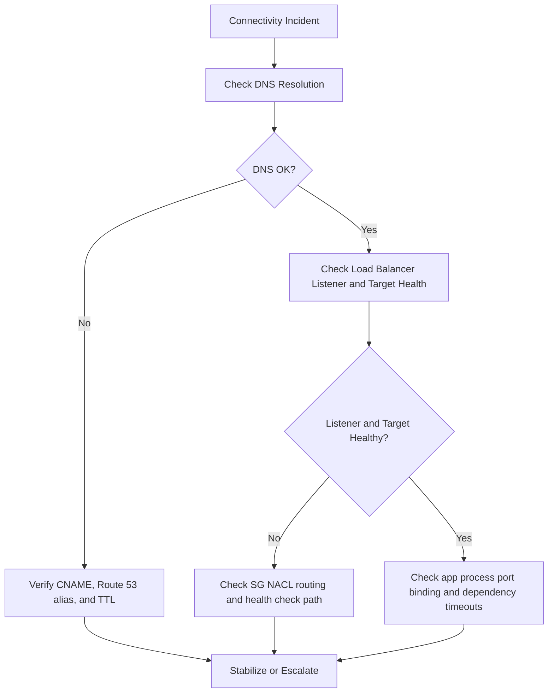

---
hide:
  - toc
---

# First 10 Minutes: Connectivity Issues

## Symptoms

-    Application URL times out or cannot be reached.
-    DNS name resolves inconsistently or not at all.
-    TLS connection fails at handshake or certificate validation.
-    Load balancer returns 502/503/504 even though environment exists.
-    Instance is reachable internally but not from expected client network.



## Quick Check Commands

```bash
aws elasticbeanstalk describe-environments \
    --application-name "$APP_NAME" \
    --environment-names "$ENV_NAME" \
    --profile "eb-ops" \
    --region "$REGION"

aws elasticbeanstalk describe-environment-resources \
    --environment-name "$ENV_NAME" \
    --profile "eb-ops" \
    --region "$REGION"

aws elbv2 describe-load-balancers \
    --names "awseb-AWSEB-xxxxxxxx" \
    --profile "eb-ops" \
    --region "$REGION"

aws elbv2 describe-target-health \
    --target-group-arn "arn:aws:elasticloadbalancing:$REGION:<account-id>:targetgroup/awseb-xxxxxxxx/xxxxxxxx" \
    --profile "eb-ops" \
    --region "$REGION"

eb health --environment "$ENV_NAME" --profile "eb-ops" --refresh
```

Validation sequence:

1.    DNS resolves expected environment endpoint.
2.    Listener accepts protocol and port expected by clients.
3.    Target group health check succeeds on correct path/port.
4.    Security groups and NACLs allow inbound and return traffic.
5.    Application listens on expected local port and responds in time.

## Common Causes

### Security Group and Network ACL Rules

-    Inbound listener port blocked at load balancer security group.
-    Instance security group does not allow load balancer source.
-    NACL denies ephemeral return traffic.

### VPC Routing and Subnet Configuration

-    Public load balancer placed in subnets without internet route.
-    Private instances missing required egress route to dependencies.
-    Mismatched subnet selection during environment creation.

### DNS and CNAME Misconfiguration

-    Custom domain alias points to stale environment endpoint.
-    DNS propagation delay after recent change.
-    CNAME swap expected but not completed.

### Load Balancer Listener or Certificate Issues

-    Missing or incorrect HTTPS listener/certificate attachment.
-    Listener rule forwards to wrong target group.
-    TLS policy mismatch causes handshake failure.

### Application Port and Health Check Mismatch

-    Application listens on different port than proxy expects.
-    Health check path returns redirect or auth challenge.
-    Startup delays exceed health check grace assumptions.

## Escalation Path

Escalate when connectivity remains broken after validating DNS, listener, target health, and network policies.

Escalation package:

-    Exact failing URL and region.
-    DNS resolution result and timestamp.
-    Load balancer listener and target health evidence.
-    Security group IDs, NACL IDs, and relevant rule excerpts.
-    Related events and health causes from Elastic Beanstalk.

## See Also

-    [First 10 Minutes Index](./index.md)
-    [Decision Tree](../decision-tree.md)
-    [Architecture Overview](../architecture-overview.md)
-    [Mental Model](../mental-model.md)
-    [Playbooks Hub](../playbooks/index.md)

## Sources

-    https://docs.aws.amazon.com/elasticbeanstalk/latest/dg/using-features.managing.elb.html
-    https://docs.aws.amazon.com/elasticbeanstalk/latest/dg/using-features.managing.vpc.html
-    https://docs.aws.amazon.com/elasticbeanstalk/latest/dg/customdomains.html
-    https://docs.aws.amazon.com/elasticloadbalancing/latest/application/load-balancer-troubleshooting.html
-    https://docs.aws.amazon.com/vpc/latest/userguide/vpc-network-acls.html
