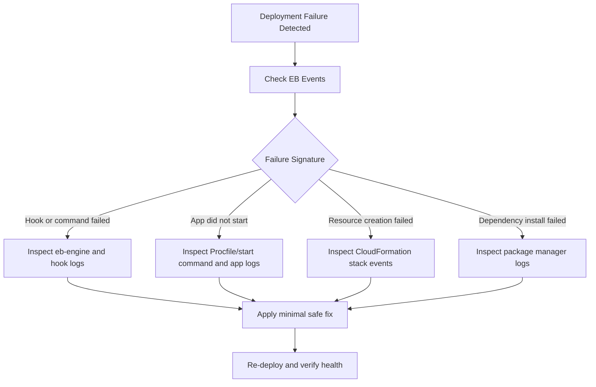

# First 10 Minutes: Deployment Failures

## Symptoms

-    `eb deploy` fails and reports unsuccessful environment update.
-    Environment update status remains `Updating` then transitions to failed.
-    New version does not become current and health degrades after deployment start.
-    Elastic Beanstalk events report command failure, hook errors, or application startup problems.
-    CloudFormation stack events show one or more resources in `CREATE_FAILED` or `UPDATE_FAILED`.



## Quick Check Commands

```bash
eb events --environment "$ENV_NAME" --profile "eb-ops"

eb logs --environment "$ENV_NAME" --profile "eb-ops"

aws elasticbeanstalk describe-events \
    --environment-name "$ENV_NAME" \
    --max-records 100 \
    --profile "eb-ops" \
    --region "$REGION"

aws cloudformation describe-stack-events \
    --stack-name "awseb-e-xxxxxxxx-stack" \
    --profile "eb-ops" \
    --region "$REGION"

aws elasticbeanstalk describe-environment-resources \
    --environment-name "$ENV_NAME" \
    --profile "eb-ops" \
    --region "$REGION"
```

Primary files to inspect from retrieved logs:

-    `/var/log/eb-engine.log`
-    `/var/log/eb-hooks.log`
-    `/var/log/web.stdout.log`
-    `/var/log/web.stderr.log`

## Common Causes

### Bad Procfile or Startup Command

-    Application process command is invalid or points to missing executable.
-    Runtime boot command succeeds locally but fails in platform environment.
-    Port binding mismatch causes health check failures.

### Failed Platform Hooks

-    `.platform/hooks/prebuild`, `predeploy`, or `postdeploy` script exits non-zero.
-    Hook script assumes missing file paths, packages, or permissions.
-    Script has shell compatibility or line ending issues.

### Missing Dependencies

-    Package manager install fails during deployment.
-    Locked dependency versions conflict with selected platform branch.
-    Native package compilation fails due to missing build prerequisites.

### CloudFormation Resource Failure

-    Invalid option settings for environment configuration namespaces.
-    IAM role lacks permission for required resource operations.
-    VPC, subnet, or security group references are invalid for selected region.

### Application Version Artifact Issues

-    Wrong source bundle uploaded as application version.
-    Build output missing required files for runtime startup.
-    Corrupted archive structure prevents deployment extraction.

## Escalation Path

Escalate to platform or application owner when:

-    Repeated deployment failures occur with identical signatures after one validated fix attempt.
-    CloudFormation failures require IAM/network/resource ownership beyond responder scope.
-    Service remains degraded after rollback to previously known-good version.

Escalation package should include:

-    Environment name, application name, platform branch, region.
-    UTC timeline of deploy attempt start and failure time.
-    Top five relevant Elastic Beanstalk events.
-    Key log snippets from `eb-engine.log` and application stderr.
-    CloudFormation failed resource logical ID and reason.

## See Also

-    [First 10 Minutes Index](./index.md)
-    [Decision Tree](../decision-tree.md)
-    [Troubleshooting Method](../methodology/troubleshooting-method.md)
-    [Log Sources Map](../methodology/log-sources-map.md)
-    [Playbooks Hub](../playbooks/index.md)

## Sources

-    https://docs.aws.amazon.com/elasticbeanstalk/latest/dg/troubleshooting.html
-    https://docs.aws.amazon.com/elasticbeanstalk/latest/dg/using-features.logging.html
-    https://docs.aws.amazon.com/elasticbeanstalk/latest/dg/eb-cli3.html
-    https://docs.aws.amazon.com/elasticbeanstalk/latest/dg/environment-resources.html
-    https://docs.aws.amazon.com/AWSCloudFormation/latest/UserGuide/view-stack-events.html
