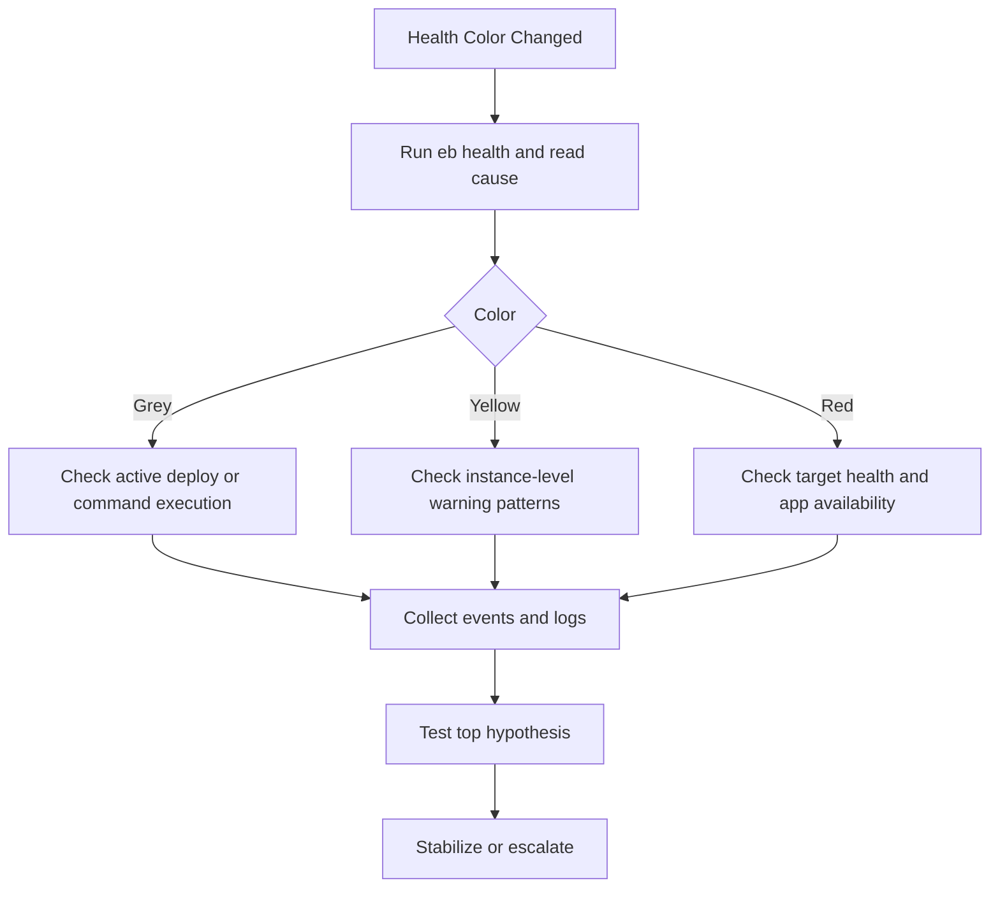

# First 10 Minutes: Health Degradation

## Symptoms

-    Environment health transitions from Green to Yellow or Red.
-    Environment shows Grey during updates and does not return to healthy state.
-    Enhanced health reports severe causes such as command timeout, failed checks, or high error rates.
-    One or more instances stay unhealthy after deployment or scaling event.
-    Users report intermittent failures that align with health status changes.



## Quick Check Commands

```bash
eb health --environment "$ENV_NAME" --profile "eb-ops" --refresh

eb events --environment "$ENV_NAME" --profile "eb-ops"

eb logs --environment "$ENV_NAME" --profile "eb-ops"

aws elasticbeanstalk describe-environment-health \
    --environment-name "$ENV_NAME" \
    --attribute-names "All" \
    --profile "eb-ops" \
    --region "$REGION"

aws elasticbeanstalk describe-instances-health \
    --environment-name "$ENV_NAME" \
    --attribute-names "All" \
    --profile "eb-ops" \
    --region "$REGION"
```

Signals to capture immediately:

-    Environment health color and status reason.
-    Instance health status and degraded cause per instance.
-    Load balancer target health transitions during the same timestamp window.
-    Recent deployment, scaling, or configuration update events.

## Common Causes

### Enhanced Health Detects Application Errors

-    Elevated 5xx rate from application process.
-    Health endpoint returns non-200 under load.
-    Dependency latency pushes responses past timeout thresholds.

### Instance Startup or Replacement Instability

-    New instances fail to pass health checks after launch.
-    Rolling deployment batch too large for current capacity.
-    Warm-up time longer than configured health expectations.

### Resource Saturation

-    CPU or memory pressure causes slow processing and failed checks.
-    Connection pools saturate and reject requests.
-    Garbage collection pauses or process restarts increase error spikes.

### Load Balancer Health Check Mismatch

-    Health check path does not represent application readiness.
-    Health check port/path mismatch after configuration change.
-    Security group rules block target health checks.

### Grey Health Prolonged

-    Environment command running longer than expected.
-    Platform hook script waiting on unavailable dependency.
-    Instance reports delayed due to initialization issues.

## Escalation Path

Escalate when any of the following remain true after first-response fixes:

-    Red health persists across all instances beyond one deploy/scale cycle.
-    Replaced instances repeatedly fail health checks.
-    Error rate remains elevated with no clear app-level signature.

Escalation package:

-    Health color timeline with exact UTC timestamps.
-    `describe-environment-health` and `describe-instances-health` outputs.
-    Correlated events and key log excerpts.
-    Recent change list (deployment, config update, scaling policy).

## See Also

-    [First 10 Minutes Index](./index.md)
-    [Decision Tree](../decision-tree.md)
-    [Mental Model](../mental-model.md)
-    [Troubleshooting Method](../methodology/troubleshooting-method.md)
-    [Log Sources Map](../methodology/log-sources-map.md)

## Sources

-    https://docs.aws.amazon.com/elasticbeanstalk/latest/dg/health-enhanced.html
-    https://docs.aws.amazon.com/elasticbeanstalk/latest/dg/health-enhanced-status.html
-    https://docs.aws.amazon.com/elasticbeanstalk/latest/dg/using-features.healthstatus.html
-    https://docs.aws.amazon.com/elasticbeanstalk/latest/dg/environments-cfg-alb.html
-    https://docs.aws.amazon.com/elasticbeanstalk/latest/dg/using-features.logging.html
