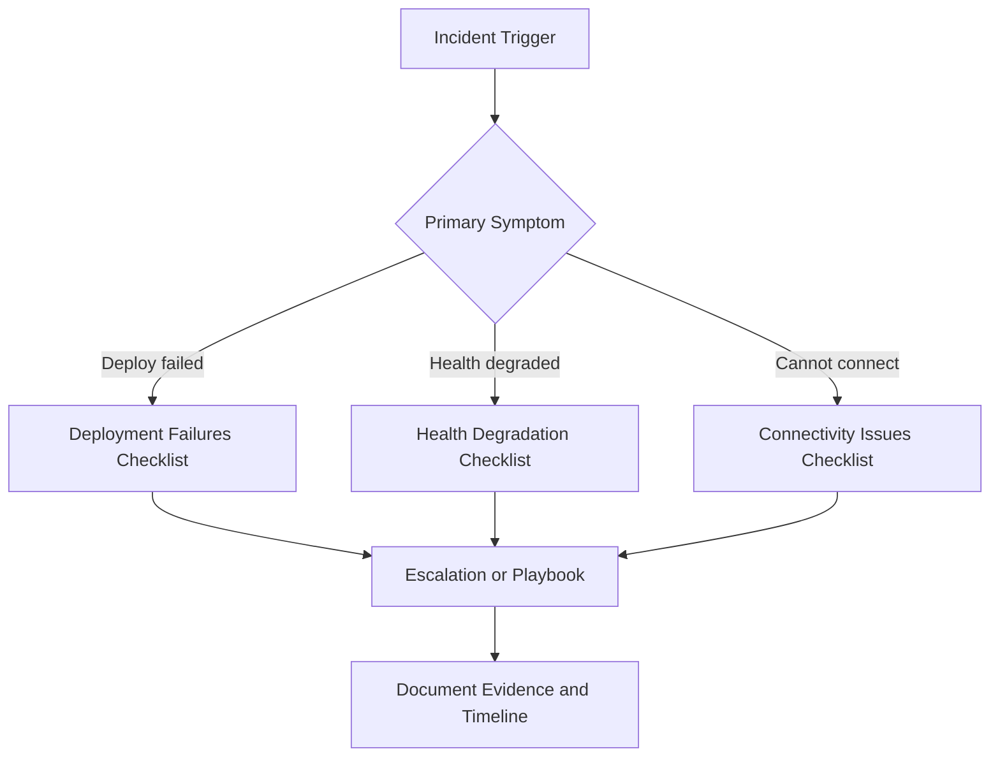

# First 10 Minutes Checklists

This section provides symptom-driven checklists for rapid stabilization in the first 10 minutes of an Elastic Beanstalk incident.

## Methodology in 10 Minutes

-    Minute 0-2: classify primary symptom and blast radius.
-    Minute 2-5: collect high-signal data (`eb events`, `eb health`, `eb logs`).
-    Minute 5-8: test top one or two hypotheses with minimal safe changes.
-    Minute 8-10: stabilize service or escalate with evidence package.

## Checklist Flow



## Checklists

| Symptom | Checklist | Focus |
|---|---|---|
| Deployment command fails or environment update aborts | [deployment-failures.md](./deployment-failures.md) | events, hooks, artifact validity |
| Environment health turns Yellow/Red/Grey | [health-degradation.md](./health-degradation.md) | enhanced health causes, instance state |
| Application cannot be reached or requests timeout | [connectivity-issues.md](./connectivity-issues.md) | DNS, listener, SG/NACL, routing |

## Shared Command Set

```bash
eb events --environment "$ENV_NAME" --profile "eb-ops"

eb health --environment "$ENV_NAME" --profile "eb-ops" --refresh

eb logs --environment "$ENV_NAME" --profile "eb-ops"

aws elasticbeanstalk describe-environments \
    --application-name "$APP_NAME" \
    --environment-names "$ENV_NAME" \
    --profile "eb-ops" \
    --region "$REGION"
```

## Escalation Guardrails

-    Escalate when service impact is ongoing and first-response checks do not isolate a safe remediation.
-    Include exact UTC timestamps, environment ID, and error snippets from events/logs.
-    Declare tested hypotheses explicitly to prevent duplicate triage loops.

## What Not to Do in First 10 Minutes

-    Avoid broad configuration changes without hypothesis and rollback plan.
-    Avoid simultaneous edits to networking, platform version, and application code.
-    Avoid deleting and recreating environments before collecting root-cause evidence.

## 10-Minute Evidence Template

Use this compact structure in incident notes:

| Field | Example |
|---|---|
| Environment | `my-app-prod` |
| Region | `us-east-1` |
| Symptom | `Deployment failed during postdeploy` |
| First seen (UTC) | `2026-04-05T12:04:00Z` |
| Impact | `All traffic returns 503` |
| Recent changes | `Version v2026.04.05-1 deployed` |
| Initial evidence | `eb events`, `eb health`, `eb logs` |
| Current status | `Mitigated`, `Monitoring`, or `Escalated` |

## Handoff Criteria

Escalate from first-response to playbook execution when:

-    A clear symptom category is identified and first checks are complete.
-    At least one evidence-backed hypothesis is documented.
-    Additional mitigation requires deeper category-specific steps.

## Cross-Section Shortcut Map

-    If deployment fails before instance replacement, start with [Deployment Failures](./deployment-failures.md).
-    If health transitions continue after successful deploy, switch to [Health Degradation](./health-degradation.md).
-    If users cannot reach endpoint at all, switch to [Connectivity Issues](./connectivity-issues.md).
-    If diagnosis is unclear, return to [Decision Tree](../decision-tree.md).

## See Also

-    [Troubleshooting Hub](../index.md)
-    [Decision Tree](../decision-tree.md)
-    [Mental Model](../mental-model.md)
-    [Troubleshooting Method](../methodology/troubleshooting-method.md)
-    [Log Sources Map](../methodology/log-sources-map.md)
-    [Playbooks Hub](../playbooks/index.md)

## Sources

-    https://docs.aws.amazon.com/elasticbeanstalk/latest/dg/troubleshooting.html
-    https://docs.aws.amazon.com/elasticbeanstalk/latest/dg/eb-cli3.html
-    https://docs.aws.amazon.com/elasticbeanstalk/latest/dg/using-features.events.html
-    https://docs.aws.amazon.com/elasticbeanstalk/latest/dg/using-features.logging.html
