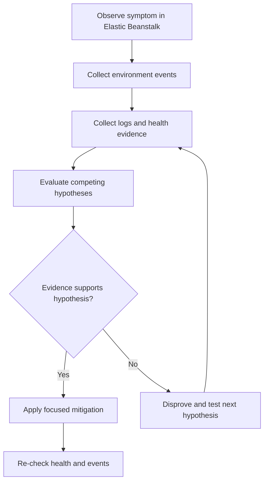

# Troubleshooting Hub

## 1. Summary
Central entry point for Elastic Beanstalk troubleshooting with a quick-start flow and links to all playbooks.



## Section Table
| Area | Start Here | Typical Signal |
| --- | --- | --- |
| First 10 Minutes | `troubleshooting/first-10-minutes/index.md` | Fresh incident and uncertain scope |
| Deployment and Availability | `troubleshooting/playbooks/deployment-availability/deployment-failed.md` | Deploy errors or immediate rollback |
| Performance | `troubleshooting/playbooks/performance/high-latency-under-load.md` | Slow responses and high saturation |
| Networking | `troubleshooting/playbooks/networking/load-balancer-5xx.md` | Load balancer errors and timeout symptoms |
| Hands-on Labs | `troubleshooting/lab-guides/index.md` | Need reproducible CloudFormation-based practice environments |
| Methodology | `troubleshooting/methodology/troubleshooting-method.md` | Need repeatable incident workflow |

## Quick-Start Flow
1.    Identify whether the incident starts at deploy time, runtime, or network boundary.
2.    Collect Elastic Beanstalk events and logs first, then verify CloudWatch metrics and health causes.
3.    Validate one hypothesis at a time and apply the narrowest mitigation possible.

## 2. Common Misreadings
1.    Green or Yellow health means no user impact; AWS guidance still requires reading health causes and events.
2.    A successful deploy event means the application is healthy; post-deploy runtime can still fail.
3.    One log source is sufficient; AWS troubleshooting guidance depends on events plus logs plus health evidence.

## 3. Competing Hypotheses
1.    The issue is deployment-related and starts at application version processing or command execution.
2.    The issue is runtime health-related and starts after deployment when instances fail health checks.
3.    The issue is network-related and traffic cannot reach healthy instances or instances cannot reach dependencies.

## 4. What to Check First
1.    Review the environment health color and health causes in the Elastic Beanstalk console before changing configuration.
2.    Read recent environment events and deployment events to identify the first failing operation in time order.
3.    Request logs from the environment and inspect web server, application, and Elastic Beanstalk engine logs.
4.    Confirm incident scope by environment name and application version label before changing settings.

## 5. Evidence to Collect
1.    Environment events in descending and ascending order for the incident window.
2.    Enhanced health statuses and health causes at environment and instance levels.
3.    Log bundles or streamed logs including web server, application, and Elastic Beanstalk engine logs.
4.    Deployment history with application version labels and timestamps.
5.    Metrics relevant to latency, error rates, CPU, and memory during the same period.

```bash
aws elasticbeanstalk describe-events \\
    --application-name "<APPLICATION_NAME>" \\
    --environment-name "<ENVIRONMENT_NAME>" \\
    --max-records 200

aws elasticbeanstalk describe-environment-health \\
    --environment-name "<ENVIRONMENT_NAME>" \\
    --attribute-names "Status" "Color" "Causes" "ApplicationMetrics" "InstancesHealth"

aws elasticbeanstalk request-environment-info \\
    --environment-name "<ENVIRONMENT_NAME>" \\
    --info-type "tail"
```

## 6. Validation and Disproof by Hypothesis
1.    Validate deployment hypothesis by matching first failure event to engine log error and command phase.
2.    Validate health hypothesis by matching health causes to request failures, process restarts, or check failures.
3.    Validate networking hypothesis by matching target health, listener status, and route or security configuration.
4.    Disprove each hypothesis with at least one contradictory artifact before selecting root cause.

## 7. Likely Root Cause Patterns
1.    Application startup command or dependency install failure during deployment lifecycle.
2.    Health check mismatch between configured path and actual application readiness behavior.
3.    Resource saturation under traffic causing timeouts, error bursts, and degraded health.
4.    Security group, listener, or routing mismatch blocking expected traffic flow.

## 8. Immediate Mitigations
1.    Stabilize by rolling back to last known healthy application version when user impact is active.
2.    Reduce blast radius by scaling capacity or pausing high-risk configuration changes.
3.    Correct failing health check or listener configuration only after evidence confirms mismatch.
4.    Re-run validation after mitigation and confirm event stream no longer emits failure pattern.

## 9. Prevention
1.    Keep deployment and runtime checks in release process with clear rollback criteria.
2.    Stream logs to CloudWatch Logs and retain enough history for multi-hour incident analysis.
3.    Use enhanced health monitoring to detect warning trends before severe user impact.
4.    Document known failure signatures and required evidence for faster future triage.

## See Also
-    `troubleshooting/index.md`
-    `troubleshooting/decision-tree.md`
-    `troubleshooting/methodology/troubleshooting-method.md`
-    `troubleshooting/lab-guides/index.md`

## Sources
-    https://docs.aws.amazon.com/elasticbeanstalk/latest/dg/troubleshooting.html
-    https://docs.aws.amazon.com/elasticbeanstalk/latest/dg/using-features.logging.html
-    https://docs.aws.amazon.com/elasticbeanstalk/latest/dg/health-enhanced-status.html
