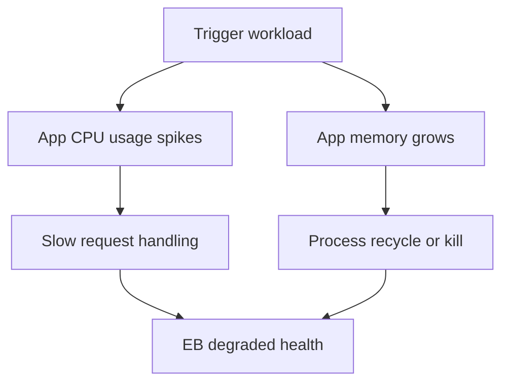
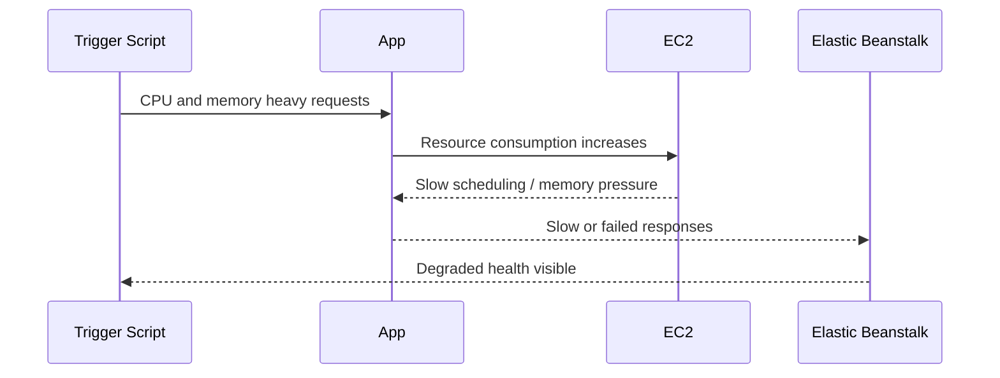

# Lab: CPU and Memory Exhaustion

Generate sustained CPU pressure and memory growth in the application process so you can practice distinguishing resource saturation from deployment and network issues.

## Lab Metadata
| Attribute | Value |
|---|---|
| Difficulty | Advanced |
| Duration | 45 minutes |
| Tier | Single-instance or load-balanced web server environment |
| Failure Mode | Application process consumes excessive CPU and memory, causing slow responses and restarts |
| Skills Practiced | EC2 resource inspection, EB health interpretation, application log analysis, CloudWatch metric correlation |

## 1) Background
### 1.1 Why this lab exists
CPU and memory incidents often look like generic slowness at first. This lab teaches how to prove compute saturation with direct evidence from instance state and logs.

### 1.2 Platform behavior model
When the application process consumes too much CPU or memory, request latency increases, worker processes may be killed or restarted, and EB health can degrade from `Ok` to `Warning`, `Degraded`, or `Severe` depending on user impact.

### 1.3 Diagram (Mermaid)


## 2) Hypothesis
### 2.1 Original hypothesis
The incident is driven by instance-level CPU and memory exhaustion caused by the application workload.

### 2.2 Causal chain
Heavy request pattern -> process CPU and memory rise -> response time and error rate worsen -> web process restarts or becomes unstable -> EB health degrades.

### 2.3 Proof criteria
- CloudWatch metrics show CPU growth and memory-related symptoms during the trigger window.
- Process-level inspection shows the application consuming abnormal resources.
- Application or system logs show worker restart, termination, or timeout behavior.

### 2.4 Disproof criteria
- CPU and memory stay normal while errors still occur, indicating a different bottleneck such as database, listener, or health configuration.

## 3) Runbook
1. Establish baseline resource usage.

```bash
aws elasticbeanstalk describe-environment-health \
    --environment-name "$ENV_NAME" \
    --attribute-names Status Color Causes ApplicationMetrics InstancesHealth

eb logs --environment-name "$ENV_NAME" --all
```

2. Trigger CPU and memory stress in the application.

```bash
bash "trigger.sh"
```

3. Inspect CloudWatch and EB health changes.

```bash
aws cloudwatch get-metric-statistics \
    --namespace AWS/EC2 \
    --metric-name CPUUtilization \
    --dimensions Name=InstanceId,Value="$INSTANCE_ID" \
    --statistics Average Maximum \
    --start-time 2026-04-07T04:00:00Z \
    --end-time 2026-04-07T04:20:00Z \
    --period 60

aws elasticbeanstalk describe-environment-health \
    --environment-name "$ENV_NAME" \
    --attribute-names Status Color Causes InstancesHealth
```

4. Inspect instance-level evidence.

```bash
top
free --mega
sudo less /var/log/web.stdout.log
sudo less /var/log/nginx/error.log
```

5. Query streamed app logs for restart clues if available.

```bash
aws logs start-query \
    --log-group-name "/aws/elasticbeanstalk/$ENV_NAME/var/log/web.stdout.log" \
    --start-time 1712480400 \
    --end-time 1712482800 \
    --query-string 'fields @timestamp, @message | filter @message like /killed|timeout|memory|worker/ | sort @timestamp desc | limit 20'
```

## 4) Experiment Log
| Time (UTC) | Observation | Evidence |
|---|---|---|
| 14:00 | Environment healthy and responsive | baseline health check |
| 14:06 | Stress trigger starts CPU-intensive and memory-heavy path | `trigger.sh` output |
| 14:09 | CPU utilization spikes and request latency rises | CloudWatch metrics |
| 14:11 | Web process logs show worker timeout or recycle | `web.stdout.log` |
| 14:15 | Health degrades until load stops or process recovers | `describe-environment-health` |

## Expected Evidence
### Before Trigger (Baseline)
- CPU is moderate.
- No memory-related process restarts.
- Health is `Ok`.

### During Incident
- CPU approaches saturation.
- Memory pressure or worker recycle messages appear.
- Response time and health state worsen in the same interval.

### After Recovery
- Resource usage returns toward baseline.
- Application stabilizes and health improves.

### Evidence Timeline (Mermaid sequence diagram)


### Evidence Chain: Why This Proves the Hypothesis
The evidence aligns across three layers: instance metrics show saturation, process logs show instability, and user-facing health degrades in the same window. That multi-layer timing supports CPU and memory exhaustion as the primary mechanism.

## Clean Up
```bash
eb terminate "$ENV_NAME"
aws cloudformation delete-stack --stack-name "$STACK_NAME" --region "$AWS_REGION"
```

## Related Playbook
- [CPU and Memory Exhaustion](../playbooks/performance/cpu-memory-exhaustion.md)

## See Also
- [Hands-on Labs](./index.md)
- [High Latency Under Load](./high-latency-under-load.md)
- [Instance Degraded Health](./instance-degraded-health.md)

## Sources
- [Enhanced health metrics for Elastic Beanstalk](https://docs.aws.amazon.com/elasticbeanstalk/latest/dg/health-enhanced-cloudwatch.html)
- [Elastic Beanstalk logs](https://docs.aws.amazon.com/elasticbeanstalk/latest/dg/using-features.logging.html)
- [Amazon EC2 metrics and dimensions](https://docs.aws.amazon.com/AWSEC2/latest/UserGuide/viewing_metrics_with_cloudwatch.html)
- [CloudWatch Logs Insights query syntax](https://docs.aws.amazon.com/AmazonCloudWatch/latest/logs/CWL_QuerySyntax.html)
