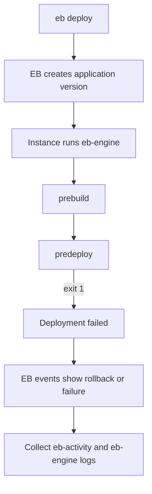
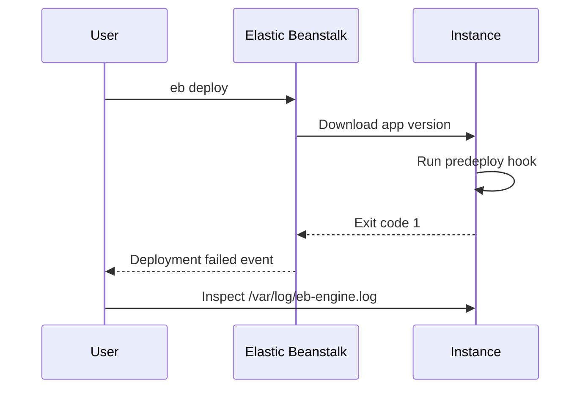

# Lab: Deployment Failure

Reproduce an Elastic Beanstalk application deployment that fails during platform hook execution so you can practice isolating the first failing lifecycle step.

## Lab Metadata
| Attribute | Value |
|---|---|
| Difficulty | Intermediate |
| Duration | 35 minutes |
| Tier | Web server environment |
| Failure Mode | `.platform/hooks/predeploy` exits non-zero during application deployment |
| Skills Practiced | EB events, `eb logs`, `eb-engine.log`, CloudFormation stack correlation, rollback decision making |

## 1) Background
### 1.1 Why this lab exists
This lab trains responders to separate control-plane success from instance-side deployment failure. In Elastic Beanstalk, the environment can accept an application version while the actual deployment fails later on instances.

### 1.2 Platform behavior model
EB downloads the application bundle, runs platform hooks, applies configuration, starts the web process, and only then considers the deployment healthy. A single non-zero hook exit can force the environment into a failed deployment state and trigger rollback behavior.

### 1.3 Diagram (Mermaid)


## 2) Hypothesis
### 2.1 Original hypothesis
The deployment fails because a platform hook in the application bundle exits non-zero before the web process starts.

### 2.2 Causal chain
Broken application bundle -> failing predeploy hook -> `eb-engine` reports command failure -> deployment status changes to failed -> EB health remains `Warning`, `Info`, or `Severe` depending on rollback state.

### 2.3 Proof criteria
- `eb events --environment-name $ENV_NAME --all` shows deployment failure during application update.
- `/var/log/eb-engine.log` or `/var/log/eb-activity.log` shows the first non-zero hook command.
- `/var/log/web.stdout.log` has no successful application startup for the bad version.

### 2.4 Disproof criteria
- Hook execution succeeds and the first error instead appears in the application startup command or health check path.

## 3) Runbook
1. Deploy the lab stack and baseline application.

```bash
aws cloudformation deploy \
    --stack-name "$STACK_NAME" \
    --template-file "template.yaml" \
    --capabilities CAPABILITY_NAMED_IAM \
    --region "$AWS_REGION"

eb deploy "$ENV_NAME" --staged
```

2. Trigger the broken deployment by adding the failing hook.

```bash
bash "trigger.sh"
eb deploy "$ENV_NAME" --staged
```

3. Capture environment events and logs.

```bash
eb events --environment-name "$ENV_NAME" --all
eb logs --environment-name "$ENV_NAME" --all
aws elasticbeanstalk describe-events \
    --environment-name "$ENV_NAME" \
    --max-items 200
```

4. If SSH is enabled, inspect instance evidence directly.

```bash
sudo less /var/log/eb-engine.log
sudo less /var/log/eb-activity.log
sudo less /var/log/web.stdout.log
```

5. Correlate with CloudFormation and deployment settings.

```bash
aws cloudformation describe-stack-events \
    --stack-name "$STACK_NAME" \
    --max-items 100

aws elasticbeanstalk describe-configuration-settings \
    --application-name "$APP_NAME" \
    --environment-name "$ENV_NAME"
```

## 4) Experiment Log
| Time (UTC) | Observation | Evidence |
|---|---|---|
| 09:00 | Baseline version deploys and environment reaches `Ok` | `eb health --environment-name $ENV_NAME` |
| 09:08 | Triggered bad deployment with failing predeploy hook | `trigger.sh` output and new version label |
| 09:10 | EB event stream reports command failure and deployment failure | `eb events --environment-name $ENV_NAME --all` |
| 09:12 | `eb-engine.log` identifies first non-zero hook exit | `/var/log/eb-engine.log` |
| 09:15 | Rollback or failed deployment leaves previous version active | `aws elasticbeanstalk describe-environments` |

## Expected Evidence
### Before Trigger (Baseline)
- Environment health is `Ok`.
- `/var/log/web.stdout.log` shows normal startup.
- EB events show completed deployment for the known-good version.

### During Incident
- EB events show deployment update in progress followed by failure.
- `/var/log/eb-engine.log` shows hook script path and non-zero exit code.
- `/var/log/eb-activity.log` mirrors the deployment phase failure.

### After Recovery
- Re-deploying the known-good bundle clears failure events.
- Health returns to `Ok` and the bad version is no longer active.

### Evidence Timeline (Mermaid sequence diagram)


### Evidence Chain: Why This Proves the Hypothesis
The failing hook appears before any successful process start. Because the first error in `eb-engine.log` is a non-zero platform hook exit, and the event stream reports deployment failure immediately after that step, the most direct causal explanation is hook execution failure rather than application runtime failure.

## Clean Up
```bash
eb terminate "$ENV_NAME"
aws cloudformation delete-stack --stack-name "$STACK_NAME" --region "$AWS_REGION"
```

## Related Playbook
- [Deployment Failed and Environment Rolled Back](../playbooks/deployment-availability/deployment-failed.md)

## See Also
- [Hands-on Labs](./index.md)
- [Health Red After Deploy](./health-red-after-deploy.md)
- [Immutable Update Rollback](./immutable-update-rollback.md)

## Sources
- [Deploying application versions to Elastic Beanstalk](https://docs.aws.amazon.com/elasticbeanstalk/latest/dg/using-features.deploy-existing-version.html)
- [Elastic Beanstalk logs](https://docs.aws.amazon.com/elasticbeanstalk/latest/dg/using-features.logging.html)
- [Platform hooks for Elastic Beanstalk Linux platforms](https://docs.aws.amazon.com/elasticbeanstalk/latest/dg/platforms-linux-extend.hooks.html)
- [Troubleshooting Elastic Beanstalk](https://docs.aws.amazon.com/elasticbeanstalk/latest/dg/troubleshooting.html)
