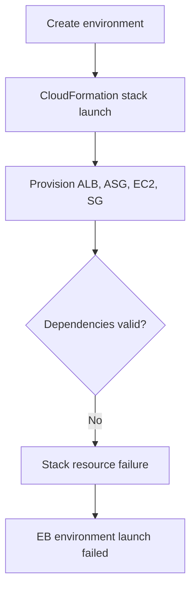
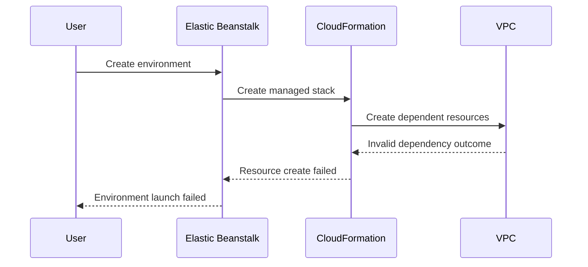

# Lab: Environment Launch Failed

Reproduce a new Elastic Beanstalk environment that fails during launch because dependent infrastructure settings in the CloudFormation stack are invalid for the target VPC layout.

## Lab Metadata
| Attribute | Value |
|---|---|
| Difficulty | Intermediate |
| Duration | 35 minutes |
| Tier | Load-balanced web server environment |
| Failure Mode | Environment creation fails during stack launch and instance provisioning |
| Skills Practiced | CloudFormation stack event review, EB create workflow tracing, subnet and load balancer dependency validation |

## 1) Background
### 1.1 Why this lab exists
Environment launch failures happen before application-level troubleshooting begins. This lab focuses on proving that the environment cannot become runnable because the infrastructure contract is broken from the start.

### 1.2 Platform behavior model
EB creates or references infrastructure resources through a CloudFormation-managed stack. If networking, instance profile, or load balancer dependencies are invalid, environment status remains `Launching` or `Terminated` and no stable application lifecycle starts.

### 1.3 Diagram (Mermaid)


## 2) Hypothesis
### 2.1 Original hypothesis
The environment launch fails because the CloudFormation-managed EB stack cannot create one or more required resources in the supplied networking configuration.

### 2.2 Causal chain
Invalid VPC or subnet input -> stack resource creation fails -> EB environment stays unhealthy or terminates -> no healthy instances ever register.

### 2.3 Proof criteria
- `aws cloudformation describe-stack-events` shows a resource failure reason.
- `aws elasticbeanstalk describe-events` references launch failure.
- No instance ever reaches steady `Ok` health.

### 2.4 Disproof criteria
- Stack resources complete successfully and the failure instead occurs later during application deployment or runtime.

## 3) Runbook
1. Launch the lab with intentionally invalid infrastructure parameters.

```bash
aws cloudformation deploy \
    --stack-name "$STACK_NAME" \
    --template-file "template.yaml" \
    --capabilities CAPABILITY_NAMED_IAM \
    --parameter-overrides PublicSubnetIds="subnet-xxxxxxxx,subnet-yyyyyyyy" \
    --region "$AWS_REGION"
```

2. Observe EB status while launch is in progress.

```bash
aws elasticbeanstalk describe-environments \
    --application-name "$APP_NAME" \
    --environment-names "$ENV_NAME"

eb events --environment-name "$ENV_NAME" --all
```

3. Inspect CloudFormation stack events for the first hard failure.

```bash
aws cloudformation describe-stack-events \
    --stack-name "$STACK_NAME" \
    --max-items 200
```

4. Confirm that no stable capacity comes online.

```bash
aws autoscaling describe-auto-scaling-groups --auto-scaling-group-names "$ASG_NAME"
aws elbv2 describe-target-health --target-group-arn "$TARGET_GROUP_ARN"
```

5. Correct the dependency and re-run the launch as validation.

```bash
aws cloudformation deploy \
    --stack-name "$STACK_NAME" \
    --template-file "template.yaml" \
    --capabilities CAPABILITY_NAMED_IAM \
    --parameter-overrides PublicSubnetIds="$GOOD_SUBNET_IDS" \
    --region "$AWS_REGION"
```

## 4) Experiment Log
| Time (UTC) | Observation | Evidence |
|---|---|---|
| 12:00 | Environment creation requested | `describe-environments` |
| 12:04 | Stack event shows resource creation failure | `describe-stack-events` |
| 12:06 | EB events report environment launch failure | `eb events` |
| 12:08 | No healthy targets registered | `describe-target-health` |
| 12:15 | Correcting VPC inputs allows launch to complete | second deploy output |

## Expected Evidence
### Before Trigger (Baseline)
- Template validates successfully.
- No existing environment with the same name.

### During Incident
- CloudFormation records the exact logical resource that failed.
- EB events reference launch failure rather than deploy failure.
- Environment status remains non-ready.

### After Recovery
- Stack reaches create or update complete.
- EB environment transitions to `Ready` and health becomes `Ok`.

### Evidence Timeline (Mermaid sequence diagram)


### Evidence Chain: Why This Proves the Hypothesis
The environment never reaches a state where application deployment evidence matters. The first failure appears in CloudFormation resource creation, which directly explains why EB cannot finish launching the environment.

## Clean Up
```bash
eb terminate "$ENV_NAME"
aws cloudformation delete-stack --stack-name "$STACK_NAME" --region "$AWS_REGION"
```

## Related Playbook
- [Environment Launch Failed](../playbooks/deployment-availability/environment-launch-failed.md)

## See Also
- [Hands-on Labs](./index.md)
- [Immutable Update Rollback](./immutable-update-rollback.md)
- [VPC Connectivity Issues](./vpc-connectivity-issues.md)

## Sources
- [Creating an Elastic Beanstalk environment](https://docs.aws.amazon.com/elasticbeanstalk/latest/dg/using-features.managing.env-tiers.html)
- [Viewing CloudFormation stack events](https://docs.aws.amazon.com/AWSCloudFormation/latest/UserGuide/view-stack-events.html)
- [Elastic Beanstalk events](https://docs.aws.amazon.com/elasticbeanstalk/latest/dg/using-features.events.html)
- [Elastic Beanstalk VPC configuration](https://docs.aws.amazon.com/elasticbeanstalk/latest/dg/using-features.managing.vpc.html)
