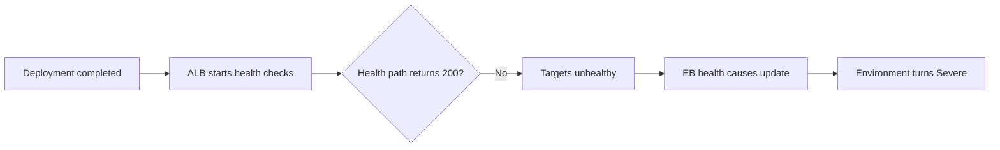
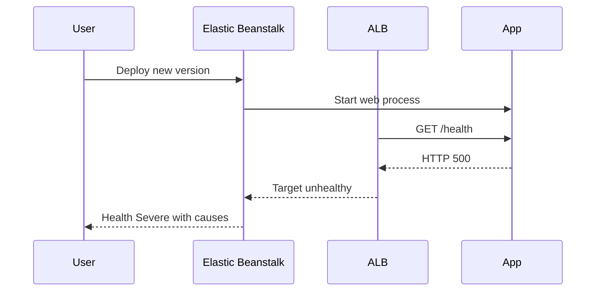

# Lab: Health Red After Deploy

Reproduce a successful deployment that still drives Elastic Beanstalk health to `Severe` because the application does not satisfy the configured health endpoint.

## Lab Metadata
| Attribute | Value |
|---|---|
| Difficulty | Intermediate |
| Duration | 40 minutes |
| Tier | Load-balanced web server environment |
| Failure Mode | Application deploy succeeds but ALB health check path returns `500` |
| Skills Practiced | Enhanced health interpretation, health cause review, ALB target health, application log correlation |

## 1) Background
### 1.1 Why this lab exists
Many EB incidents begin after a “successful” deployment. This lab shows how post-deploy health validation can fail even when package extraction and process startup succeeded.

### 1.2 Platform behavior model
EB treats deployment completion and runtime health as separate stages. The instance can start the web process, but if the ALB health check path fails, environment health quickly moves from `Info` to `Warning`, `Degraded`, or `Severe`.

### 1.3 Diagram (Mermaid)


## 2) Hypothesis
### 2.1 Original hypothesis
The environment turns red after deploy because the new version returns errors on the configured health check path.

### 2.2 Causal chain
Healthy deployment lifecycle -> application starts with bad route behavior -> ALB health checks fail -> target health becomes unhealthy -> EB enhanced health turns `Severe`.

### 2.3 Proof criteria
- `aws elasticbeanstalk describe-environment-health` shows unhealthy causes after deploy.
- `aws elbv2 describe-target-health` shows failing health checks.
- `/var/log/web.stdout.log` or web server logs show the health endpoint returning `500` or timing out.

### 2.4 Disproof criteria
- Health endpoint returns `200` locally and through the target group, and the failure instead comes from listener, security group, or instance launch issues.

## 3) Runbook
1. Deploy the baseline healthy application.

```bash
eb deploy "$ENV_NAME" --staged
aws elasticbeanstalk describe-environment-health \
    --environment-name "$ENV_NAME" \
    --attribute-names Status Color Causes ApplicationMetrics InstancesHealth
```

2. Trigger the faulty version that breaks the health endpoint.

```bash
bash "trigger.sh"
eb deploy "$ENV_NAME" --staged
```

3. Inspect EB and ALB health signals.

```bash
aws elasticbeanstalk describe-environment-health \
    --environment-name "$ENV_NAME" \
    --attribute-names Status Color Causes InstancesHealth

aws elbv2 describe-target-health --target-group-arn "$TARGET_GROUP_ARN"
```

4. Pull logs and validate the failing route.

```bash
eb logs --environment-name "$ENV_NAME" --all
curl --silent --show-error --location "http://127.0.0.1/health"
sudo less /var/log/nginx/access.log
sudo less /var/log/web.stdout.log
```

5. Query CloudWatch Logs if log streaming is enabled.

```bash
aws logs start-query \
    --log-group-name "/aws/elasticbeanstalk/$ENV_NAME/var/log/nginx/access.log" \
    --start-time 1712476800 \
    --end-time 1712480400 \
    --query-string 'fields @timestamp, @message | filter @message like /GET \/health/ and @message like / 500 / | sort @timestamp desc | limit 20'
```

## 4) Experiment Log
| Time (UTC) | Observation | Evidence |
|---|---|---|
| 10:00 | Environment healthy before deployment | `describe-environment-health` |
| 10:07 | New version deployed without package errors | `eb events` |
| 10:10 | ALB target health reports failed checks | `describe-target-health` |
| 10:12 | EB health causes show failing ELB/ALB health checks | `describe-environment-health` |
| 10:14 | Application log shows `/health` returning `500` | `/var/log/web.stdout.log` |

## Expected Evidence
### Before Trigger (Baseline)
- Environment health is `Ok`.
- Target group health is healthy.
- `/health` returns `200`.

### During Incident
- Environment color moves through `Warning` or `Degraded` to `Severe`.
- EB health causes cite failed checks or target failures.
- Application or access logs show repeated failures on `/health`.

### After Recovery
- After restoring the correct route, target health returns to healthy.
- Environment color returns to `Ok`.

### Evidence Timeline (Mermaid sequence diagram)


### Evidence Chain: Why This Proves the Hypothesis
The deployment itself succeeds, but runtime evidence shows the health check path failing immediately afterward. Because ALB target health and EB enhanced health both degrade only after `/health` begins returning errors, the causal driver is the application health endpoint, not the deployment engine.

## Clean Up
```bash
eb terminate "$ENV_NAME"
aws cloudformation delete-stack --stack-name "$STACK_NAME" --region "$AWS_REGION"
```

## Related Playbook
- [Health Turns Red After Successful Deploy](../playbooks/deployment-availability/health-red-after-deploy.md)

## See Also
- [Hands-on Labs](./index.md)
- [Deployment Failure](./deployment-failure.md)
- [Load Balancer 5xx](./load-balancer-5xx.md)

## Sources
- [Enhanced health for Elastic Beanstalk environments](https://docs.aws.amazon.com/elasticbeanstalk/latest/dg/health-enhanced.html)
- [Elastic Beanstalk environment health](https://docs.aws.amazon.com/elasticbeanstalk/latest/dg/health-enhanced-status.html)
- [Elastic Beanstalk logs](https://docs.aws.amazon.com/elasticbeanstalk/latest/dg/using-features.logging.html)
- [Application Load Balancer target group health checks](https://docs.aws.amazon.com/elasticloadbalancing/latest/application/target-group-health-checks.html)
